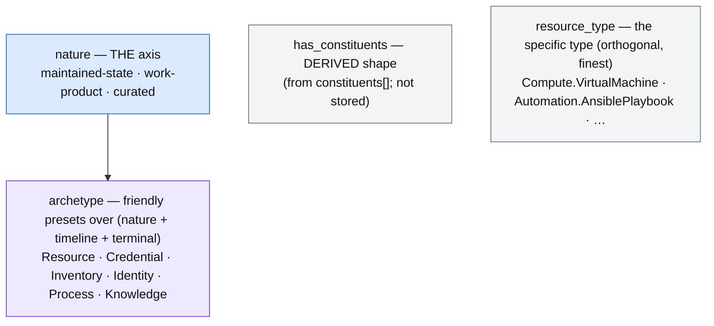

# UDLM/DCM Naming Charter (Proposed)

> **Status: Proposed — a straw man for engineering review.** The goal is **one cohesive naming pass before
> the 0.1 tag, then a freeze.** This charter proposes the canonical vocabulary, shows how the axes relate,
> and batches the renames still outstanding. It binds nothing until ratified. Opinionated on purpose — react
> to it, don't start from a blank page.

## Why now

Every individual term is justified, but the vocabulary is not a cohesive *system*: several axes overlap
(`family` / `nature` / `archetype`), and terms have churned (Blueprint → Template, Atomic/Composite →
derived `has_constituents` (ADR-027 addendum), Composite Service → Template). **Incremental** renaming is the churn that erodes adopter
trust. **One** deliberate pass is the cure. Pre-0.1 is the only cheap window — after the tag, terms are
cited, depended-on, and externally adopted, and renaming is breaking. So: settle it once here, publish the
map, and **freeze at 0.1**.

## The one lifecycle, at two scales

There is one shape. Don't invent parallel vocabulary for it.

| Entity scale (four states) | Assembly scale | Role |
|---|---|---|
| **Intent** | **Pattern** | the reusable, design-time desire (type level) |
| **Requested** | **Template** | the resolved, orderable definition |
| **Realized** | **System** | the running instance |
| **Discovered** | — | observed reality with no intent (joined by adoption) |

`Intent → Requested → Realized` (ADR-030) *is* `Pattern → Template → System` (ADR-033) one scale up. The
transitions are the same act — **Converge**.

## The classification axes (proposed — collapse the overlap)

The core simplification: **`nature` is the one fundamental axis; `family` and `archetype` are a view and a
preset over it, not parallel classifications.** Today three fields draw nearly the same partition.

| Axis | Values | Answers | Proposal |
|---|---|---|---|
| **nature** | maintained-state / work-product / curated | what *kind* of lifecycle — reconciled? terminal? | **the axis**; reconcilability hangs off it |
| **archetype** | Resource · Credential · Inventory · Identity · Process · Knowledge | the friendly, queryable **preset** over (nature + timeline + terminal) | **a view of nature**, not a peer axis |
| **has_constituents** | derived (true iff `constituents[]`) | constituent **shape** — is it a composite? | **derived**, not stored (ADR-027 addendum); the stored `entity_type` shape is retired — `entity_type` survives only as the Knowledge/Access discriminator |
| **resource_type** | `Compute.VirtualMachine`, … | the **specific** type | **keep** — orthogonal, finest |

**Update (2026-07-22) — the derive decision already did part of this.** The ADR-027 addendum retired *two* stored classifiers as derived views: `lifecycle_archetype` (now derived from `family`) and the entity_type **shape** (now the derived `has_constituents`). That is exactly this charter's move — collapse redundant tiers to derived views — applied and shipped, so `nature`-as-the-one-axis inherits a validated precedent.

**What this retires:** `family` (Resource / Process / Knowledge / Access) as a *separate* axis. The
state-vs-execution distinction it drew (ADR-027) *is* the nature distinction — Resource = maintained-state,
Process = work-product, Knowledge = curated. `family` was a third name for the partition `nature` already
draws. It may survive as a **derived view/alias** of nature (query convenience) rather than a stored field —
that's a ratification detail.

**The one decision that unlocks the axis** (task #55): is `work-product` a *full* nature, or a
maintained-state with a one-shot intent and a terminal condition? This is the same question as "does a
Process reconcile?" Settle it and the axis locks. *(`Access` / `Identity` folds in as a maintained-state
archetype — an identity is maintained, not one-shot.)*

## The tiers and the triad (unchanged — just naming them once)

- **Data · Policy · Provider** — the invariant decomposition. UDLM = Data (substrate); DCM = Policy
  (realization); Provider = mechanism (wraps tools, T8). Every decision decomposes across all three.
- **Pattern → Template → System** — roles, not new things (above). **Composite Service = Template**
  (ADR-034); **Blueprint** is retired → Template.

## Canonical glossary (proposed) + retired aliases

| Canonical | Means | Retired / folded names |
|---|---|---|
| **Template** | the orderable, resolved composite definition (Requested tier) | Blueprint · Composite Service (catalog item) |
| **System** | the realized instance of a Template | Composite Entity |
| **Pattern** | the reusable, design-time design (Intent, type level) | — |
| **nature** | the lifecycle-kind axis (maintained-state/work-product/curated) | *family* (folds in as a view) |
| **archetype** | friendly preset over nature | — |
| **has_constituents** (derived) | constituent shape (is it a composite?) | the stored `entity_type` shape · Atomic/Composite · single/multi — all retired (derived, ADR-027 addendum) |
| **edge_type** | the relationship-kind field | `kind` (for edges) |
| **Converge** | the single lifecycle act | realize/reconcile/rehydrate/teardown (colloquial shortcuts, not distinct acts) |

*(Note a residual collision to resolve: "family" is also used for a **rule-ID prefix family** — an unrelated
sense. If `family` is retired as an entity axis, keep it only in the rule-ID sense, or rename that too.)*

## Batched renames still to land (pre-0.1)

These land together, then the freeze applies:

- **Composite Service → Template**, Composite Entity → System, `CMP-*` → `TPL-*` — ADR-034 (gated on eng ruling).
- **`family` → `nature` reconciliation** — this charter (gated on the work-product decision above).
- *(already landed: Blueprint → Template · edge `kind` → `edge_type` · **the Atomic/Composite shape → derived `has_constituents`** (ADR-027 addendum; the `single`/`multi` rename was superseded and its branch deleted).)*

## Known term conventions to reconcile

Real-world usage of these words varies by group — the charter should map onto it, not ignore it.

- **"Blueprint."** *This group* uses "blueprint" ≈ a **reusable design** — i.e. our **Pattern**. vRealize /
  Aria and Azure use "blueprint" ≈ a **deployable definition** — i.e. our **Template**. The word spans *both*
  tiers, which is exactly why it is retired here: adopting it for either tier collides with the other group's
  meaning. **Open question for eng:** do we adopt **"Blueprint" for the Pattern tier** (rename `Pattern →
  Blueprint`, matching this group's usage), or keep `Pattern` and treat team-"blueprint" as an informal alias
  mapped in conversation? We *cannot* use "Blueprint" for the Template tier without re-colliding with the
  vRA/Azure sense.
- **"Validated Pattern"** (Red Hat) — a *deployable, tested* composite ≈ our **Template**, **not** our
  (abstract) Pattern. When citing it, map it to Template.
- **"Consumer" — three roles under one word.** The term is used for (1) the **requester** — the party that
  submits a Request and owns the resulting entity in its Tenant (the "consumer side of the transaction", anchored
  on the formal **Tenant** + **Identity**; a role, not a type — may be a person, an agent, or a peer control
  plane); (2) the **dependent** — a resource that requires/references another in the dependency graph (a VM
  "consuming" a Volume; a project "consuming" a library); (3) the **data-consumer** — a downstream tool ingesting
  *emitted* data at a boundary (a FinOps tool consuming FOCUS). Plus unrelated technical uses (`information-consumer`
  in the IP contract, `consumer_profile` in DAV). **Open question for eng:** disambiguate into distinct terms —
  e.g. **requester** (submits intent, owns the entity), **dependent** (graph edge), **data-consumer** (boundary) —
  and reserve "consumer" for at most one; or keep "consumer" as the umbrella with the three always qualified.

These are the vocabulary the eng review reconciles alongside the `family`/`nature` collapse — the point of the
charter is to land on names that match how teams already speak, then freeze.

## Model & policy vocabulary landed 2026-07-22 (fold into the glossary)

The scoped-Class paradigm (ADR-038) and the policy-firewall (ADR-041) introduced canonical terms the freeze must cover — captured here so the pass is complete:

- **Base / Type / Provider Class** · **`SharedDataElement`** — the scoped resource-type meta-model (subsumes `provider_extensions` and the Vendor.Type fork).
- **authority** (the addressing/routing namespace) · **references-context edge** (a classified, dereferenceable edge — the former `reference_data` layer, retired) · **`covers` / `applies_on` / `from_layers`** (layer→request injection scoping).
- **information firewall** / **guard** · **structural vs value policy** · **egress / ingress** mediation — the policy-flow vocabulary (ADR-041).
- **Knowledge classes** `SoftwareImage` / `SoftwarePackage` / `Vulnerability` — the SBOM/CVE knowledge domain.

Canonical as of their ADRs; adding the glossary rows is a mechanical follow-up.

## The freeze

**At the 0.1 tag the vocabulary is frozen.** After that, a new term or a rename is a **breaking change**
(VERSIONING) and requires a **charter amendment** (a Proposed ADR that updates this doc). This charter then
becomes the canonical glossary — the single place the vocabulary lives, so coherence is in a doc, not in
anyone's head.

## Alternatives considered

- **Keep `family` + `nature` + `archetype` as three axes** — rejected: three names for ~one partition is the
  incoherence this charter fixes (the same "two terms for one objective" smell as Composite Service).
- **Freeze the current terms as-is** — rejected: locks in the overlap permanently.
- **Keep renaming incrementally** — rejected: churn without a charter erodes adopter trust; one pass + freeze
  is the discipline.
