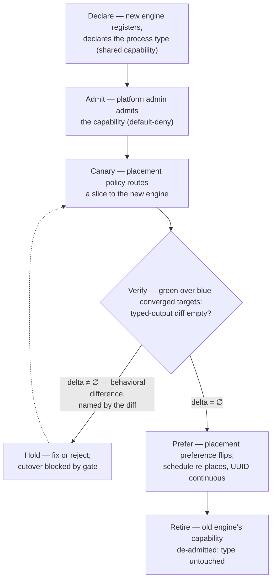

# Automation migration & staged promotion — the stage

**What this settles:** how automation moves — between engines, between engine versions, and
through environments — using only the machinery resources already use. The premise is the
process-family class model (ADR-038 applied to the Process family): a process **type** is the
portable definition multiple engines declare as a shared capability, an engine binding is a
provider-tier concern, and a run instantiates the type. Everything below follows from that; no
migration-specific machinery exists. A **lighter** flow — it builds on
[request-realization](request-realization.md); the new twist is that the "resource" being placed
is an automation engine's execution of a declared process.

> **Use Cases:** `process-migration/engine-migration-canary-cutover`,
> `blue-green-engine-verification`, `automation-staged-promotion`,
> `process-portability-structural-query`, `engine-upgrade-regression`.
> **Persona:** platform-engineer · **Profile:** standard.

**In one breath.** Two engines declare the same process type; a placement policy sends a canary
slice to the new engine; because the type is idempotent and both engines publish the same typed
outputs, a green run over blue-converged targets should change nothing — the diff *is* the
verification; cutover is a preference flip on an untouched definition, the schedule keeps its
identity, and the audit trail reads as one practice that changed engines. The same three moves —
declare, verify by output diff, re-prefer — also promote automation versions through
dev/test/prod like an application release, and regression-test an engine upgrade against itself.

## What this adds over request-realization

- **The "provider" is an automation engine, the "resource" is a run.** Placement selects among
  engines that declared the process type, exactly as it selects among providers of a resource
  type. Admission, trust, and audit apply unchanged.
- **Intent lives at the type; the engine binding is provider-tier.** Targets, policy knobs,
  windows — the org's automation intent — never move during a migration. Only the selection and
  the engine-bound elements change. Lock-in is *readable*: it is exactly the set of elements
  sitting at engine scope.
- **Verification is an output diff, not a harness.** Idempotent type + identical typed outputs
  ⇒ green-over-blue should be an empty change-set; a non-empty delta names the behavioral
  difference. The same mechanism tests engine upgrades (N vs N+1) forever after.
- **Promotion is version pinning per stage.** A process definition version realizes in dev,
  gates on its output evidence, promotes by re-pinning the next stage — the application
  deployment discipline (versioned artifact, staged rollout, gated promotion, rollback =
  re-select previous) applied verbatim to automation.

## The flow — only what's different

Promotion runs the same loop per stage: **dev** (declare/pin the new version) → verify →
**test** (re-pin) → verify → **prod** (re-pin), with each gate consuming the prior stage's
typed-output evidence. Rollback at any stage is re-pinning the previous version — placement
machinery again, nothing new.

## Data · Policy · Provider (required lens — SPEC-DESIGN §29)

- **Data (UDLM):** the process type (portable definition + typed outputs), the engine bindings as
  provider-tier elements, version pins per stage, and the run records instantiating the type —
  identity and history continuous across engine changes.
- **Policy (DCM/org):** canary routing, empty-delta gates, stage promotion gates, and cutover
  preference are all placement/validation policies — the migration has no mechanism of its own.
- **Provider:** engines declare the shared capability and are selected, verified, preferred, and
  retired through the standard provider lifecycle; an engine upgrade is modeled as two versions of
  one provider competing on evidence.
