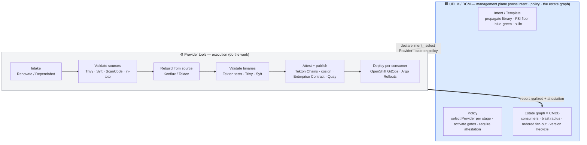
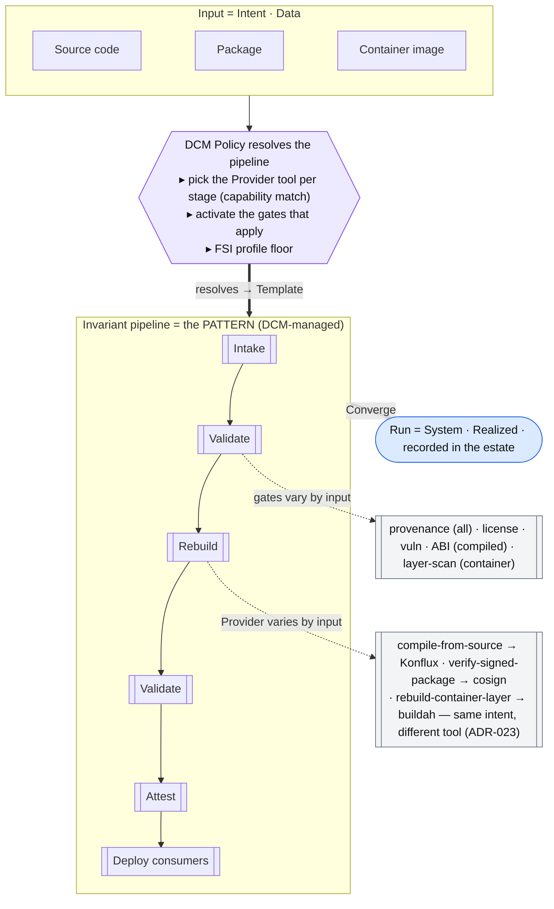
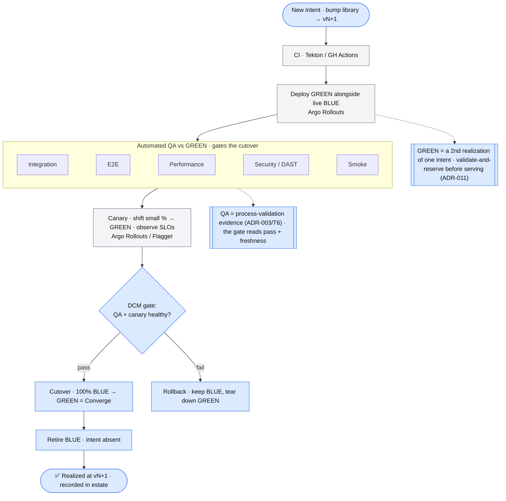

# Example (WIP) — an FSI software supply chain, managed by UDLM/DCM over existing tools

> **Status: work-in-progress example, non-normative.** A worked example mapping a real scenario onto the
> **post-1.0** UDLM/DCM direction (convergence lifecycle ADR-030, Pattern → Template → System ADR-033,
> Data · Policy · Provider). Concepts marked *post-1.0* / *gap* are not in 1.0. Tool names are **illustrative
> examples** of Providers, not requirements.

**The thesis.** UDLM/DCM is a **management / control plane**, not an execution engine. The build, scan, sign,
and deploy work is already owned by mature, best-of-breed tools — **Konflux/RHTAP, Tekton (+ Chains), Trivy,
Syft, Sigstore/cosign, Enterprise Contract, Quay, OpenShift GitOps (Argo CD / Rollouts)**. DCM does **not**
reimplement them; it **orchestrates them as Providers** and owns the layer none of them own: the **intent**
across the whole flow and the **estate graph** (who consumes what, blast radius, ordered fan-out, version
lifecycle). *Manage the pipeline; don't drive the work.*

## The scenario

*A new version of an upstream open-source library is available. Validate it, rebuild it **from source**
(vendor packages are not trusted), attest it, and roll it out to every consuming application — event-driven,
FSI-only, in under an hour.*

## 1 · The management picture — two planes

DCM/UDLM declares intent, selects a Provider per stage (by capability + policy), gates on evidence, and
**records realized state + attestation back into the estate**. The tools do the work.

DCM never builds, scans, or deploys. It declares *what* (the Template intent), picks *who* (the Provider tool,
by capability match — ADR-004, DCM ADR-023), enforces *the gates* (policy/profile), and records *the result*
(realized + attestation) into the estate. Its unique value is the thing no single tool owns: **"a library
changed — who's affected, in what dependency order do I roll it, and is every consumer conformant before I
retire the old version?"**

## 2 · Stage → tool (delegated) → what DCM manages

| Stage | Provider tool (example) | What UDLM/DCM manages |
|---|---|---|
| Package Available | Renovate / registry watcher | the **event → trigger**; records the new version as intent |
| Validate sources | Trivy · Syft · ScanCode · in-toto | **requires** the gates (policy floor); records evidence |
| Rebuild from source | **Konflux / Tekton** | declares "rebuild from source" intent; selects the build Provider |
| Validate binaries | Tekton tests · Trivy · Syft | gate thresholds (policy); records SBOM + verdicts |
| Attest · sign · publish | **Tekton Chains · cosign · Enterprise Contract · Quay** | **requires** attestation (not the signing); records it to the estate = "update CMDB" |
| Find & PR consumers | Renovate PR bots | **owns** this — the consumer **dependency-graph traversal** (ADR-010) + fan-out order |
| Per-consumer CI/CD + deploy | **Tekton · Argo CD · Argo Rollouts** | declares each consumer's new intent; gates cutover; records realized |
| Retire old version | — | **owns** this — retire once the graph shows *all* consumers converged |

The pattern: tools own the **mechanism**; DCM owns **intent, policy, and the graph**.

## 3 · It is a *policy-driven* pipeline — DCM selects the tool per input

The build mechanism changes with the input (source / package / container), and the gates that apply change
too — but the pipeline shape is the same. That's **Data · Policy · Provider** + **Pattern → Template → System**:
the pipeline is a **Pattern**; **Policy** resolves it into an input-specific **Template** by **selecting the
Provider tool** at each stage and **activating the applicable gates**; the run is a **System**.

## 4 · Deployment — DCM gates, Argo Rollouts drives the blue-green

Per consumer, a dependency bump is a **new Intent** (`library → vN+1`). **Argo Rollouts** (or Flagger) executes
the blue-green; **DCM gates the cutover** on automated-QA evidence and **records the realized state**. Blue-green
is a *gated Converge over two realizations* — green is fully realized and validated before it takes traffic (the
T6 tenet: pre-validated outcomes, not testing during incidents).

The tools (Argo Rollouts) own the *mechanism* of the swap; DCM owns the *decision* — gate on evidence, record
realized, order the fan-out across consumers.

## 5 · Twelve-Factor as a conformance overlay

Twelve-Factor is **adopted as a conformance policy set** (T5), not re-expressed: a consumer app's Template
*declares* conformance, the Validate gates *check* the machine-checkable factors, and the FSI profile can
*require* it. Three of the twelve are already native model relationships:

- **1 Codebase** (one codebase → many deploys) = **Pattern → Template → System**
- **5 Build / release / run** = **Intent → Requested → Realized**
- **10 Dev/prod parity** = one Pattern, profile-differentiated Templates (ADR-007)

The rest map to model constructs (deps = dependency graph; config = layers; backing services = references;
disposability = the lifecycle that makes blue-green drain safe; admin tasks = one-shot Processes) and are
enforced as **declared conformance + pipeline gates**, not new mechanism.

## 6 · The boundary — what DCM delegates vs what it owns

The litmus: *does a mature tool already own this mechanism?* → **Provider-wrap it**. *Does anyone own the
cross-tool intent + estate graph?* → no → **that's DCM**.

| Delegate (a tool owns the mechanism) | Own (nobody owns it well — DCM's product) |
|---|---|
| build · CI/QA · SBOM · vuln · sign · deploy · blue-green | the **cross-tool intent**, end to end |
| Konflux/RHTAP · Tekton (+ Chains) · Trivy · Syft · cosign · Enterprise Contract · Argo CD / Rollouts · Quay | the **estate graph / CMDB** — consumers, blast radius, **ordered fan-out**, version lifecycle |
|  | **policy / conformance** (require attestation, require 12-factor) — not the signing |
|  | the **orchestration decision** — which consumers, in what order, gated on what |

> **Tenet (proposed):** *adopt-by-reference for tools, not just standards* — if a mature tool owns a mechanism,
> DCM orchestrates it as a Provider and never reimplements it. The tool-level twin of T5/T7.

## 7 · Gaps — which are DCM's actual value

Tellingly, the "gaps" are exactly DCM's unique layer (not the delegated tool work):

| Gap | Disposition |
|---|---|
| Supply-chain artifact type (version, SBOM, attestation, provenance) | **Adopt** SPDX/CycloneDX + in-toto/SLSA (T5) |
| External event ingestion (watch upstream → trigger) | model an event-source Information Provider |
| **Consumer-graph-gated retirement** (retire when all consumers converged) | **DCM-owned** — a lifecycle policy over a graph predicate |
| **Consumer fan-out orchestration** (N apps, each its own convergence) | **DCM-owned** — a governed process fan-out |
| **Policy-composed constituent set** (policy picks which providers + gates fire) | the crux of "policy-driven pipeline"; the one real modeling question for eng |
| Blue-green: two realizations of one intent + atomic cutover | extends validate-and-reserve (ADR-011) to a dual-realized swap |
| Work-product Process nature + `<1hr` SLA | the open post-1.0 nature question (task #55) |

## Where each piece is specified
| Piece | Home |
|---|---|
| Intent / Requested / Realized · Converge | ADR-030 · [lifecycle-convergence](lifecycle-convergence.md) |
| Pattern → Template → System | ADR-033 · [template-assembly](template-assembly.md) |
| Provider capability match · naturalization boundary (wrap tools) | ADR-004 · DCM ADR-023 |
| Validate-and-reserve (green before cutover) | ADR-011 |
| Dependency-graph completion (consumer graph / fan-out) | ADR-010 |
| Attestation / trust | ADR-005 · DCM ADR-022 |
| Profiles / floors · config bundles | ADR-007 · ADR-015 |
| Adopt external standards **and tools** by reference | T5 · `adopted-standards.md` |
