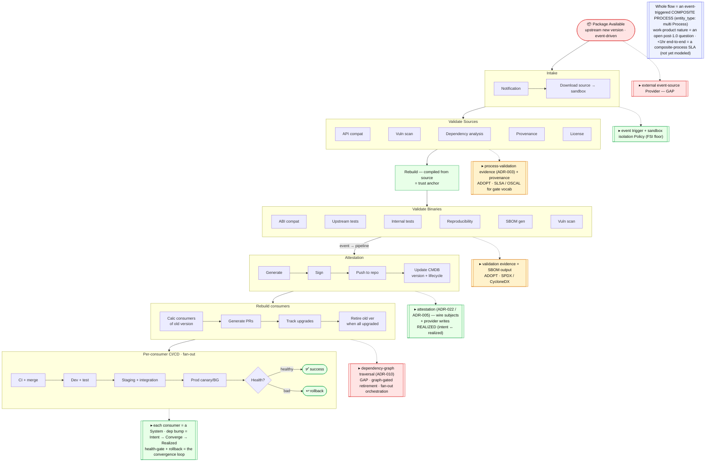
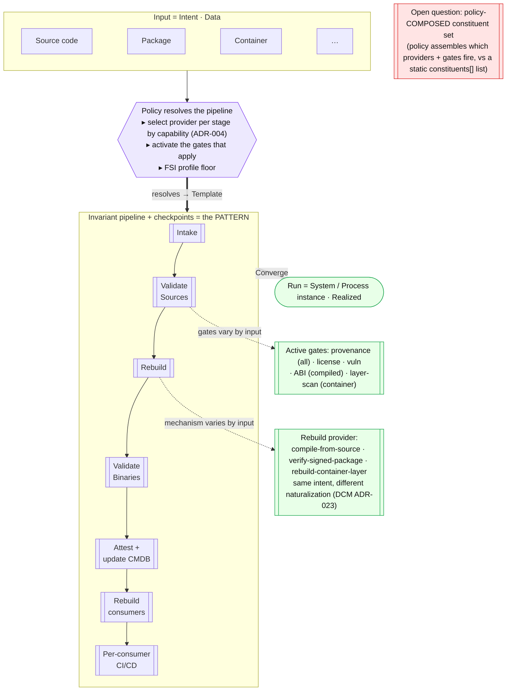

# Example (WIP) — an FSI software supply chain as a policy-driven pipeline

> **Status: work-in-progress example, non-normative.** This is not a conformance flow — it is a worked
> example mapping a real-world scenario onto the **post-1.0** UDLM/DCM direction (the convergence lifecycle
> ADR-030, Pattern → Template → System ADR-033, Data · Policy · Provider). Its purpose is to show *how the
> model would carry this* and to surface **what is missing**. Concepts marked *post-1.0* or *gap* are not
> in 1.0.

**What this settles:** whether the model can express a regulated (FSI) software-supply-chain "golden path"
— and what it would take. The short answer: the pipeline is a **Pattern**, **Policy** resolves it into an
input-specific **Template**, and the run is a **System**; most of the machinery already exists, and the
remaining gaps are mostly *adopt-a-standard* plus one genuine modeling question.

## The scenario

*A new version of an upstream open-source library is available. Validate it, rebuild it **from source**
(vendor packages are not trusted), attest it, and roll it out to every consuming application — **event-driven,
FSI-only, in under an hour.***

The pipeline: `Package Available` → **Intake** (sandbox) → **Validate Sources** → **Rebuild** →
**Validate Binaries** → **Attest** (sign, push, update the CMDB) → **Find & PR all consumers** →
**per-consumer CI/CD** → health-gated prod (rollback on failure).

## 1 · The pipeline, mapped to the model

The backbone is the supply-chain flow; each stage's note is the UDLM/DCM construct it maps to, colored by
fit — 🟩 the model covers it · 🟨 adopt an external standard · 🟥 a real gap.

## 2 · The insight — it is a *policy-driven* pipeline

The build mechanisms change with the input (source code vs a package vs a container), and the checkpoints
that apply change too — but the **pipeline and its checkpoints are the same shape**. That is exactly the
**Data · Policy · Provider** triad and the **Pattern → Template → System** resolution:

- **The pipeline + checkpoints = a Pattern** — the invariant design.
- **The input + its type = the Intent (Data).**
- **Policy resolves the Pattern into a Template** for that input: it **selects the Provider at each stage by
  capability match** (ADR-004) — `compile-from-source`, `verify-signed-package`, `rebuild-container-layer`
  all satisfy the *same* stage intent with different mechanisms (the naturalization boundary, DCM ADR-023) —
  and it **activates the gates that apply** (ABI-compat for a compiled binary, layer-scan for a container,
  provenance for everything). The FSI profile sets the floor.
- **The run = a System / Process instance (Realized).**

So *"mechanisms change by input"* is the **Provider** abstraction working as designed, and *"policy-driven"*
is the **Policy** abstraction selecting providers and gates. "Same pipeline, different components" is simply
**one Pattern → many Templates**.

## 3 · Where it fits, and where the gaps are

**Fits the model as-is** (the parts worth leading with): the estate *is* the "CMDB" — attestation writes
**Realized** state into it; "calculate all projects consuming the old version" is a **dependency-graph
traversal** (ADR-010); each consumer upgrade is a new **Intent → Converge → Realized** with a health gate and
rollback; and the per-input mechanism/gate variance is the **Provider + Policy** model doing its job.

**Gaps — what it would take:**

| # | Gap | Disposition |
|---|-----|-------------|
| 1 | Supply-chain artifact type (version, SBOM, attestation, provenance) | **Adopt** SPDX/CycloneDX (SBOM) + in-toto/**SLSA** (attestation) — don't invent (T5) |
| 2 | External event ingestion ("watch upstream → emit *Package Available*") | Model an Information-Provider / event source; the external-world → trigger edge |
| 3 | Validation gates as declared Policy (vuln thresholds, license allowlist, reproducibility) | **Adopt** SLSA levels / OSCAL for the gate vocabulary |
| 4 | Graph-gated retirement ("retire old version once *all* consumers converged") | A lifecycle policy gated on a dependency-graph predicate |
| 5 | Consumer fan-out orchestration (N consuming projects, each its own CI/CD convergence) | A Template-of-Templates / governed process fan-out |
| 6 | Attestation subjects wired end-to-end (realization / capability / operations) | Known open work |
| 7 | Work-product Process nature + `<1hr` end-to-end SLA | The open post-1.0 "does *work-product* survive as a nature?" question; a composite-process SLA is not yet modeled |

**The one modeling question to settle with engineering:** can a composite Process's **constituent set be
policy-composed** — policy assembles which providers and which gates fire, from the input — rather than a
static `constituents[]` list? This is the Intent → Requested resolution extended to *process composition*,
and it is the crux of "policy-driven pipeline."

## Where each piece is specified
| Piece | Home |
|---|---|
| Intent / Requested / Realized · Converge | ADR-030 · [lifecycle-convergence](lifecycle-convergence.md) |
| Pattern → Template → System (assembly) | ADR-033 · [template-assembly](template-assembly.md) |
| Provider capability match; naturalization | ADR-004 · DCM ADR-023 |
| Process validation evidence + freshness | ADR-003 |
| Dependency-graph completion | ADR-010 |
| Attestation / trust | ADR-005 · DCM ADR-022 |
