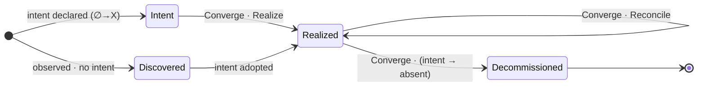
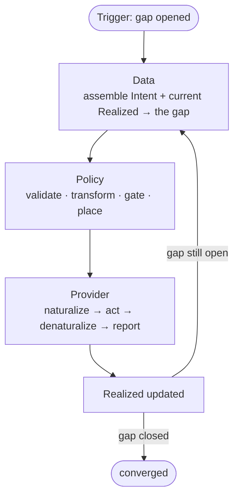
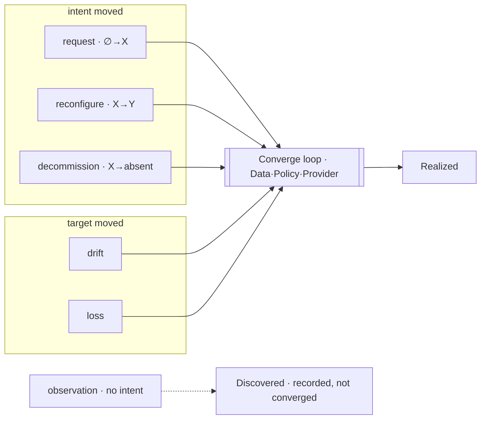
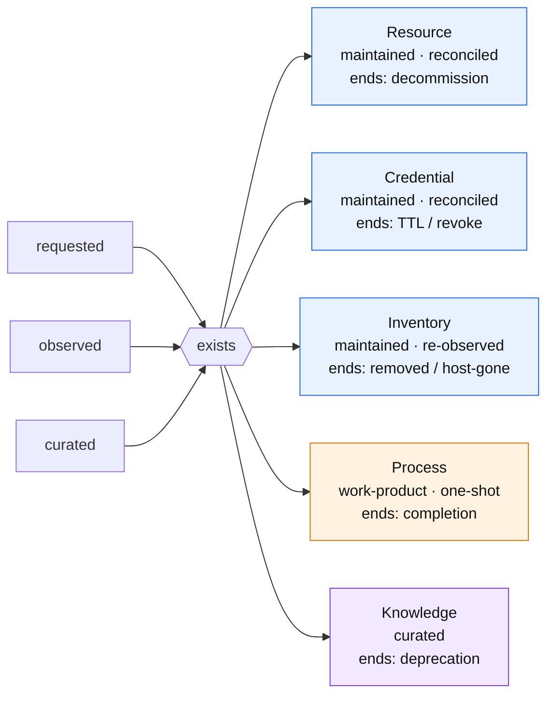
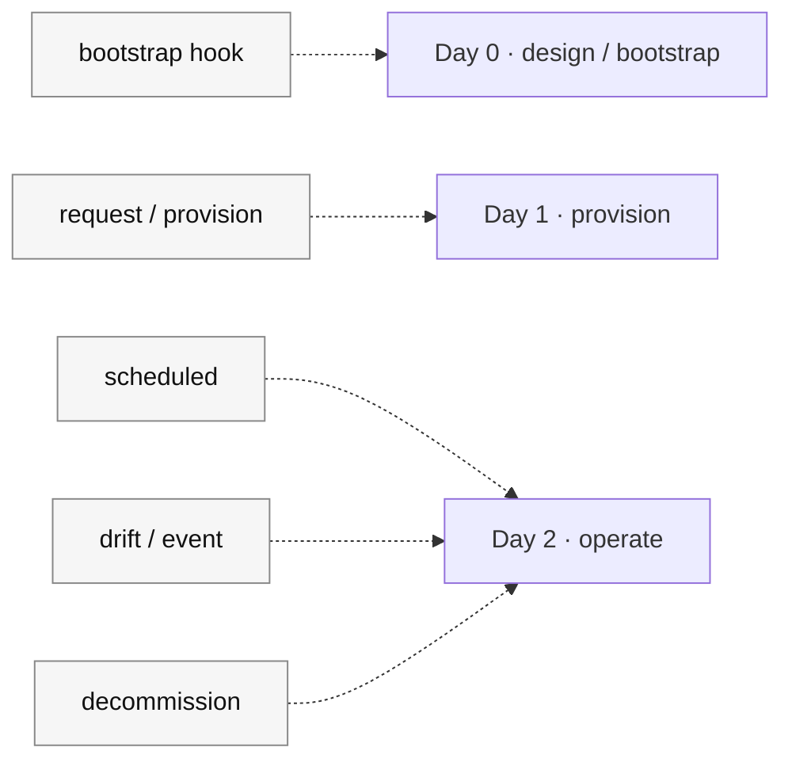

# The convergence lifecycle — one loop under everything

**What this settles:** the single lifecycle model beneath every entity — Resource, Process, Credential, Inventory, Knowledge. There is one **state** (Intent vs Realized), one **act** (Converge — close the gap between them), and two **trigger-classes** (the intent moved, or the target moved). Everything else — provisioning, drift, reconfigure, rehydrate, teardown, day-0/1/2, the familiar entity types — is that model *parameterized*. This is the **stage** telling (croadfeldt/udlm); the engine it runs on is [request-realization](request-realization.md) generalized, and the loop itself is **ADR-006 (convergence control), completed**.

The three primitives:

- **Intent** — the declared desired state. Mutable; its values include *exists-as-X* and *absent* (decommission). *(Intent = `absent` reclaims the realized resource; the entity record is retained as `Decommissioned` for audit — the record does not vanish.)*
- **Realized** — the actual state. `Realized` = reality with an intent behind it; `Discovered` = observed reality with *no* intent.
- **Converge** — the one act (a Data · Policy · Provider loop) that drives Realized toward Intent. A **gap** (Intent ≠ Realized) is what it closes.

---

## 1 · Flow of lifecycles — one loop, walked by any entity

An entity's whole life is Converge firing on a gap. `Realize` / `Reconcile` / `Rehydrate` are **not distinct acts** — they are colloquial shortcuts for the one act, naming a scenario by its *trigger* and *gap shape* (not by first-vs-later). `Decommissioned` is the state reached when intent is set to *absent* that Converge drives reality to.

*Observed things enter at `Discovered` and only join the loop if an intent is adopted for them. Nothing is a state you "do" — you set the intent and the act closes the gap.*

---

## 2 · Flow through DCM — one convergence pipeline

DCM runs **one** pipeline. Realize and Reconcile share every stage; only the trigger differs. There is no separate "provision" vs "day-2" subsystem — that distinction is a reading, not a mechanism.

*This is the re-entrant Data·Policy·Provider loop of ADR-006. The `request-realization` flow is this pipeline's **first** firing (Realize); drift-remediation (uc-14), rehydration (uc-12), and idempotent reconvergence (uc-05) are **later** firings of the identical pipeline.*

---

## 3 · Flow of triggers — every lifecycle event is a gap, from two sources

A gap opens exactly two ways: the **intent moved**, or the **target moved**. Every named lifecycle event is one of those firing the one loop. Observation is the sole intake with no intent — it is recorded, never converged.

*The act never cares which side moved — it sees only the gap and closes it. That is why `reconfigure` is not a distinct act (it's Converge on an intent-change) and `rehydrate` is not distinct either (it's Converge on a target-loss).*

---

## 4 · Archetype projection — the familiar types are presets over the one spine

Resource / Process / Credential / Inventory / Knowledge are not separate kinds. Each is a **preset** of three parameters over the same spine: its **nature** (maintained-state vs work-product vs curated), whether it **reconciles** (a consequence of nature, not timeline), and its **terminal condition**.

| archetype | nature | reconcilable? | enters via | exists as | terminal condition | timeline |
|---|---|---|---|---|---|---|
| **Resource** (VM) | maintained-state | yes | requested | Realized | decommission | long |
| **Credential** (JIT) | maintained-state | yes | requested | Realized | TTL / revoke / decommission | short |
| **Inventory** (CPU) | maintained-state | yes (re-observe) | **created OR observed** | Realized / Discovered | removed / host-gone | indefinite |
| **Process** (backup) | work-product | no | requested | Realized (executed) | completion | bounded |
| **Knowledge** (Capability) | curated | — | curated | Canonical | deprecation | — |

*The blue rows are one nature (maintained-state) at three timelines — Credential and Inventory are Resource-nature, not their own species. `reconcile` hangs off `nature = maintained-state`, never off duration. (Process `no` is DCM's **1.0 orchestration** view — given enough observability and control levers a running process could be reconciled mid-flight, which softens the work-product/maintained-state line; **post-1.0 follow-up**.)*

---

## 5 · Day-N is a projection, not a field

Day 0 / 1 / 2 never appears in the data. The model stores the **trigger**; "which day" is derived by filtering triggers by lifecycle phase. Templates (see ADR-033) compose consumables + their triggers into one unit — and a "Day-2 view" is just a lens over the operate-time triggers.

*There is no "Day-2 subsystem." Day-2 is the same convergence pipeline (§2) fired by operate-time triggers (§3). One mechanism, three days.*

---

## The whole story in one line

One loop (§2), fired by two trigger-classes (§3), walked by any entity (§1), yielding the familiar archetypes (§4), with days as a lens (§5) — `Intent + Realized`, a gap, and `Converge` closing it. See the combined-model ADR for the decision and the *why*.
