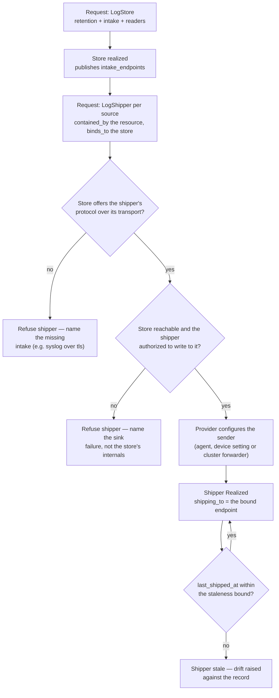

# Log shipping — store → shippers → staleness (the flow)

**What this settles:** how a resource's logs come to land in a store, as records: a **log store** publishes its
intake, and one **log shipper** per source binds that intake and delivers to it. A **lighter** flow: it **builds
on [request-realization](request-realization.md)** (the base intent→realized loop) and documents only what log
shipping adds: the binding to the store's published intake, the protocol match, and staleness after realization.

> **Use Cases:** `observability/deploy-log-shipper`, `observability/estate-logs-reach-one-store` (positive);
> `observability/log-shipper-sink-unreachable-refused` (must-reject). **Persona:** platform-engineer ·
> **Classes:** `LogStore`, `LogShipper`, `LogShipper.Syslog`, `LogShipper.OTLP`.

**In one breath.** The store is realized first and publishes one endpoint per declared intake (`syslog` over
`tls`, `otlp` over `http`). Each shipper names the resource it ships from (a `contained_by` edge) and the store
it ships to (a `binds_to` edge), and its Type names the protocol. A shipper whose protocol and transport the store
does not offer is refused before any sender is configured; one whose store is unreachable or unauthorized is
refused too. Once realized, the shipper's `last_shipped_at` is watched, and a source that stops arriving is
stale, not silently healthy.

## The flow

## What log shipping adds over the base loop

- **A bound, not a typed-in, destination.** The shipper carries no address. It binds the store's published
  `intake_endpoints`, so moving the store's receiver changes one record and every shipper follows.
- **A protocol match checked before dispatch.** The shipper's Type (Syslog or OTLP) and transport must appear in
  the store's `intake`. A mismatch is a refusal with a named cause, never a sender pointed at a port that will
  not listen.
- **Liveness after realization.** `last_shipped_at` is an observed fact: the time the store last heard from the
  target. A realized shipper whose logs stop arriving is stale, which is the failure that matters for logs.
- **Identity on every line.** The provider stamps the target's `host.name` and `udlm.handle`, so a log line in
  the store can be followed back to the record and through its edges.

## What UDLM does not decide

Which product stores the logs, how a sender is configured (an rsyslog drop-in, a Redfish EventDestination, a
cluster log forwarder), the staleness bound, and whether every resource must have a shipper. The last two are
policy: a deployment may require a shipper for every realized machine and raise the gap when one is missing.
UDLM defines the record shapes, the binding and the protocol match; the control plane and its providers
realize them.

## Where each piece is specified

| Piece | Contract |
|---|---|
| The four record shapes and their examples | `registry/classes/resource/observability/log-shipper/`, `registry/classes/resource/data/log-store/` (`spec_examples`) |
| Why these are classes, and the standards they adopt | [ADR-083](../adr/ADR-083-log-shipping-classes.md) — a shipper binds a store; syslog terms from RFC 9742, identity from OpenTelemetry |
| Binding a published output across a boundary | `binds_to` in `registry/edge-types.yaml` — borrow another record's output |
| Corpus | `use-cases/observability/` |
