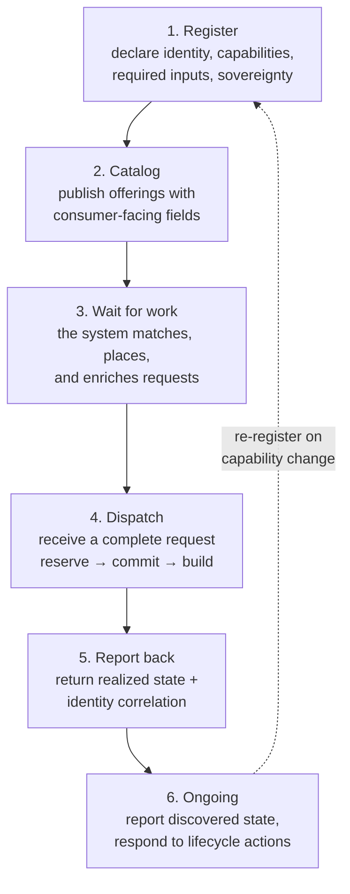
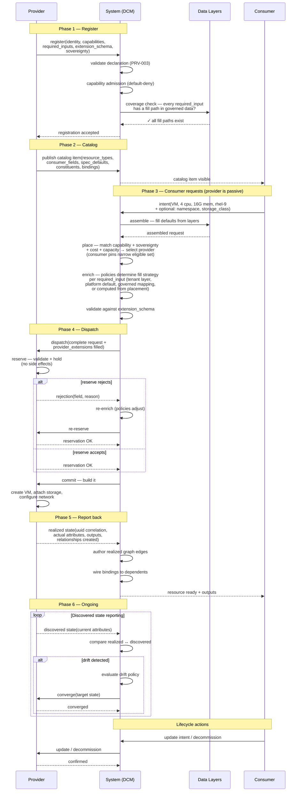

# Provider lifecycle — from the provider's perspective

**What this settles:** the complete journey a provider takes — from declaring what it can do, through
receiving and fulfilling requests, to reporting back what it built. This is the **provider's view** of the
system: what it must do at each stage, what data it supplies, and what it gets back. The companion
[request-realization](request-realization.md) tells the same story from the request's perspective; this
document tells it from the provider's.

**In one breath.** A provider registers, declares "I can provision VMs on OpenShift, and I need a namespace
and a storage class to do it." It publishes a catalog item that says "here's my VM offering with these
consumer-facing options." A consumer asks for a VM. The system picks this provider, fills in the namespace
from governed data, and hands the provider a complete request. The provider reserves, commits, builds the
VM, and reports back what it did. From then on, it reports discovered state so the system can detect drift.
The provider never sees the portable abstraction layer — it gets a request that already has everything it
needs, regardless of whether the consumer or the system supplied each value.

## The lifecycle — six phases



### The full interaction — sequence



---

## Phase 1 — Register: tell the system what you can do

Before receiving any work, a provider registers with the system. Registration is the provider's
**declaration of identity and capability** — everything the system needs to know before it can consider
this provider for placement.

**What the provider supplies:**

| What | Why | Where it's specified |
|------|-----|---------------------|
| Identity (name, version, health endpoint) | The system needs to reach you and know you're alive | `provider-contract.md` §1 |
| Capabilities — which resource types you realize, which operations you support | The system needs to match requests to providers who can fulfill them | `capability-discovery.md` §2.1 |
| Required inputs per resource type — the fields you need beyond the portable base (e.g., `namespace`, `storage_class`) | The system and policies need to know what must be present before dispatching to you — policies determine where each value comes from | `provider-contract.md` §1a.2 |
| Extension schema — the JSON Schema for your provider-specific fields | The system validates the enriched request before dispatch; consumers who pin provider-specific fields get validation at intent time | `provider-contract.md` §1a.3, PRV-010 |
| Sovereignty zones | The system enforces sovereignty constraints at placement | `capability-discovery.md` §2.1 |
| Capacity (optional but recommended) | The system uses capacity data for placement decisions — without it, placement is capability-match only | UC-10 |

**Example — an OpenShift VM provider registering:**

```yaml
provider:
  name: "ocp-prod-east"
  version: "1.2.0"
  health_endpoint: "https://ocp-prod-east.internal/healthz"

  capabilities:
    realize_resources:
      resource_types:
        - type: Compute.VirtualMachine
          required_inputs: [namespace, storage_class]
          extension_schema_ref: "urn:udlm:schema:ocp-vm-extensions:1.0"
        - type: Compute.Container
          required_inputs: [namespace, resource_quota]
          extension_schema_ref: "urn:udlm:schema:ocp-container-extensions:1.0"
      operations: [create, update, scale, decommission]
      supports_discovery: true
      supports_capacity_query: true

  sovereignty:
    zones: [us-east-1]
```

A VMware provider registering for the same resource type would declare different required inputs:

```yaml
capabilities:
  realize_resources:
    resource_types:
      - type: Compute.VirtualMachine
        required_inputs: [cluster, datastore, resource_pool]
        extension_schema_ref: "urn:udlm:schema:vmware-vm-extensions:1.0"
```

Same portable type. Different required inputs. The system knows both at registration time and can fill
each one after placement selects a specific provider.

**What happens at registration:**
- The system validates the declaration (PRV-003: capabilities not declared at registration cannot be invoked later)
- Capability admission runs — default-deny; a platform admin must admit each capability before it's usable (§2.5)
- A coverage check verifies every `required_input` has a fill path — the provider declares what it needs; policies determine where each value comes from (consumer-supplied, tenant layer, platform default, or computed at placement time). Gaps are caught at registration, not on a user's first request

---

## Phase 2 — Catalog: publish what consumers can order

After registration, the provider publishes **catalog items** — the consumer-facing offerings built on top
of registered capabilities. A catalog item is the menu: what a consumer sees when they browse what's
available.

**What the provider supplies:**

| What | Why |
|------|-----|
| Resource type + version | Which portable type this offering realizes |
| Consumer fields | What the consumer fills in at intent time — business-level choices, plus optionally provider-specific fields |
| Spec defaults | Sensible defaults for the portable fields the consumer doesn't specify |
| Constituents + dependencies (for composites) | How a multi-tier offering decomposes and in what order |
| Bindings (composites only) | How one constituent's output wires into another's input |

### Simple catalog item — a VM

Continuing the VM example from Phase 1. The OpenShift VM provider publishes a catalog item for a
single virtual machine:

```yaml
name: Compute.VirtualMachine.OCP
resource_type: Compute.VirtualMachine
type_version: 0.1.1

spec_defaults:
  guest_os: rhel-9
  disks:
    - size_gb: 100
      type: ssd

consumer_fields:
  - name: environment
    type: enum
    required: true
    enum_values: [dev, staging, prod]
  - name: vcpu
    type: integer
    required: false
    default: 2
  - name: memory
    type: integer
    required: false
    default: 8192
  - name: namespace
    type: string
    required: false
    description: "OpenShift namespace — optional; resolved by policy if omitted"
  - name: storage_class
    type: string
    required: false
    description: "Storage class — optional; resolved by policy if omitted"
```

The consumer sees `environment`, `vcpu`, `memory` as the primary choices. `namespace` and
`storage_class` are visible but optional — the consumer MAY specify them if they know what they want
(honored, validated, flagged as non-portable per `PRV-010`). If omitted, policies resolve them
post-placement. The provider declares *what* it needs at registration (Phase 1); the catalog item
exposes *whether* the consumer can supply it directly.

### Composite catalog item — a three-tier application

A provider that offers a complete application stack publishes a composite catalog item. The
composite decomposes into constituents with dependency ordering and output bindings:

```yaml
name: ApplicationStack.ThreeTierWebApp
composition_visibility: transparent

constituents:
  - component_id: database
    resource_type: Data.Database
    depends_on: []
    failure_effect: required
    spec_defaults:
      engine: postgresql
      high_availability: false

  - component_id: app
    resource_type: Compute.Container
    depends_on: [database]
    bindings:
      - from_component: database
        output: connection_string
        to_field: env.database_url
    failure_effect: required
    spec_defaults:
      replicas: 2

  - component_id: web
    resource_type: Compute.Container
    depends_on: [app]
    bindings:
      - from_component: app
        output: internal_dns
        to_field: env.upstream_host
    failure_effect: partial
    spec_defaults:
      replicas: 2

consumer_fields:
  - name: environment
    type: enum
    required: true
    enum_values: [dev, staging, prod]
  - name: domain
    type: string
    required: true
  - name: replicas
    type: integer
    required: false
    default: 2
```

The system decomposes this into three separate requests dispatched in dependency order (database →
app → web). Each constituent goes through the same placement → enrichment → reserve → commit cycle
described in Phases 3–4. The `bindings` wire outputs from one constituent into the next — the
database's `connection_string` output feeds the app's `env.database_url` input automatically.

For the composite, the consumer sees only `environment`, `domain`, `replicas` — they don't manage
the individual constituents or their wiring. Provider-specific fields for each constituent (which
namespace the containers land in, which storage class the database uses) are resolved per-constituent
by the same policy-driven enrichment as a simple request.

---

## Single-stage vs two-stage intent

Provider-specific fields (namespace, storage class, node pool) can reach the request at two different
moments. Both are valid; the consumer's situation and the organization's policy determine which
applies.

### Single-stage intent

The consumer supplies everything — portable fields and provider-specific fields — in one submission.
The catalog UI shows all fields upfront, with provider-specific fields clearly marked as optional
and as narrowing placement. This works for power users who know their environment, scripted/API
consumers, and IaC pipelines where the provider is already known.

```
┌─────────────────────────────────────────────────────────────┐
│  Request a VM                                               │
│                                                             │
│  ── Portable fields ──────────────────────────────────────  │
│  CPU        [ 4        ]                                    │
│  Memory     [ 16 GiB   ]                                    │
│  Guest OS   [ RHEL 9   ▼]                                   │
│  Network    [ prod-vlan-40 ▼]                                │
│  Disk       [ 100 GB SSD   ]                                │
│                                                             │
│  ── Provider-specific (optional) ─────────────────────────  │
│  ⚠ Specifying these narrows placement and may break         │
│    portability                                              │
│                                                             │
│  ▸ OpenShift                                                │
│    Namespace      [ tenant-alpha-prod ▼]                     │
│    Storage class  [ ceph-rbd-fast     ▼]                     │
│                                                             │
│  ▸ VMware                                                   │
│    Cluster        [                   ▼]                     │
│    Datastore      [                   ▼]                     │
│    Resource pool  [                   ▼]                     │
│                                                             │
│  ▸ Libvirt                                                  │
│    Host           [                   ▼]                     │
│    Storage pool   [                   ▼]                     │
│                                                             │
│                                    [ Submit ]               │
└─────────────────────────────────────────────────────────────┘
```

The provider-specific sections are **grouped by provider** and collapsed by default (the ▸
disclosure). Expanding a provider group and filling a field narrows placement to that provider.
Filling fields in two provider groups is a contradiction — the UI prevents it (expanding one
collapses the others, or a radio-select at the group level picks the target provider). Drop-downs
are populated from the provider's registered resources — namespaces from `Platform.Namespace`
records the consumer's tenant has access to, storage classes from `Platform.StorageClass` records
on the selected cluster.

### Two-stage intent

The consumer submits portable intent only. The system runs placement and selects a provider. Then
the system comes back with the provider-specific fields that still need values, pre-populated with
valid options the consumer can choose from (or accept defaults). This is the natural model for GUI
portal users, first-time users, and compliance-heavy environments where the system should show what's
allowed.

**Stage 1 — portable intent:**

```
┌─────────────────────────────────────────────────────────────┐
│  Request a VM                                               │
│                                                             │
│  CPU        [ 4        ]                                    │
│  Memory     [ 16 GiB   ]                                    │
│  Guest OS   [ RHEL 9   ▼]                                   │
│  Network    [ prod-vlan-40 ▼]                                │
│  Disk       [ 100 GB SSD   ]                                │
│                                                             │
│                                    [ Continue → ]           │
└─────────────────────────────────────────────────────────────┘
```

**System runs placement → selects OpenShift (ocp-prod-east)**

**Stage 2 — provider-specific refinement:**

```
┌─────────────────────────────────────────────────────────────┐
│  Provider selected: OpenShift (ocp-prod-east)               │
│  Region: us-east-1 · Profile: fsi                           │
│                                                             │
│  The following fields are needed to complete your request.   │
│  Defaults have been selected by policy — change if needed.  │
│                                                             │
│  Namespace      [ tenant-alpha-prod ▼]  ← policy default    │
│                   tenant-alpha-prod                          │
│                   tenant-alpha-staging                       │
│                   shared-workloads                           │
│                                                             │
│  Storage class  [ ceph-rbd-fast     ▼]  ← policy default    │
│                   ceph-rbd-fast (block, 10K IOPS, encrypted) │
│                   ceph-fs-standard (file, 1K IOPS)          │
│                   local-nvme (local, 50K IOPS, no repl)     │
│                                                             │
│  Node pool      [ general-purpose   ▼]  ← auto (no GPU req) │
│                   general-purpose (x86_64, 340 vCPU avail)  │
│                   gpu-a100 (x86_64, 8×A100, 12 vCPU avail) │
│                                                             │
│                          [ ← Back ]  [ Submit ]             │
└─────────────────────────────────────────────────────────────┘
```

Key UX principles for Stage 2:

- **Drop-downs, not free text.** Every provider-specific field is populated from the provider's
  registered resources (Platform.Namespace, Platform.StorageClass, Platform.NodePool) filtered to
  what the consumer's tenant has access to. The consumer picks from valid options, not from memory.
- **Policy defaults pre-selected.** The enrichment policy selects a default before the consumer
  sees the form. The consumer can change it, but the happy path is "accept and submit."
- **Context on each option.** Drop-down items show relevant attributes — storage class shows IOPS,
  encryption, replication; node pool shows architecture, GPU, available capacity; namespace shows
  tenant binding. The consumer makes an informed choice without looking it up elsewhere.
- **Provider grouping.** If multiple providers were eligible and the system picked one, the Stage 2
  form shows which provider was selected and why (cost, sovereignty, capacity). A "choose a
  different provider" link re-runs placement with the consumer's override.
- **Back button preserves intent.** Going back to Stage 1 keeps the portable fields and re-runs
  placement (the consumer can change constraints and get a different provider).

### Fill strategy per field

The provider declares `required_inputs` at registration. Each field's fill behavior is governed by
policy — not hardcoded in the provider. The catalog item or the enrichment policy declares the fill
strategy:

| Strategy | Behavior | When to use |
|----------|----------|-------------|
| `auto` | Policy fills silently; consumer never sees the field | Deterministic, no meaningful choice (e.g., single namespace per tenant) |
| `prompt` | System presents valid options; waits for consumer selection | Multiple valid options, consumer preference matters |
| `auto_with_override` | Policy fills a default; consumer can change before reserve | Sensible default exists but consumer may have a reason to override |

The fill strategy is data about data — declared per field in the catalog item's `consumer_fields`
or in the enrichment policy configuration. It is not a new architectural primitive.

```yaml
# Example: catalog item declaring fill strategies for provider-specific fields
consumer_fields:
  # Portable fields — always shown
  - name: vcpu
    type: integer
    required: false
    default: 2
  - name: environment
    type: enum
    required: true
    enum_values: [dev, staging, prod]

  # Provider-specific fields — fill strategy governs UX
  - name: namespace
    type: reference
    reference_type: Platform.Namespace
    required: false
    fill_strategy: auto_with_override
    description: "OpenShift namespace — defaulted by policy, overridable"
  - name: storage_class
    type: reference
    reference_type: Platform.StorageClass
    required: false
    fill_strategy: prompt
    description: "Storage class — choose based on performance/cost needs"
  - name: node_pool
    type: reference
    reference_type: Platform.NodePool
    required: false
    fill_strategy: auto
    description: "Node pool — selected automatically from workload requirements"
```

---

## Phase 3 — Wait: the system does the matching

The provider does nothing in this phase. The system handles:

1. **Intent** — a consumer submits a request. In single-stage, it may include provider-specific
   fields. In two-stage, it contains only portable fields. Either way, the flow proceeds the same.
2. **Assembly** — data layers fill in defaults (profile, tenant, platform layers)
3. **Placement** — policies narrow to eligible providers based on capability match, sovereignty,
   cost, capacity, and consumer constraints. If the consumer pinned provider-specific fields, only
   providers that accept those values are eligible.
4. **Enrichment** — policies determine how to fill any of the provider's `required_inputs` the
   consumer did not already supply. Per field, the fill strategy determines the behavior:
   - `auto` — policy fills silently from governed data
   - `prompt` — system pauses and presents valid options to the consumer (two-stage, Stage 2)
   - `auto_with_override` — policy fills a default; consumer may change it (two-stage, Stage 2)
   If any field's strategy is `prompt` or `auto_with_override`, the system pauses after enrichment
   and presents the Stage 2 form before proceeding to validation.
5. **Validation** — the complete request (consumer-supplied + policy-enriched + consumer-refined)
   is checked against the provider's `extension_schema`. The provider's reserve step (Phase 4) is
   the final validation — if anything is wrong regardless of who supplied it, reserve rejects with
   a field-level error.

The provider's registration (Phase 1) and catalog items (Phase 2) are the inputs the system uses. The
provider is passive until dispatch.

---

## Phase 4 — Dispatch: receive a complete request and build it

The provider receives a **fully enriched request** — portable base fields plus all provider-specific
fields filled in. It never receives an incomplete request; the system's validation (Phase 3) guarantees
that.

**What the provider receives:**

```yaml
resource_type: Compute.VirtualMachine
spec:
  vcpu: 4
  memory: 16384
  guest_os: rhel-9
  disks:
    - size_gb: 100
      type: ssd
  networks:
    - name: eth0
      network_ref:
        ref_uuid: "b7e3f1a2-..."        # → existing Network.VirtualNetwork
        ref_name: "prod-vlan-40"         # advisory (human-readable)
        reference_data_type: network
      ip_mode: dynamic

provider_extensions:
  ocp-prod-east:
    namespace_ref:
      ref_uuid: "e2f3a4b5-..."           # → Platform.Namespace
      ref_name: "tenant-alpha-prod"
      reference_data_type: namespace
    storage_class_ref:
      ref_uuid: "c6d7e8f9-..."           # → Platform.StorageClass
      ref_name: "ceph-rbd-fast"
      reference_data_type: storage_class

request_context:
  tenant_uuid: "75ccf4ff-..."
  sovereignty_zone: "us-east-1"
  intent_uuid: "a1b2c3d4-..."
```

### References, not strings

Every field that points at another resource uses the canonical data-reference shape (ADR-012):
`ref_uuid` is authoritative (immutable, version-pinned), `ref_name` is advisory (human-readable).

- `network_ref` → `Network.VirtualNetwork`
- `namespace_ref` → `Platform.Namespace`
- `storage_class_ref` → `Platform.StorageClass`
- `ip_address` → `Network.IPAddress`
- Storage volume attachments → `Storage.Volume`

**The principle:** if something has identity, lifecycle, and other resources depend on it — it's a
resource type in the registry and gets a reference, not a bare string. A bare string is opaque to the
system: it can't be queried by policies, it can't be drift-detected, and impact analysis can't trace
through it. A reference is a graph edge the system can walk.

References are version-pinned via `ref_uuid` (each version mints a new UUID), but the referenced
resource's **handle** remains stable across versions — so a consumer or policy can reference
"tenant-alpha-prod" by handle and the system resolves to the current version.

**What the provider does — two-phase realize:**

1. **Reserve** — validate the request against its own systems, hold resources (capacity, IP, name),
   but create nothing. No side effects. If the request can't be fulfilled, return a clear error
   with the specific field or constraint that failed. The system may loop (re-enrich and re-reserve)
   until the reservation converges.

2. **Commit** — build it. Create the VM, attach the storage, configure the network. This is the
   only step where real infrastructure changes happen.

Both MUST be **idempotent** — the system may re-drive either step on failure or restart.

The reserve step is where the provider validates the complete request against its own requirements.
It does not matter who supplied each value — the consumer, a policy, or a governed layer. If the
provider cannot fulfill the request as assembled, it rejects with a specific reason. The system may
re-enrich (policies adjust values) and re-reserve in a convergence loop until the request is
satisfiable or the system determines it cannot be fulfilled.

---

## Phase 5 — Report back: tell the system what you built

After commit, the provider reports the **realized state** — the receipt of what was actually created.

**What the provider returns:**

| What | Why |
|------|-----|
| Identity correlation (`udlm_uuid` ↔ provider-native id) | The system tracks the resource across both worlds |
| Realized attributes (actual CPU, memory, IP, FQDN, storage path) | The system records what was delivered vs what was requested |
| Outputs (connection strings, endpoints, DNS names) | Downstream constituents bind to these via the catalog item's `bindings` |
| Relationships created (storage attached, network assigned) | The system builds the realized dependency graph from these |

**Example — realized state report:**

```yaml
udlm_uuid: "a1b2c3d4-..."
provider_native_id: "ocp-prod-east/tenant-alpha-prod/vm-0042"
status: active

realized:
  vcpu: 4
  memory: 16384
  fqdn: "vm-0042.tenant-alpha-prod.ocp-east.internal"
  ip_address:
    ref_uuid: "c9d4e5f6-..."            # → realized Network.IPAddress
    ref_name: "10.128.4.42"
  storage_path: "/dev/rbd0"

outputs:
  internal_dns: "vm-0042.tenant-alpha-prod.ocp-east.internal"
  ssh_endpoint: "10.128.4.42:22"

relationships_created:
  - type: attached
    target_type: Storage.Volume
    target_ref:
      ref_uuid: "d8e9f0a1-..."          # → realized Storage.Volume
      ref_name: "pvc-a1b2c3"
    target_native_id: "ceph/pvc-a1b2c3"   # provider's native id for correlation
  - type: connected
    target_type: Network.VirtualNetwork
    target_ref:
      ref_uuid: "b7e3f1a2-..."          # → same Network.VirtualNetwork from intent
      ref_name: "prod-vlan-40"
    target_native_id: "vlan-40"
```

Relationships use the same reference pattern — `target_ref` points at the UDLM resource by UUID,
`target_native_id` carries the provider's native identifier for correlation. The system can walk
references in either direction (UDLM UUID ↔ provider native ID) because both are recorded.

The system authors the realized relationships from this report — the provider supplies the
correlation, the system sets the edges in the graph.

---

## Phase 6 — Ongoing: keep the system informed

After realization, the provider has ongoing obligations:

**Discovered-state reporting.** Periodically (or on change), report the current state of every resource
the provider manages. The system compares discovered state against realized state — mismatches are drift,
and policies determine the response (alert, re-converge, or escalate).

**Lifecycle actions.** Respond to system-driven lifecycle actions:
- **Converge** — the system asks the provider to bring a drifted resource back to its intended state
- **Update** — a consumer changes their intent; the system re-enriches and dispatches the delta
- **Scale** — increase or decrease a resource's capacity
- **Decommission** — tear down the resource and confirm removal

**Re-registration.** If the provider's capabilities change (new resource types, changed required inputs,
new sovereignty zones), it re-registers. The coverage check runs again to verify fill paths.

---

## The full chain — one picture

```
Provider                          System                           Consumer
────────                          ──────                           ────────
1. Register
   → capabilities
   → required_inputs
   → extension_schema
   → sovereignty
                                  ← admit capabilities
                                  ← verify fill paths

2. Publish catalog items
   → consumer_fields
   → spec_defaults
   → constituents + bindings
                                  ← catalog visible to consumers
                                                                   Browse catalog
                                                                   Submit intent
                                                                   (may include provider-
                                                                    specific fields — optional)
                                  Assemble (layers)
                                  Place (match + select;
                                    consumer pins narrow the field)
                                  Enrich (fill any required_inputs
                                    the consumer didn't supply)
                                  Validate (against extension_schema)

3. (passive)

4. Receive dispatch
   ← complete request
   → reserve (validate + hold)
   → commit (build)

5. Report realized state
   → identity correlation
   → realized attributes
   → outputs
   → relationships
                                  Author realized graph
                                  Wire bindings to dependents
                                                                   See result

6. Ongoing
   → discovered state (periodic)
                                  Compare realized ↔ discovered
                                  Detect drift → policy response
   ← converge / update / decommission
   → confirm action
```

---

## Pointers

- The request's perspective on the same flow: [request-realization](request-realization.md)
- Provider base contract (what you MUST implement): `contracts/provider-contract.md` §1a
- Capability advertisement shape: `contracts/capability-discovery.md` §2.1
- How required inputs get filled: `docs/adr/ADR-024-filling-provider-required-inputs.md`
- Policy contract (enrichment policies): `contracts/policy-contract.md` §12
- Catalog item schema: `registry/catalog-item.schema.json`
- Resource type extension rules: `contracts/provider-contract.md` PRV-010
- Realized entity schema: `registry/realized-entity.schema.json`
- Provider registration UC: [UC-10](uc-10-provider-registration-capability.md)
