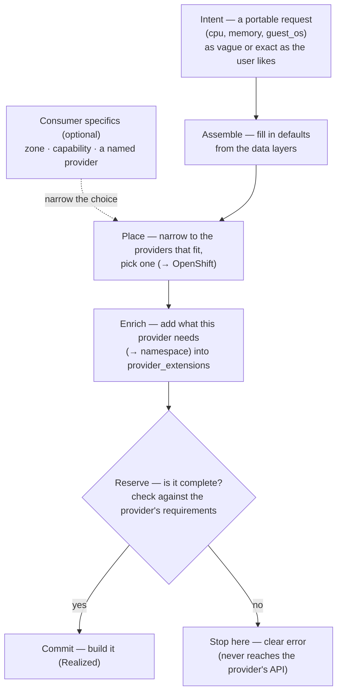

# Request realization — the stage

**What this settles:** how an abstract, portable request becomes one a *specific* provider can actually
build — filled in and checked before anything is created. This is the model's telling: the pieces in play
and the rules that always hold, told without reference to any particular engine. How a real engine performs
it is the DCM companion, [`docs/flows/request-realization.md`](https://github.com/dcm-project/dcm/tree/main/docs/flows/request-realization.md).

**In one breath.** A user asks for *a VM this size*; the OpenShift-specific parts like the `namespace` are
usually left to the system to fill in. The system picks a provider, fills in whatever that provider needs
(OpenShift wants a `namespace`; VMware wants a `cluster`), checks the result is complete, and only then
builds it. Portable in, provider-ready out — never dispatched half-built.

## Start vendor-agnostic; add specifics on top

Every request starts from a **vendor-agnostic base**. A portable `Compute.VirtualMachine` carries the things
true of *any* VM — `guest_os`, size, disks, networks — and deliberately leaves out one provider's mechanics
like OpenShift's `namespace`. Keeping those off the base is what makes the type portable: another provider
can still read it ([ADR-016](../adr/ADR-016-resource-type-role-graph-audit-not-config.md) — the type models
the graph and audit surface; provider-specific config is stored separately).

Provider-specific details get added *on top* of that base, and there are two ways in:

- **The system adds them** after it picks a provider — the usual path, and the flow below.
- **The consumer adds them at intent time** — a consumer *may* pin a `namespace`, a vendor QoS class, any
  provider-specific extension, right in the request. That's allowed and honored; it's simply **flagged as
  breaking portability** so the trade is explicit (`PRV-010`).

So the base is always portable, and going beyond it is a choice made with eyes open. The running example
takes the common path: *the user gave cpu and memory, left the OpenShift specifics to the system, and
OpenShift needs a `namespace` — where does it come from?* The answer is a real step in the flow.

## The flow

Step by step, with `namespace` threaded through:

**1. Intent — the user asks for what they want.** The **required** part is the portable base — the user is
never *forced* to supply anything provider-specific. They *may* add provider-specific extensions (even the
`namespace`) if they want; those are honored and flagged as non-portable. How much they pin down is their
choice, from vague to exact — see [the specificity scale](#the-specificity-scale). In the common case they
leave the provider-specifics to the system.

**2. Assemble — fill in the defaults.** The data layers (platform, profile, tenant, then the user's own
values on top) resolve the fields, and every field remembers where its value came from. The request now has
cpu, memory, guest_os — still no `namespace`, because no layer on a portable type carries a provider-specific
field.

**3. Place — pick a provider that fits.** The system narrows to the providers that satisfy the request and
the policies (sovereignty, cost, capability), then picks one. The vaguer the request, the more providers fit
and the more the system decides; the more exact, the fewer fit. Only now — with a specific provider chosen —
do we know what that provider requires. (OpenShift needs a `namespace`; VMware would need a `cluster`.)

**4. Enrich — add what this provider needs.** The system compares what the provider requires against what
the request already has, and fills the difference — here, `namespace`. The value lands in
`provider_extensions` (kept separate from the portable type) with its origin recorded, and
`enrichment_status` moves toward `complete`. *Where* the value comes from is the organization's choice — see
[Where the value comes from](#where-the-value-comes-from).

**5. Reserve — check before building.** The provider validates the filled-in request against its own
requirements, without creating anything. Complete → it holds a spot and the flow commits. Still missing
something → the request stops here with a clear, field-level error. An incomplete VM never reaches
OpenShift's API; the gap surfaces as a plain validation failure, not a runtime crash.

**6. Commit — build it.** The provider creates the VM, reports back what it built and the id that ties the
UDLM record to the provider's native one, and DCM records the result. What was *asked* and what was *built*
are both stored, so they can be compared later.

## Where the value comes from

Step 4 fills a field the request didn't *already* carry — `namespace`. (If the user supplied it themselves
at intent time, it's already set — and flagged non-portable — so this step leaves it alone.) **The model
doesn't dictate where the value comes from.** There are a few valid ways, and the organization picks:

- **A data layer for the requestor** — a tenant (or profile) layer carries a default, e.g. the tenant's
  standing namespace. The value is simply *there*; nothing computes it. Good when the mapping is simple and
  standard.
- **A policy** — an enrichment policy derives it, e.g. `namespace = f(tenant)`. Good when the value depends
  on context or needs a rule.
- **A plain default** — a fixed fallback, when neither of the above applies.

They aren't competing options the system guesses between — they compose in a defined precedence: the data
layers set defaults (a tenant or provider layer can carry one), the consumer's own value overrides those
defaults if they gave one, an enrichment policy fills or derives whatever is still missing, and a
compliance policy can override *anything* — even the consumer's value — for sovereignty or security. The
authoritative order is the merge rules in
[`layering-and-versioning.md`](../../foundations/layering-and-versioning.md) §5, with §5a governing what a
consumer is allowed to override. Whichever wins is recorded, so *"why this namespace"* always has an answer.
What the model insists on is only the outcome: **every field the provider requires has a value, with a
recorded origin, before reserve** — however it got there.

## The specificity scale

A request can be as vague or as exact as the user wants, and the system handles the whole range the same
way. The three points below are markers on one scale, not three separate cases:

| Request | What the user pins down | Providers that fit | Who chooses |
|---|---|---|---|
| **Abstract** | Just the essentials — a VM, cpu, memory, guest_os | Widest — any provider of the type | The system picks the best |
| **Partial** | A few things that matter — a region, a capability, a network | Narrowed to those that fit | The system picks within that |
| **Finite** | The placement itself — a named provider or cluster | Smallest — often exactly one | The user chose; the system just checks it's allowed |

Placement always does the same thing: start with every provider of the type, keep the ones that satisfy the
user's specifics *and* policy, pick from what's left. Abstract is that with no user specifics; finite is it
narrowed to one; partial is everything between. **Adding detail only ever narrows the choice** — it can't
widen it past what policy allows.

**The trade:** ask for less and get flexibility (more providers fit, the system optimizes, the resource
stays portable); ask for more and get precision (fewer fit, and you may tie the request to one provider's
ground). Neither is more correct — it's the user's call, and the flow runs the same either way.

(Grounded in the specificity spectrum, `contracts/policy-contract.md` §2.4; the request `placement` block;
and soft-vs-hard dependencies, `contracts/provider-contract.md` §1b — "any resolvable name" vs "this exact
FQDN" is the same idea one level down.)

## The rules that always hold

Whatever engine runs this flow:

- **The required data is portable** — the user is never *required* to supply anything provider-specific; the
  portable base is always enough. They *may* add provider-specific extensions at intent time — that's allowed
  and honored, and flagged as breaking portability ([ADR-016](../adr/ADR-016-resource-type-role-graph-audit-not-config.md); `PRV-010`).
- **How much to pin down is the user's dial, and it only narrows** — every request from abstract to finite
  is valid; more detail means fewer providers fit, never more.
- **Nothing is built until it's complete** — reserve checks the filled-in request against the provider's
  requirements first; an incomplete request is stopped, not dispatched.
- **Every value remembers where it came from** — a layer, the user, a policy, or a default; and
  `enrichment_status` says honestly whether it is `pending`, `partial`, or `complete`.
- **Provider-specific values stay off the portable type** — they live in `provider_extensions`, flagged as
  non-portable ([ADR-016](../adr/ADR-016-resource-type-role-graph-audit-not-config.md); `PRV-010`).
- **"Enough" is the provider's to define** — the provider's required-data schema is what "provider-ready"
  means; the system doesn't guess it.

## What UDLM leaves to DCM

UDLM sets the stage; it doesn't perform. These are the engine's to decide (see the DCM companion):

- **The engine itself** — how assembly, placement, and enrichment are wired and ordered.
- **The actual enrichment rules** — the real `namespace = f(tenant)` rule is content an organization writes;
  UDLM guarantees the *step* exists and checks its result, DCM supplies the *rule*.
- **How a provider is scored, and how reserve/commit are called.**

The performance: [dcm-project/dcm `docs/flows/request-realization.md`](https://github.com/dcm-project/dcm/tree/main/docs/flows/request-realization.md).

## Data · Policy · Provider (required lens — SPEC-DESIGN §29)

- **Data (UDLM):** the portable request, the four states, `provider_extensions` for provider-specific
  values, and the provenance behind every field.
- **Policy (DCM/org):** which provider gets chosen, and how the provider-required fields get filled.
- **Provider:** declares what it needs ("enough"), and checks the request at reserve.

## Where each piece is specified

| Piece | Governing spec |
|---|---|
| Provider-specific config off the portable type | [ADR-016](../adr/ADR-016-resource-type-role-graph-audit-not-config.md) · `PRV-010` |
| Provider declares the data it requires | `contracts/provider-contract.md` §base-level #2 |
| Data layers + provider-aware enrichment | [`foundations/layering-and-versioning.md`](../../foundations/layering-and-versioning.md) |
| Enrichment as a policy | `contracts/policy-contract.md` §12 |
| Reserve-then-commit (check before build) | [ADR-011](../adr/ADR-011-validate-and-reserve.md) |
| The four states (Intent → Requested → Realized) | [`foundations/four-states.md`](../../foundations/four-states.md) |
