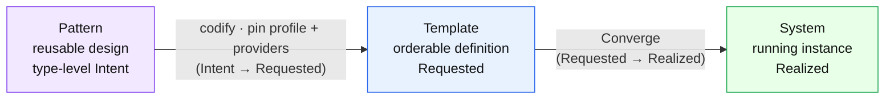
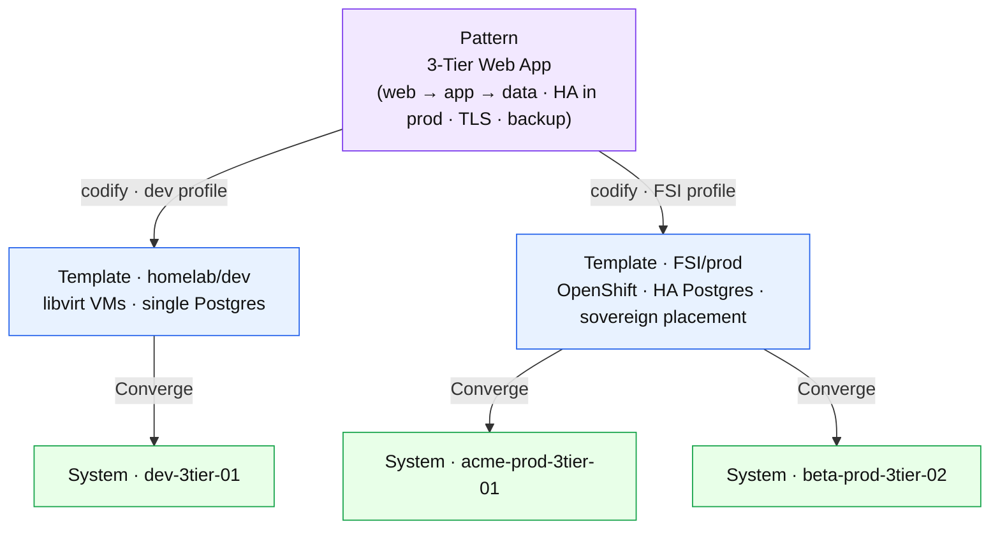
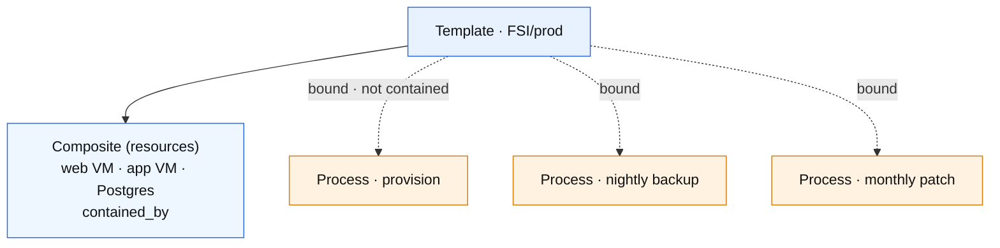
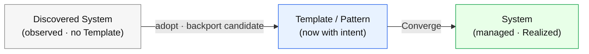

# Template assembly — Pattern → Template → System

**What this settles:** the assembly-scale telling of the lifecycle — how a *reusable design* becomes an *orderable definition* becomes a *running system*. The three tiers are not a new taxonomy: they are **Intent → Requested → Realized** ([lifecycle-convergence](lifecycle-convergence.md)) one scale up. The engine is [request-realization](request-realization.md) generalized to a whole assembly; the decision and the *why* are **ADR-033 (Templates)**.

The three tiers:

- **Pattern** — the reusable, provider-neutral design ("how a 3-tier app is built"). Names shape and rules, not parts; **not orderable**. It is **type-level Intent** (design-time), and it lives in Knowledge as `Antipattern`'s positive twin.
- **Template** — that design **resolved** by policy/profile into a concrete, **orderable** definition. It is the assembly's **Requested** state. ≈ a **TOSCA Service Template** / **OAM Application**.
- **System** — the Template **Realized**: real instances with the provider's specific output (IDs, addresses).

---

## 1 · The spine — two arrows, both already in the model

Going down the tiers is the request-realization pipeline, at assembly scope. The first arrow is **codification** (a design is resolved into a concrete request); the second is **Converge** (a request is realized).

*Neither arrow is new. `Pattern → Template` is `resource_type → request` (authoring — pick the design, resolve it under a profile). `Template → System` is `request → realized` (Converge). The whole doc is [request-realization](request-realization.md) with "one resource" replaced by "one assembly."*

---

## 2 · One design, many concrete definitions, many instances

The fan-out is why the tiers are distinct objects, not stages of one record. A **Pattern** is resolved once **per profile / provider set** into a Template; a **Template** is converged once **per environment** into a System — exactly as one `resource_type` yields many requests, and one request yields many realized instances.

| Tier | In the example | State | What is pinned |
|---|---|---|---|
| **Pattern** | "3-Tier Web App" — tiers, dependencies, "data tier HA in prod", TLS, a backup process | Intent (type-level) | nothing concrete — no product, size, or provider |
| **Template** | "FSI/prod" — OpenShift, HA Postgres, sovereign placement, audit-heavy; params: hostname prefix, DB size, replica count | Requested | every blank has a real type + provider; **orderable** |
| **System** | "acme-prod-3tier-01" — three pods/VMs with UUIDs+IPs, a Postgres with a connection string, backup scheduled, cert issued | Realized | the provider's actual output |

*Gut-check for any artifact: names no providers/sizes → **Pattern**; orderable, everything pinned → **Template**; one-of, with live IDs → **System**.*

---

## 3 · What a Template is made of — a Composite plus bound processes

A Template composes **consumables** (resources and processes are both consumables; ADR-030). Its resources are a **`Composite`** (structural constituents, `contained_by` — the `entity_type` value being renamed `single | multi`, task #58); its processes are **bound** (operational binding — the subscription `manages` model), **not** contained. Both a Composite's constituents and a Template's resources stay **same-family** (Resources) — cross-family combination (Resources + Processes) is what *binding* is for.

*A backup is not a **part** of the stack the way a VM is — it **operates on** it. Each bound activity fires on a **trigger** (lifecycle hook / schedule / event); **Day 0/1/2 is a lens over those triggers, not a field** ([lifecycle-convergence §5](lifecycle-convergence.md)). This is why a Template does not widen `Composite` to hold mixed-family constituents — binding stays binding.*

---

## 4 · Brownfield — a System with no Template

A running assembly that DCM did not create is **Discovered** (observed reality, no intent). It joins the model the same way any observed thing does — by **adoption**: backport a candidate Template/Pattern from the discovered state, run Converge in dry-run, compare projected vs discovered, tweak to the faithfulness knob, then approve.

*Same machinery as a single discovered resource ([lifecycle-convergence §1](lifecycle-convergence.md)) — greening the brownfield is just adoption at assembly scale. It is also the **derive** direction of the architecture-format on-ramp (ADR-033): capture a running System as a reusable Template/Pattern.*

---

## What UDLM decides, and what it hands to DCM

- **UDLM (the stage):** the three tiers, the edges (`contained_by` for the Composite, `binds_to` for the bound processes), and the invariant that a System is a Template Realized — nothing more, nothing less than its intent plus the provider's output.
- **DCM (the actors):** *how* a Pattern resolves into a Template (profile + placement + enrichment — the Intent → Requested policy), and *how* a Template converges into a System (the provider mechanism). Both are realization; a conformant peer may do either differently.

## Data · Policy · Provider
- **Data** — Pattern is Knowledge (type-level intent); Template is a catalog definition (Requested); System is a realized composite + bound-activity records (Realized).
- **Policy** — resolving a Pattern into a Template *is* policy (Intent → Requested); each binding's `lifecycle_policy` governs suspend/cancel propagation across the System.
- **Provider** — constituents are fulfilled by their ordinary providers; bound processes by process/automation providers; a *composable-infrastructure* provider may assemble constituents from pools (a capability, ADR-004 — not a tier).

## Where each piece is specified
| Piece | Home |
|---|---|
| The tiers + the decision (Blueprint→Template, standards anchors, interop on-ramp) | **ADR-033** |
| Intent / Requested / Realized, Converge, adoption | ADR-030 · [lifecycle-convergence](lifecycle-convergence.md) |
| The shared pipeline (assemble → place → enrich → reserve → converge) | [request-realization](request-realization.md) |
| Consumables, binding, `lifecycle_policy` triggers | `lifecycle/subscription-lifecycle.md`; ADR-006 |
| `Composite` (structural constituents) | ADR-027 |

## The whole story in one line

A **Pattern** (reusable design · Intent) is **codified** into a **Template** (orderable definition · Requested), which is **Converged** into a **System** (running instance · Realized) — the lifecycle you already have, one scale up. See ADR-033 for the decision and the *why*.
