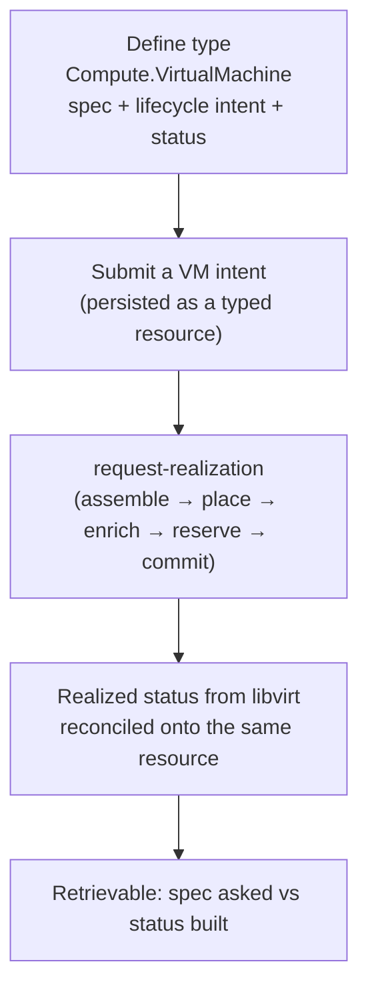

# UC-01 · VM as a first-class UDLM resource — the stage

**What this settles:** what the `Compute.VirtualMachine` *type itself* is made of — the spec a user submits, the lifecycle intent, and the realized status the provider hands back — so a VM is a typed, retrievable resource, not a bag of provider fields. A **lighter** flow — it **builds on [request-realization](request-realization.md)** and documents only what this case adds.

> **Use Case:** `libvirt-vm-provider/standard/vm-resource-representation`. **Persona:** platform-operator · **Profile:** standard.

**In one breath.** request-realization shows how a VM *request* gets built. This case is one level earlier: it defines the VM type that request is an instance of. A `VirtualMachine` carries a portable **spec** (placement, resources, storage, networks) and a **lifecycle intent**; once realized, the libvirt provider's **status** is reconciled back onto the same resource — so intent and reality live in one record.

## What this adds over request-realization

- **The type, not just a request of it.** request-realization assumes `Compute.VirtualMachine` exists; here the platform-operator *defines* it — its spec fields and its status shape.
- **Spec / status split on one resource.** Spec is what was asked (portable base per [ADR-016](../adr/ADR-016-resource-type-role-graph-audit-not-config.md)); status is what the provider realized. Both hang off the same typed record so they can be compared.
- **Realized status reconciles back.** The libvirt/KVM provider reports native facts (assigned host, disk paths, power state) and those land in status — the [four-states](../../foundations/four-states.md) Realized side, made concrete for a VM.

## The flow — only what's different

Everything between Submit and Realized is request-realization.

## Success criteria (from the UC)

- UDLM defines a `VirtualMachine` resource with spec (placement, resources, storage, networks), lifecycle intent, and status.
- A submitted VM intent is persisted and retrievable as a typed resource.
- Realized status (from the provider) is reconciled back onto the resource.

## Data · Policy · Provider

- **Data:** the `Compute.VirtualMachine` type — portable spec base, lifecycle intent field, and a status subresource for realized facts.
- **Policy:** system defaults only here (`system_defaults_only`); enrichment/placement are request-realization's job.
- **Provider:** libvirt/KVM realizes the VM and reports status back for reconciliation.

## Pointers

- Base flow: [request-realization](request-realization.md). UC source: `libvirt-vm-provider/standard/vm-resource-representation`.
- The four states (Intent → Requested → Realized): [`foundations/four-states.md`](../../foundations/four-states.md).
