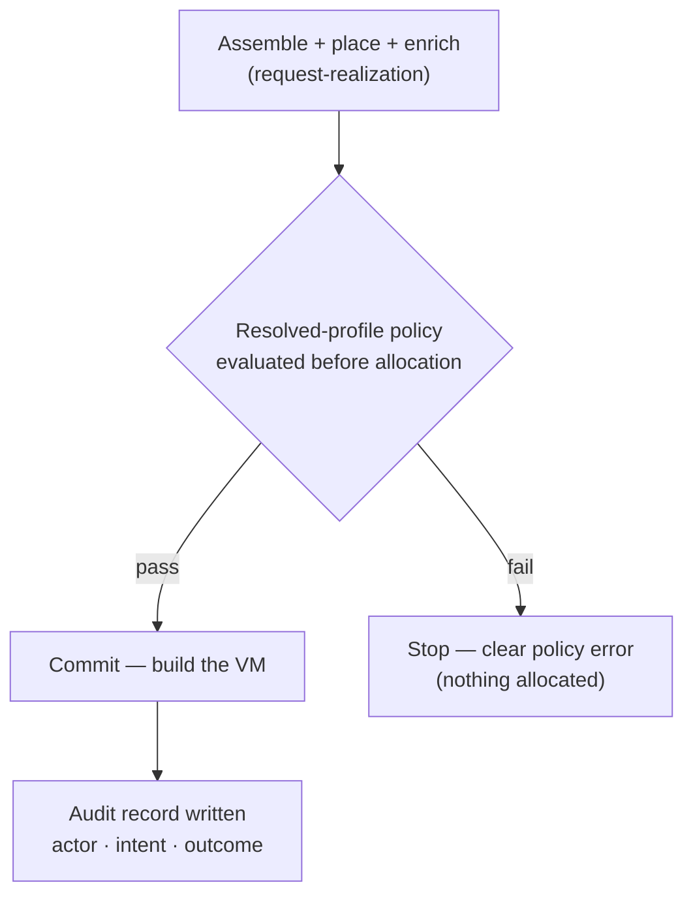

# UC-01 · Standard VM provision — the stage

**What this settles:** the plainest realization there is — a standard-profile VM, one eligible provider, one
policy check — and the two guarantees that ride along with it: an **audit record** of who asked for what and
what happened, and **idempotency** (re-asking doesn't build a second VM). A **lighter** flow — it **builds on
[request-realization](request-realization.md)** and documents only what this case adds.

> **Use Case:** `compute/vm-standard-provision` — set 29 (FF Extended Target). **Persona:** application-team-member · **Profile:** standard.

**In one breath.** An application team asks for a VM in the standard profile. The system runs the profile's
policy check, allocates through the one eligible provider, and writes an audit record carrying actor, intent,
and outcome — and if the same request comes again, it converges onto the existing VM rather than making a new one.

## What this adds over request-realization
- **Nothing new about assembly or placement** — standard profile, single eligible provider, so placement has
  exactly one candidate and enrichment fills the provider's required fields as always.
- **Policy runs before allocation** — the *resolved-profile* policies (the standard profile's set) are
  evaluated before anything is reserved. Single validation, not gating branches.
- **Audit is a first-class outcome** — the realization event is recorded with **actor · intent · outcome**,
  not just the resulting `Realized` record. This is a success criterion, not a side effect.
- **Idempotency is required** — repeating the request matches the existing resource and is a no-op. The
  mechanics of that match live in [UC-05](uc-05-idempotent-reconvergence.md); here it's just a stated guarantee.

## The flow — only what's different

Everything else (assemble, place, enrich, reserve, commit, converge) is request-realization.

## Success criteria (from the UC)
- VM is created and reachable for the requesting team.
- The applicable resolved-profile policies are evaluated **before** allocation.
- Provisioning is recorded in the audit trail with **actor, intent, and outcome**.
- The request is idempotent — repeating it does not create duplicate VMs.

## Data · Policy · Provider
- **Data:** the portable `Compute.VirtualMachine`, its four states, and the audit record binding actor ·
  intent · outcome to the realization event.
- **Policy:** the standard profile's resolved policy set, evaluated as a single validation before allocation.
- **Provider:** the one eligible service provider allocates the VM and reports its native id back.

## Pointers
- Base flow: [request-realization](request-realization.md). Idempotency detail: [UC-05](uc-05-idempotent-reconvergence.md).
- UC source: `compute/vm-standard-provision`.
