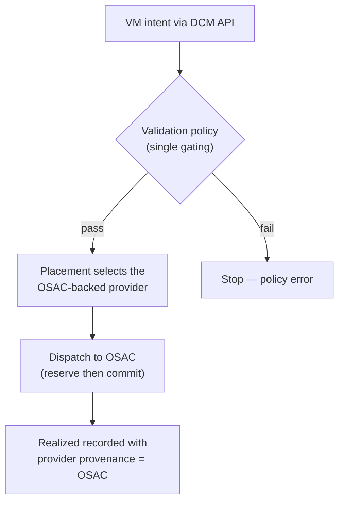

# UC-02 · VM intent onto OSAC — the stage

**What this settles:** that an OSAC-backed provider is *just a provider* — DCM stays the governing control
plane, OSAC is chosen at placement and dispatched to like any other, and the realized record carries
provenance naming OSAC. A **lighter** flow — it **builds on [request-realization](request-realization.md)**
and documents only what this case adds.

> **Use Case:** `compute/vm-intent-osac-placement`. **Persona:** application-team-member · **Profile:** standard.

**In one breath.** A consumer submits a VM intent through the DCM API; validation policies run; the placement
engine selects the OSAC-backed provider; the request is dispatched to OSAC for realization; and the `Realized`
state records provider provenance identifying OSAC — the whole intent-to-realized path auditable end to end.

## What this adds over request-realization
- **OSAC is a provider, not a dependency** — placement treats the OSAC-backed provider as one candidate among
  the eligible set. The base placement step is unchanged; what's proven here is that a specific provider
  *kind* participates through the ordinary contract.
- **Provider provenance is explicit** — the `Realized` record names OSAC as the realizing provider. Provenance
  is already part of the four-state model; this UC makes "which provider" a checked outcome.
- **Validation gates before placement** — a single gating policy runs before the placement engine selects,
  same shape as the base's policy phase.
- Everything after selection — enrich, reserve, commit — is request-realization unchanged.

## The flow — only what's different

Everything else (assemble, enrich, reserve, commit, converge) is request-realization.

## Success criteria (from the UC)
- Consumer submits the VM intent through the DCM API.
- Validation policies are evaluated **before** placement.
- The placement engine selects the OSAC-backed service provider.
- The request is dispatched to OSAC for realization.
- `Realized` state is recorded with provider provenance identifying OSAC.
- The provisioned VM is reachable and operational; the full intent-to-realized lifecycle is auditable.

## Data · Policy · Provider
- **Data:** the portable VM intent, and the `Realized` record carrying OSAC provenance.
- **Policy:** a single gating validation before placement; the placement engine selecting OSAC.
- **Provider:** the OSAC-backed service provider realizes the VM through the ordinary provider contract.

## Pointers
- Base flow: [request-realization](request-realization.md). UC source: `compute/vm-intent-osac-placement`.
