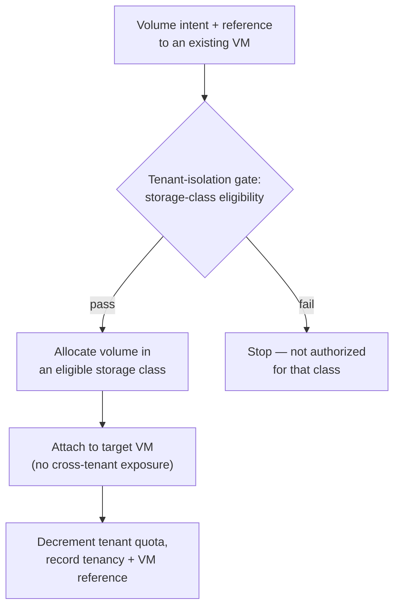

# UC-03 · Persistent volume with attach — the stage

**What this settles:** the first case with a **dependency in the payload** — a block volume that must attach
to an existing VM — plus tenant-plane isolation, data residency, and quota accounting. A **lighter** flow —
it **builds on [request-realization](request-realization.md)** and documents only what this case adds.

> **Use Case:** `data/persistent-volume-provision` — set 29 (FF Extended Target). **Persona:** application-team-member · **Profile:** dev.

**In one breath.** A dev team asks for a persistent block volume attached to a VM they already own. The
storage provider allocates it from a storage class the tenant is authorized to use, attaches it to the target
VM without cross-tenant exposure, decrements the tenant's quota, and records both the provisioning and the
attachment — all in the dev profile.

## What this adds over request-realization
- **A cross-resource dependency** — the request references an *existing* `Compute.VirtualMachine`. Placement
  and reserve must resolve and honor that reference, not just stand up an isolated resource.
- **Tenant isolation at the storage plane** — a gating policy checks the request against the tenant's storage
  class eligibility before allocation, and the attach must not expose the volume across tenants.
- **Quota is state that moves** — the tenant's quota is decremented to reflect consumed capacity; the volume
  record carries the tenancy and the VM reference.
- **Two provider interactions, not one** — the storage provider allocates the volume, then attaches it to the
  target VM. Reserve checks both are satisfiable before either is committed.

## The flow — only what's different

Everything else (assemble, place, enrich, reserve, commit, converge) is request-realization.

## Success criteria (from the UC)
- Volume is created in a storage class the tenant is authorized to consume.
- Volume is attached to the target VM without cross-tenant exposure.
- Tenant quota is updated to reflect the new consumption.
- Provisioning and attachment are recorded in the audit trail.

## Data · Policy · Provider
- **Data:** the volume record with tenancy and the VM reference; the tenant quota it decrements.
- **Policy:** tenant-isolation gating on storage-class eligibility, and any data-residency constraint.
- **Provider:** the storage provider allocates the volume; a service provider attaches it to the VM.

## Pointers
- Base flow: [request-realization](request-realization.md). UC source: `data/persistent-volume-provision`.
