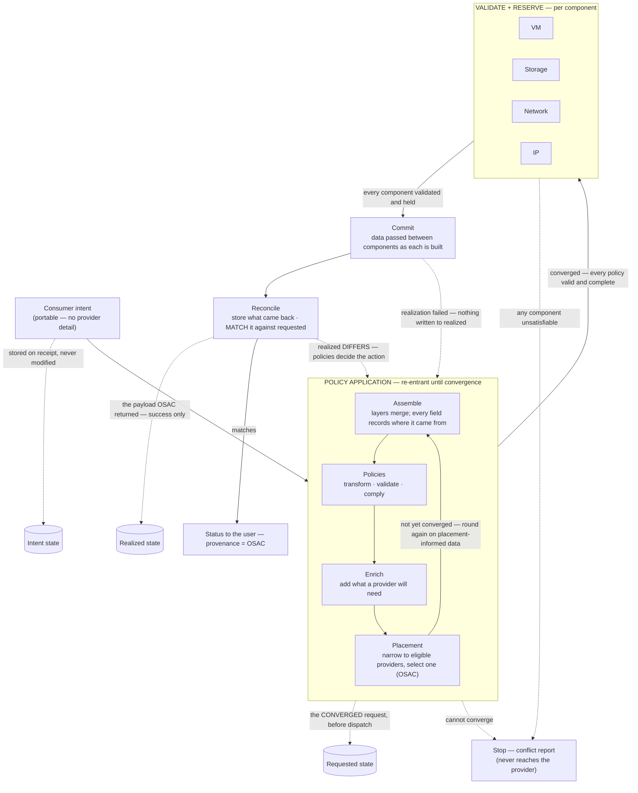

# UC-04 · Intent to VM placement on OSAC — the stage

**What this settles:** that an OSAC-backed provider is *just a provider* — DCM stays the governing control
plane, OSAC is chosen at placement and dispatched to like any other, and the realized record carries
provenance naming OSAC. A **lighter** flow — it **builds on [request-realization](request-realization.md)**
and documents only what this case adds.

> **Use Case:** `compute/vm-intent-osac-placement`. **Persona:** application-team-member · **Profile:** standard.

**In one breath.** A consumer submits a VM intent through the DCM API; validation policies run; the placement
engine selects the OSAC-backed provider; the request is dispatched to OSAC for implementation; and the `Realized`
state records provider provenance identifying OSAC — the whole intent-to-realized path auditable end to end.

## What this adds over request-realization
- **OSAC is a provider, not a dependency** — placement treats the OSAC-backed provider as one candidate among
  the eligible set. The base placement step is unchanged; what's proven here is that a specific provider
  *kind* participates through the ordinary contract.
- **Provider provenance is explicit** — the `Realized` record names OSAC as the realizing provider. Provenance
  is already part of the four-state model; this UC makes "which provider" a checked outcome.
- Everything after convergence — reserve, commit — is request-realization unchanged.

## The flow

The loop runs **assemble → validate → enrich → placement**, then round again — until every policy is
valid and complete. Layer assembly, transformation, validation and enrichment all happen *before*
placement; placement is the **last step of an iteration**, and what it chooses is data the earlier steps
have not seen. There is no separate post-placement phase: **the post-placement work is the next
iteration.** Only once it converges does each component validate and reserve, and only when every
component holds does anything commit.

**Why the loop matters.** A single forward pass cannot work: a policy that depends on *where* a resource
lands can only be satisfied once a placement exists, and satisfying it can invalidate the placement that
produced it. So the payload goes round again rather than through a separate post-placement stage. The
loop is bounded — the convergence limit is an engine parameter, and failure to converge is a full conflict
report, never a silent best-effort (see [ADR-006](../adr/ADR-006-convergence-control-model.md)).

**Why reserve is per component.** A VM request is not one thing. The VM, its storage, its network
attachment, and its IP are separate resources with separate providers and separate ways of failing.
Each is validated and held before *anything* is built, so a request that cannot be satisfied fails while
nothing has been created ([ADR-011](../adr/ADR-011-validate-and-reserve.md)).

---

## Who provides what, and when — and what THIS case changes

The lifecycle answer — the personas, what a request contains, what is added and by whom, why nobody
sets placement, and the VM-with-network-and-storage example — lives once in
[request-realization § Who provides what, and when](request-realization.md#who-provides-what-and-when).
It holds for every use case; only the delta belongs here.

**What UC-04 changes:** one row of that table, and only its *value*.

| | Lifecycle answer | UC-04 |
|---|---|---|
| Who declares capability, capacity, residency | cloud-operator / provider-owner | **an OSAC cloud-operator** — the residency guarantee is real, not nominal |
| Provider-specific fields added at enrich | the selected provider's Provider Class | **OSAC's** — namespace, native storage class, native subnet |
| Which persona sets placement | nobody; it is derived | **unchanged** — OSAC is *selected*, never assigned |
| Reserved facts at reserve | from the component's provider | **unchanged** |

That last row is the point of the whole use case: a sovereign cloud participates through the ordinary
contract. If UC-04 needed a *different* answer to any of these questions, OSAC would not be "just a
provider" — and the claim this flow settles would be false.

## Success criteria (from the UC)
- Consumer submits the VM intent through the DCM API.
- Validation policies are evaluated **before** placement — and again after it, on the placement-informed payload.
- The placement engine selects the OSAC-backed service provider.
- The request is dispatched to OSAC for implementation.
- `Realized` state is recorded with provider provenance identifying OSAC.
- The provisioned VM is reachable and operational; the full intent-to-realized lifecycle is auditable.

## Data · Policy · Provider
- **Data:** the portable VM intent, the assembled payload with field-level provenance, and the `Realized`
  record carrying OSAC provenance.
- **Policy:** the whole convergence block — assemble, policy, placement, and enrichment are one re-entrant
  application, not a sequence with a gate in front of it.
- **Provider:** the OSAC-backed service provider declares capability and capacity, answers the reserve, and
  realizes the VM through the ordinary provider contract.

## Pointers
- Base flow: [request-realization](request-realization.md). UC source: `compute/vm-intent-osac-placement`.
- Authoritative assembly process (steps 1–9, exact policy phases):
  [`layering-and-versioning.md` §6](../spec/foundations/layering-and-versioning.md); the rendered
  placement loop is in the [annex](../spec/foundations/layering-and-versioning-annex.md).
