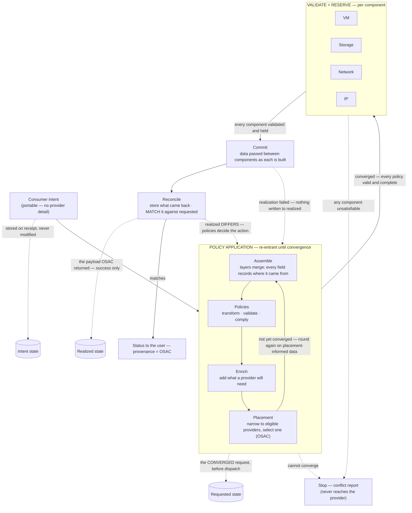
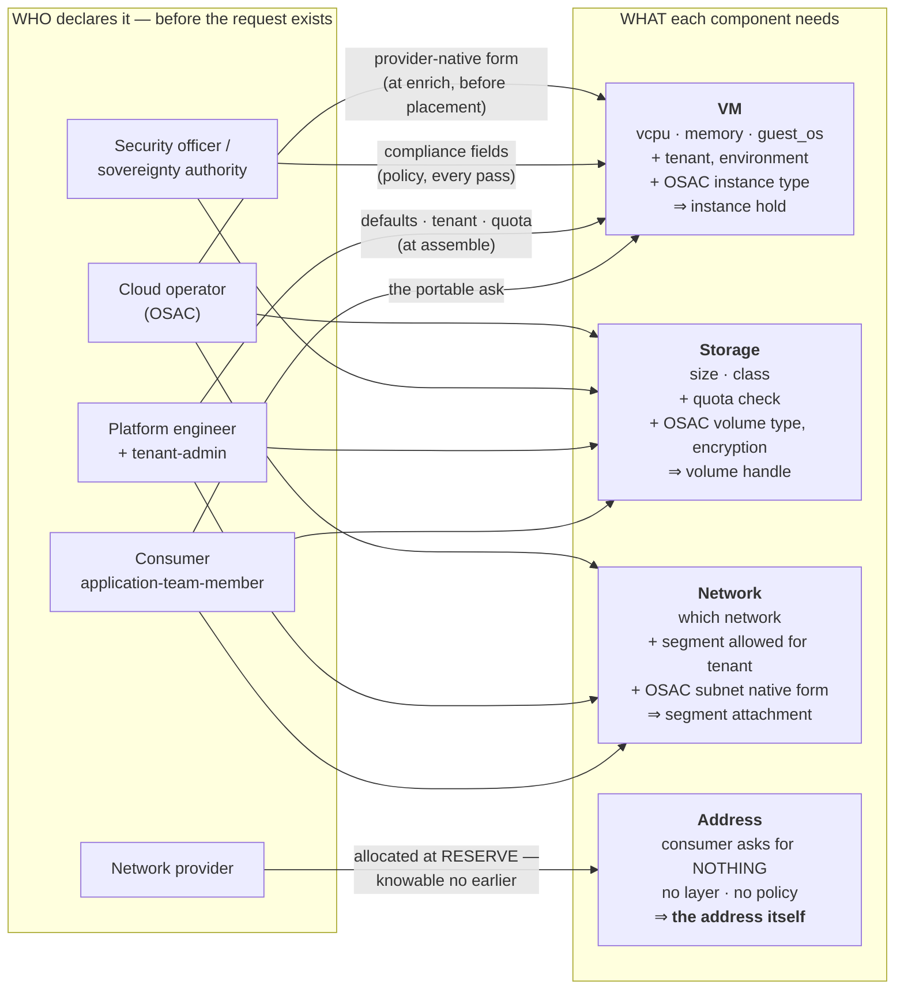

# UC-04 · Intent to VM placement on OSAC — the stage

**What this settles:** that an OSAC-backed provider is *just a provider* — DCM stays the governing control
plane, OSAC is chosen at placement and dispatched to like any other, and the realized record carries
provenance naming OSAC. A **lighter** flow — it **builds on [request-realization](request-realization.md)**
and documents only what this case adds.

> **Use Case:** `compute/vm-intent-osac-placement`. **Persona:** application-team-member · **Profile:** standard.

**In one breath.** A consumer submits a VM intent through the DCM API; validation policies run; the placement
engine selects the OSAC-backed provider; the request is dispatched to OSAC for implementation; and the `Realized`
state records provider provenance identifying OSAC — the whole intent-to-realized path auditable end to end.

## What this adds over request-realization
- **OSAC is a provider, not a dependency** — placement treats the OSAC-backed provider as one candidate among
  the eligible set. The base placement step is unchanged; what's proven here is that a specific provider
  *kind* participates through the ordinary contract.
- **Provider provenance is explicit** — the `Realized` record names OSAC as the realizing provider. Provenance
  is already part of the four-state model; this UC makes "which provider" a checked outcome.
- Everything after convergence — reserve, commit — is request-realization unchanged.

## The flow

The loop runs **assemble → validate → enrich → placement**, then round again — until every policy is
valid and complete. Layer assembly, transformation, validation and enrichment all happen *before*
placement; placement is the **last step of an iteration**, and what it chooses is data the earlier steps
have not seen. There is no separate post-placement phase: **the post-placement work is the next
iteration.** Only once it converges does each component validate and reserve, and only when every
component holds does anything commit.



**Why the loop matters.** A single forward pass cannot work: a policy that depends on *where* a resource
lands can only be satisfied once a placement exists, and satisfying it can invalidate the placement that
produced it. So the payload goes round again rather than through a separate post-placement stage. The
loop is bounded — the convergence limit is an engine parameter, and failure to converge is a full conflict
report, never a silent best-effort (see [ADR-006](../adr/ADR-006-convergence-control-model.md)).

**Why reserve is per component.** A VM request is not one thing. The VM, its storage, its network
attachment, and its IP are separate resources with separate providers and separate ways of failing.
Each is validated and held before *anything* is built, so a request that cannot be satisfied fails while
nothing has been created ([ADR-011](../adr/ADR-011-validate-and-reserve.md)).

---

## Who provides what, and when

The four questions engineering needs answered from this flow. **Who and what — deliberately not how.**

### 1. The personas

| Persona | What they do for this request | When |
|---|---|---|
| **application-team-member** | Submits the intent. This is the *only* per-request actor. | at request |
| **platform-engineer** | Maintains the data layers that supply defaults (environment, zone, tags). | before, standing |
| **tenant-admin** | Binds the tenant: isolation, quota, which storage classes and networks it may use. | before, standing |
| **security-officer** · **sovereignty-authority** | Author the policies that constrain where and how the request may be realized. | before, standing |
| **cloud-operator** (OSAC) · **provider-owner** | Declare the provider's capabilities, capacity, and residency guarantees. | before, standing |

**Only one persona acts per request.** Everything else was declared earlier as governed data — which is
the point: a request succeeds because other people's declarations were already in place, not because
someone was asked at the time.

### 2. What a user request contains

Only the **portable** fields the type declares as consumer-supplied:

```yaml
resource_type: Compute.VM
vcpu: 4
memory: 16GiB
guest_os: <reference to a governed OS image>
network: <reference to a governed network>
storage: [{ size: 100GiB, class: <reference to a governed storage class> }]
```

What a consumer **never** supplies: the provider, the host, the datastore path, the namespace, the IP
address, the volume handle. Those are either derived or supplied by someone else. A consumer *may*
narrow the choice (a zone, a required capability, even a named provider) — that is allowed and recorded
as a non-portable pin, but it is **narrowing**, not placing.

### 3. What must be added before a provider can act — and who supplies it

| What is added | Who supplies it | When |
|---|---|---|
| Defaults — environment, zone, tags | the data layers (platform-engineer) | assemble |
| Tenant identity, quota, allowed classes | the tenant binding (tenant-admin) | assemble |
| Compliance-driven fields and constraints | policies (security-officer, sovereignty-authority) | policy application |
| **The provider** | **nobody — derived by placement** | placement |
| Provider-specific fields (namespace, storage class native form) | the Provider Class declaration (provider-owner / cloud-operator) | enrich — **before** placement, refined each pass |
| Reserved facts — the IP, the volume handle, the segment | the provider, at reserve | validate + reserve |

Every one of these records **who set it** — field-level provenance is not a nice-to-have here; it is how
this table is answerable after the fact for a specific record.

### 4. Which persona sets placement

**None.** Placement is **derived** — the engine narrows to providers whose declared capability and
capacity satisfy the request, and whose selection satisfies every applicable policy. It is an *outcome*
of data other personas declared, not a decision anyone makes at request time.

This is the single most important thing to take from this flow. If a request lands somewhere unexpected,
nobody "set" it wrongly: either a capability declaration, a capacity advertisement, or a policy said so.
The placement record names which.

### 5. When policy is engaged — three times, not once

The clearest answer to *when*:

| # | Moment | What policy decides |
|---|---|---|
| 1 | **Convergence**, before dispatch | whether the payload is valid and complete — the loop |
| 2 | **On failure** of realization | the response. Nothing is written to realized; most likely the user is told |
| 3 | **On difference**, after realization | the action — notify, instruct the provider to change the resource, or update the request where the provider's change is the one that has to win |

Same mechanism, three moments. Neither UDLM nor DCM has a built-in action for (2) or (3): the model
carries the facts, policy carries the decision. A profile may extend what the options are.

### The three stores

| Store | What it holds | Written |
|---|---|---|
| **Intent** | what the consumer asked for | on receipt, never modified afterwards |
| **Requested** | what the system decided to ask the providers for | once the loop converges — that is what makes it storable |
| **Realized** | the payload the provider returned | on success only |

Reconcile matches **realized against requested** — which is why the middle one has to exist as a stored
record rather than a transient payload.

---

## Worked example — a VM with network and storage

One request, four components. Each needs different data, from a **different source**, at a **different
moment** — which is the whole reason this example is worth drawing rather than listing.



Read it as columns: **who** on the left, **what** in the middle, and the *when* on each arrow.

| Component | Consumer declares | Added at assemble/policy | Added at enrich (provider known) | Reserved fact |
|---|---|---|---|---|
| **VM** | vcpu, memory, guest_os | tenant, environment, compliance fields | OSAC instance type, image in native form | instance hold |
| **Storage** | size, storage class | quota check against the tenant's bound classes | OSAC volume type, encryption per policy | volume handle |
| **Network** | which network | segment allowed for this tenant | OSAC subnet in native form | segment attachment |
| **IP** | *nothing* | — | address family / pool from the segment | **the address itself** |

**The IP row is the teaching case.** The consumer never mentions an IP, no layer carries one, and no policy
sets one. It exists only as a *reserved fact* — the network provider allocates it during reserve and hands
it back, and it becomes part of the record with the provider named as its source. It cannot be known
earlier, which is exactly why reserve exists as its own phase before commit.

**Data flows between components at commit.** The VM needs the volume handle to attach it and the segment
attachment to connect. Those are pulled during validate-and-reserve in the ordinary case; a component may
need more during final provisioning, and the commit phase passes it as each is built.

**Four sources, four moments** — the table above is the same story in reference form: the consumer at
request time, the layers and tenant binding at assemble, policy on every pass, the provider's native form
at enrich (before placement), and the reserved facts at reserve. No single actor could have supplied all
of it, and no earlier moment could have produced the address.

---

## Success criteria (from the UC)
- Consumer submits the VM intent through the DCM API.
- Validation policies are evaluated **before** placement — and again after it, on the placement-informed payload.
- The placement engine selects the OSAC-backed service provider.
- The request is dispatched to OSAC for implementation.
- `Realized` state is recorded with provider provenance identifying OSAC.
- The provisioned VM is reachable and operational; the full intent-to-realized lifecycle is auditable.

## Data · Policy · Provider
- **Data:** the portable VM intent, the assembled payload with field-level provenance, and the `Realized`
  record carrying OSAC provenance.
- **Policy:** the whole convergence block — assemble, policy, placement, and enrichment are one re-entrant
  application, not a sequence with a gate in front of it.
- **Provider:** the OSAC-backed service provider declares capability and capacity, answers the reserve, and
  realizes the VM through the ordinary provider contract.

## Pointers
- Base flow: [request-realization](request-realization.md). UC source: `compute/vm-intent-osac-placement`.
- Authoritative assembly process (steps 1–9, exact policy phases):
  [`layering-and-versioning.md` §6](../spec/foundations/layering-and-versioning.md); the rendered
  placement loop is in the [annex](../spec/foundations/layering-and-versioning-annex.md).
