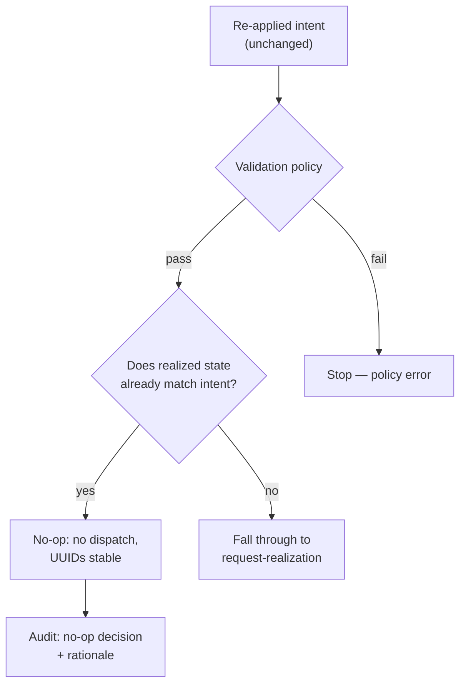

# UC-05 · Idempotent reconvergence — the stage

**What this settles:** re-applying an **unchanged** intent to an already-realized resource is a **no-op** — no
new dispatch, no provider calls, no duplicate resources, stable UUIDs — and that no-op is itself recorded. A
**lighter** flow — it **builds on [request-realization](request-realization.md)** and documents only the
short-circuit this case adds.

> **Use Case:** `compute/idempotent-reconvergence` — set 29 (FF Extended Target). **Persona:** application-team-member · **Profile:** standard.

**In one breath.** An application team re-applies an intent that matches what's already realized. The pipeline
accepts and processes it, sees that realized state already equals the intent, and stops before dispatch — the
resource is untouched, its UUIDs stay put, and the audit trail records a no-op with its rationale. This is the
guarantee safe reconvergence and rehydration depend on.

## What this adds over request-realization
- **A comparison, not a build** — the new step is intent-vs-realized equivalence. When they match, the flow
  short-circuits *before* reserve/commit; the base pipeline's remaining steps simply don't run.
- **This is a modification, not a new request** — `lifecycle_phase: modification`. The resource already
  exists; the question is only whether anything changed.
- **Stable identity** — resource UUIDs are not reassigned. A no-op must not perturb identity.
- **The no-op is auditable** — the decision and its rationale ("realized already matches intent") are
  recorded, so a reconvergence run is legible after the fact.

## The flow — only what's different

On a mismatch, everything (place, enrich, reserve, commit, converge) is request-realization.

## Success criteria (from the UC)
- The re-applied intent is accepted and processed through the pipeline.
- The system detects that realized state already matches the intent.
- No new provider dispatch occurs (no-op).
- No duplicate resources are created.
- The no-op decision and its rationale are recorded in the audit trail.
- Resource UUIDs remain stable (no reassignment).

## Data · Policy · Provider
- **Data:** the four-state stores — the compare is intent against realized; UUIDs stay stable.
- **Policy:** the validation policy still runs; the no-op decision is a recorded outcome.
- **Provider:** not called at all on a match — the point of the case.

## Pointers
- Base flow: [request-realization](request-realization.md). Convergence contract: this is the idempotence the
  base's re-entrant loop relies on. UC source: `compute/idempotent-reconvergence`.
