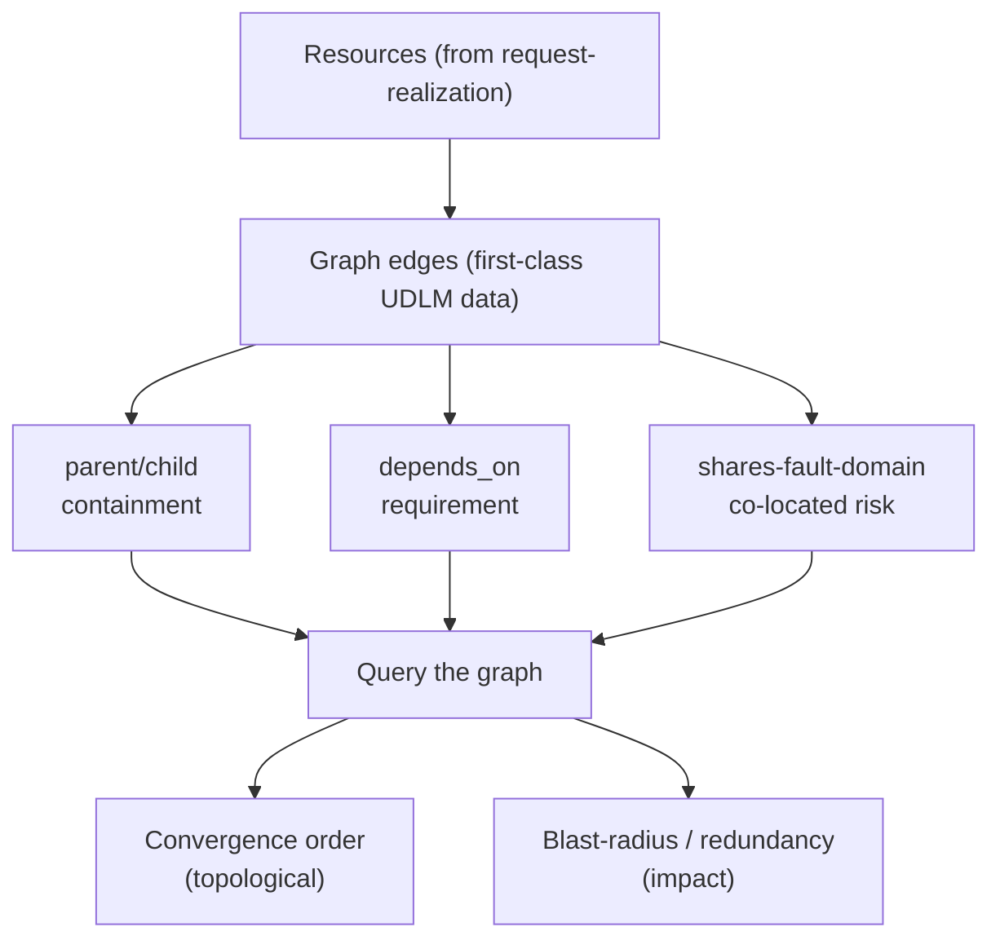

# UC-07 · Dependency graph as first-class data — the stage

**What this settles:** the dependency graph is *modeled data* in UDLM, not something DCM infers at runtime — three named edge kinds (containment, requirement, shared-fault-domain) that DCM can query for ordering and impact. A **lighter** flow — it **builds on [request-realization](request-realization.md)** and documents only what this case adds.

> **Use Case:** `dcm-core/standard/udlm-dependency-graph-data-model`. **Persona:** platform-operator · **Profile:** standard.

**In one breath.** request-realization builds one resource. Real estates are graphs of them. This case says the edges between resources are first-class, queryable UDLM data: **parent/child containment**, **depends_on requirement**, and **shares-fault-domain**. Because the graph is data, DCM *derives* safe ordering and blast-radius from it — the ordering isn't bolted on after the fact.

## What this adds over request-realization

- **Edges are typed data, not runtime guesses.** Three edge kinds, each with defined meaning: containment (parent/child), requirement (`depends_on`), and shared-fault-domain (co-located risk).
- **The graph is queryable two ways** — for **convergence order** (topological over `depends_on` + containment) and for **blast-radius / redundancy** (what falls with this node, and what survives).
- **Ordering is derived, not decorated.** DCM reads order and impact *from* the graph ([the fault-domain lens, SPEC-DESIGN §29 triad](request-realization.md#data--policy--provider-required-lens--spec-design-29)) — nothing computes a separate ordering table.

## The flow — only what's different

Each node is realized by request-realization; this UC is the edges between them.

## Success criteria (from the UC)

- UDLM defines edge kinds: parent/child containment, `depends_on` requirement, and shares-fault-domain.
- The graph is queryable for convergence order and blast-radius / redundancy impact.
- DCM derives safe operation ordering and redundancy impact directly from the UDLM graph — it is not bolted on.

## Data · Policy · Provider

- **Data:** the three edge kinds as first-class UDLM structure; edges carry endpoints and kind.
- **Policy:** cross-domain constraint (`cross_domain_constraint`) — ordering/impact policies query the graph rather than owning their own dependency map.
- **Provider:** contributes containment and fault-domain facts it knows (e.g. which host a VM lands on).

## Pointers

- Base flow: [request-realization](request-realization.md). UC source: `dcm-core/standard/udlm-dependency-graph-data-model`.
- Built on by cross-provider ordering (UC-08) and failure impact (UC-09).
