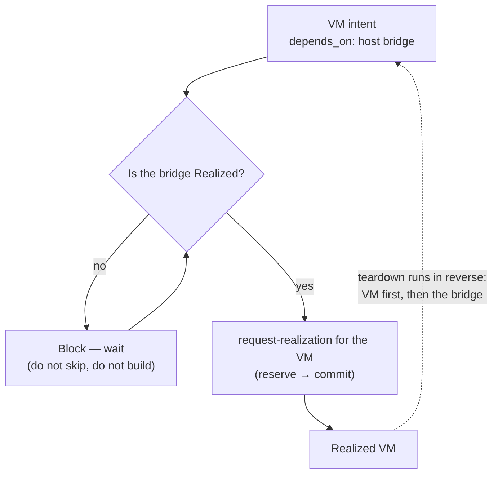

# UC-08 · Cross-provider ordering — the stage

**What this settles:** a `depends_on` edge is honored *across provider boundaries* — a VM is realized only after the host bridge/bond/pool it needs is realized by *its* owning provider, and teardown runs in reverse. A **lighter** flow — it **builds on [request-realization](request-realization.md)** and documents only what this case adds.

> **Use Case:** `libvirt-vm-provider/standard/cross-provider-dependency-ordering` — set 29 (FF Extended Target). **Persona:** platform-operator · **Profile:** standard.

**In one breath.** request-realization builds one resource; UC-07 made the `depends_on` edges data. This case makes DCM *converge in topological order* over those edges even when the prerequisite lives in another provider. The libvirt VM depends on a host bridge owned by a network/host provider — the VM waits until the bridge is Realized, then builds; teardown reverses. A prerequisite that isn't realized yet **blocks**, it never silently skips.

## What this adds over request-realization

- **Ordering spans providers.** The `depends_on` prerequisite (a host bridge) is realized by a *different* provider than the dependent VM; DCM sequences across that boundary.
- **Topological convergence, reverse teardown.** Prerequisites first, dependents after; on teardown, dependents first, prerequisites last.
- **Block, never skip.** An unrealized dependency holds the dependent in place — the base flow's reserve-before-build extended to "prerequisite-realized-before-build".

## The flow — only what's different

Each node's own build is request-realization; this UC is the *ordering* between them.

## Success criteria (from the UC)

- A VM declares `depends_on` edges to resources owned by other providers (e.g. a host bridge).
- DCM converges resources in topological order across providers and tears down in reverse.
- A dependency that is not yet realized blocks (does not silently skip) the dependent VM.

## Data · Policy · Provider

- **Data:** `depends_on` edges (from UC-07) pointing at resources in other providers; each carries the prerequisite's identity.
- **Policy:** cross-domain constraint — convergence order is derived from the graph, not per-provider.
- **Provider:** multiple eligible; each owns its own resource's realization, DCM owns the ordering between them.

## Pointers

- Base flow: [request-realization](request-realization.md). UC source: `libvirt-vm-provider/standard/cross-provider-dependency-ordering`.
- Edges come from the graph model: [UC-07](uc-07-udlm-dependency-graph-data-model.md). The blocking/impact case is [UC-09](uc-09-dependency-failure-impact.md).
