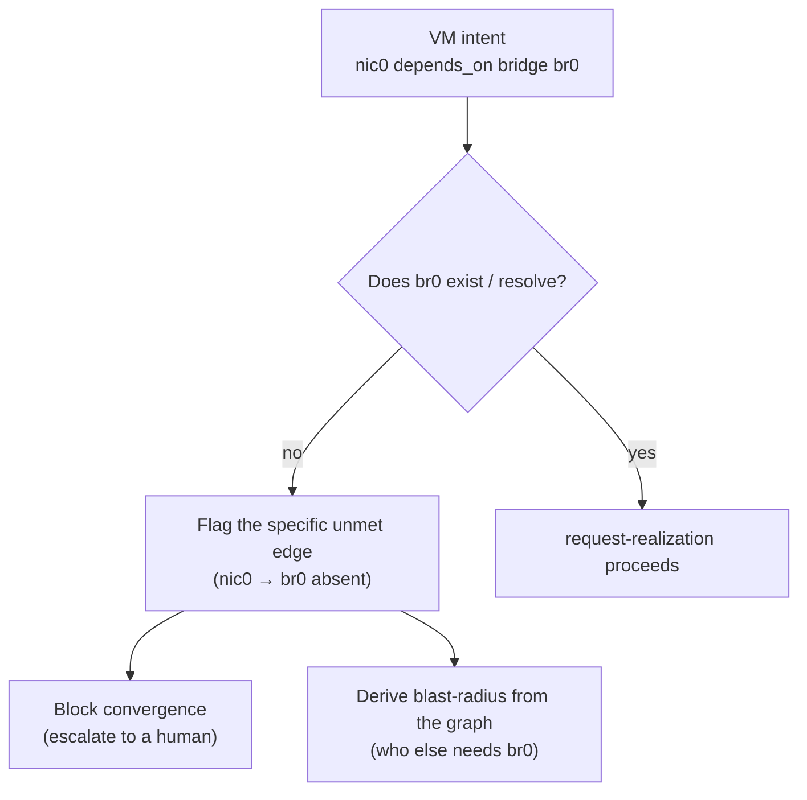

# UC-09 · Broken dependency, surfaced — the stage

**What this settles:** a missing or misconfigured dependency is made **explicit and blocking** before realization — the macvtap-vs-bridge class of failure surfaces as a named unmet edge, not a silent blackhole. A **lighter** flow — it **builds on [request-realization](request-realization.md)** and documents only what this case adds.

> **Use Case:** `libvirt-vm-provider/standard/dependency-failure-impact` — set 29 (FF Extended Target). **Persona:** platform-operator · **Profile:** standard.

**In one breath.** UC-08 orders good dependencies; this case handles the broken one. A VM's NIC declares `depends_on` a host bridge that doesn't exist. Instead of building a VM that quietly blackholes traffic, DCM flags the *specific* unmet edge, blocks the VM's convergence until it's satisfied, and — from the same graph — tells you the blast-radius of the gap. This is the drift-detection, `provider_failure` side of the base flow: caught and reported, not crashed.

## What this adds over request-realization

- **The unmet edge is named.** Not "reserve failed" but "VM `nic0` depends_on bridge `br0` — absent". The [ADR-024 clear-reason gate](request-realization.md#where-the-value-comes-from) applied to a dependency, not a field.
- **Blocking, not silent.** Convergence of the dependent VM halts until the bridge exists — the failure surfaces before the blackhole, not after.
- **Impact is derivable.** Blast-radius of the missing dependency comes from the UC-07 graph — what else waits on this bridge, what's at risk.

## The flow — only what's different

## Success criteria (from the UC)

- A VM whose NIC depends on a non-existent bridge is flagged with the specific unmet dependency.
- Convergence of the dependent VM is blocked until the dependency is satisfied.
- Impact / blast-radius of the missing dependency is derivable from the graph.

## Data · Policy · Provider

- **Data:** the `depends_on` edge (UC-07) and its resolution state — resolved vs unmet, with the target's identity.
- **Policy:** `human_escalation_required` — an unmet dependency blocks and escalates rather than auto-filling.
- **Provider:** reports the bridge absent at reserve; DCM turns that into a named, blocking unmet-edge rather than a runtime blackhole.

## Pointers

- Base flow: [request-realization](request-realization.md). UC source: `libvirt-vm-provider/standard/dependency-failure-impact`.
- Edges + impact queries come from [UC-07](uc-07-udlm-dependency-graph-data-model.md); the happy-path ordering is [UC-08](uc-08-cross-provider-dependency-ordering.md).
