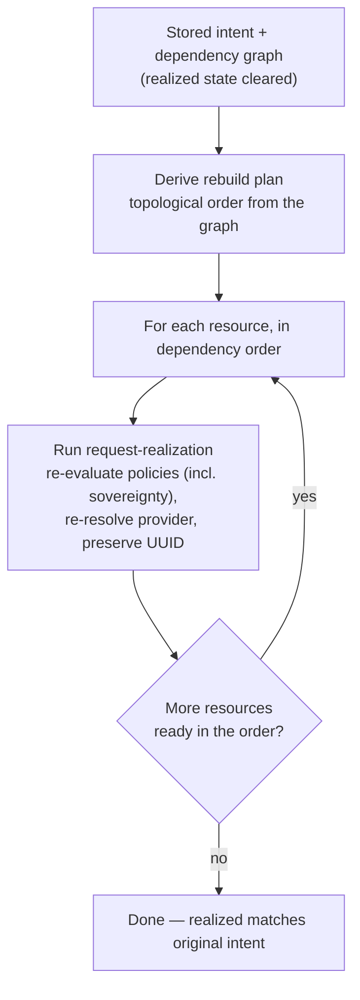

# UC-10 · Full rehydration from intent — the stage

**What this settles:** how a whole environment is rebuilt from **stored intent alone** after total
destruction — the plan *derived* from the dependency graph, not replayed from a recorded sequence, with
policies re-evaluated and providers re-chosen as if fresh. A **lighter** flow — it **builds on
[request-realization](request-realization.md)** and documents only what this case adds.

> **Use Case:** `cross-domain/dynamic-rehydration`. **Persona:** platform-engineer · **Profile:** standard.

**In one breath.** Everything realized is gone; the intent states and the dependency graph survive. The system
reads that graph, computes a rebuild order on the spot, and runs request-realization for each resource in
dependency order — re-evaluating validation policies (including sovereignty) and re-resolving providers as it
goes. UUIDs carry across the destroy/rebuild boundary, and when it finishes the realized state matches the
original intent.

## What this adds over request-realization
- **Many realizations, ordered by the graph.** This is request-realization run once per resource, sequenced
  by the stored dependency graph so that dependencies come up before dependents. The per-resource flow is
  unchanged.
- **The plan is derived, not replayed.** There is no recorded action log to re-run. The order is computed from
  the dependency graph at rebuild time, so a changed policy or a departed provider is honored automatically.
- **Policies re-evaluate against today's world.** Sovereignty and the other validation policies run again
  during rebuild — a resource can legitimately land on a different provider than it did originally if that is
  what policy now requires.
- **Identity is preserved.** UUIDs are stable across the cycle, so references between resources still resolve
  and the rebuilt graph is the *same* graph, not a look-alike.
- **Completeness is the bar.** The rebuild is done when every resource in the original intent is realized and
  the realized state matches intent — not when the sequence "finished".

## The flow — only what's different

Everything inside each rebuild step is request-realization.

## Success criteria (from the UC)
- All resources are destroyed (realized state cleared) before rebuild.
- The system derives a rebuild plan from stored intent and the dependency graph.
- The plan is computed dynamically, not replayed from a recorded sequence.
- Validation policies (including sovereignty) are re-evaluated during rebuild.
- Providers are resolved via the standard placement engine.
- All resources are re-realized in the correct dependency order.
- UUIDs are preserved across the destroy/rebuild cycle.
- Post-rebuild realized state matches the original intent state.

## Data · Policy · Provider
- **Data:** stored intent and the dependency graph are the sole source of truth for the rebuild; the four
  states are repopulated with UUIDs preserved.
- **Policy:** validation policies (sovereignty included) re-evaluate per resource during rebuild — nothing is
  grandfathered.
- **Provider:** the standard placement engine re-resolves each resource; providers re-realize in dependency order.

## Pointers
- Base flow: [request-realization](request-realization.md). Measured and validated by [UC-12](uc-12-rehydration-rto-measurement.md). UC source: `cross-domain/dynamic-rehydration`.
