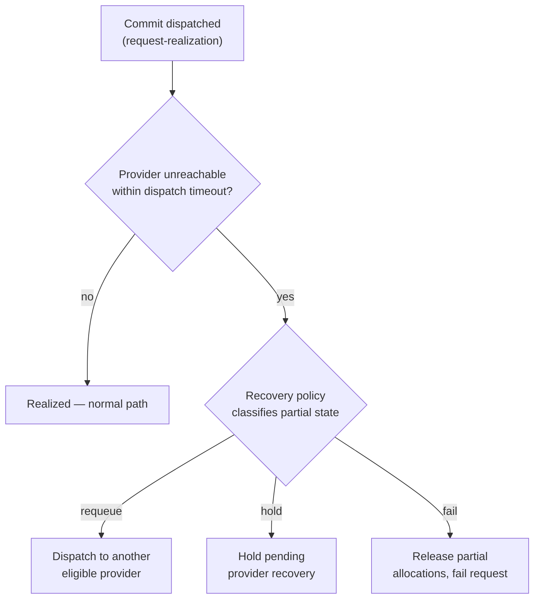

# UC-11 · Provider-failure recovery — the stage

**What this settles:** what happens when reserve and commit both start but the provider **goes unreachable
partway through** — how the partial state is classified, decided on (requeue / hold / fail), and never left
orphaned. A **lighter** flow — it **builds on [request-realization](request-realization.md)** and documents
only the recovery this case adds after commit.

> **Use Case:** `compute/vm-provision-with-provider-failure`. **Persona:** application-team-member · **Profile:** standard.

**In one breath.** Policy passes and the provider accepts the dispatch, but mid-realization the provider
becomes unreachable. A recovery policy detects it within the dispatch timeout, classifies the partial state,
and decides — requeue against another eligible provider, hold pending recovery, or fail and release what was
allocated — with the decision recorded and no orphaned partial state left behind.

## What this adds over request-realization
- **The base assumes commit succeeds; this doesn't.** Everything up to and including dispatch is
  request-realization. The new surface is *after* commit begins and the provider drops.
- **Bounded failure detection** — unreachability is caught within the **dispatch timeout**, not left pending
  indefinitely.
- **A recovery policy with an explicit decision** — it classifies the partial-realization state and picks one
  of **requeue / hold / fail**; the decision is audit-recorded.
- **Multiple eligible providers** — because more than one provider qualifies, requeue onto an alternate is a
  real option when policy permits.
- **No orphaned state** — partial allocations are reconciled to complete or cleanly released; the tenant's
  requested state never shows an indeterminate resource without a matching recovery record.

## The flow — only what's different

Everything up to commit (assemble, place, enrich, reserve) is request-realization.

## Success criteria (from the UC)
- Provider unreachability is detected within the dispatch timeout, not left indefinitely pending.
- Partially-allocated resources are either reconciled to a completed state or cleanly released.
- The recovery-policy decision is explicit and audit-recorded (requeue / hold / fail).
- If another eligible provider exists and policy permits, the request is requeued automatically.
- The tenant's requested state never shows a resource in an indeterminate state without a matching recovery record.

## Data · Policy · Provider
- **Data:** the partial-realization state, tracked and then reconciled or released; the recovery record.
- **Policy:** the recovery policy — classify the partial state, choose requeue / hold / fail.
- **Provider:** the primary accepts dispatch then goes unreachable; an alternate eligible provider may take the requeue.

## Pointers
- Base flow: [request-realization](request-realization.md). UC source: `compute/vm-provision-with-provider-failure`.
