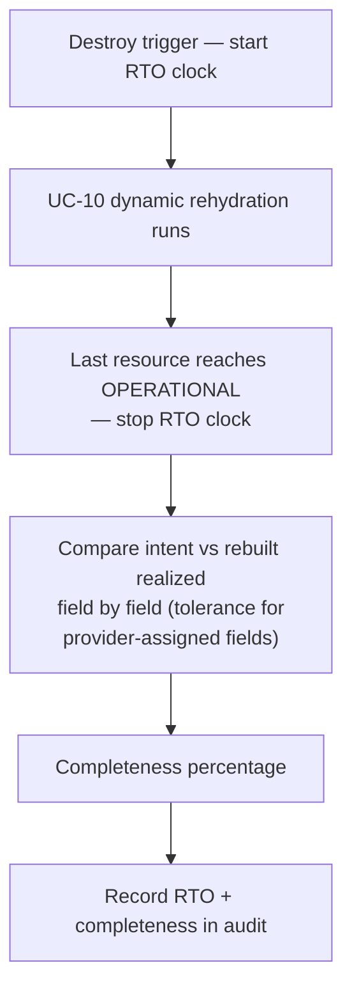

# UC-12 · Resilience posture rehydration test — the stage

**What this settles:** how a rehydration is *scored* — the recovery-time objective (RTO) measured end to end,
and completeness checked field by field against the original intent. A **lighter** flow — it **builds on
[request-realization](request-realization.md)** and layers on top of [UC-10](uc-10-dynamic-rehydration.md);
it changes nothing about how resources are built, only how the rebuild is observed.

> **Use Case:** `observability/rehydration-rto-measurement`. **Persona:** platform-engineer · **Profile:** standard.

**In one breath.** After a dynamic rehydration, the system measures how long recovery took — from the destroy
trigger to the last resource reaching `OPERATIONAL` — and then checks the rebuilt realized state against the
original intent, resource by resource and field by field, reporting a completeness percentage. Both the RTO
and the completeness result go into the audit trail.

## What this adds over request-realization
- **A pure observation layer** — no policy, no placement, no provider work of its own. It wraps
  [UC-10](uc-10-dynamic-rehydration.md) and only reads.
- **RTO is a single, defined clock** — start at the destroy trigger, stop when the *last* resource reaches
  `OPERATIONAL`. One number for the whole environment, not per-resource timings.
- **Completeness is intent-vs-realized, not a status roll-up** — every resource in the original intent must
  exist in the rebuilt realized state, and its fields must match, allowing tolerance for provider-assigned
  fields (an address, a native id) that were never expected to be identical.
- **The score is durable** — RTO and the completeness percentage are recorded in the audit trail as the
  evidence a recovery actually met its objective.

## The flow — only what's different

The rebuild itself is [UC-10](uc-10-dynamic-rehydration.md); each resource build is request-realization.

## Success criteria (from the UC)
- RTO is measured from the destroy trigger to the last resource reaching `OPERATIONAL`.
- Every resource in the original intent exists in the rebuilt realized state.
- Field values in the rebuilt realized state match the original intent, within tolerance for
  provider-assigned fields.
- A completeness percentage is calculated and reported.
- The RTO measurement and completeness results are recorded in the audit trail.

## Data · Policy · Provider
- **Data:** the original intent and the rebuilt realized state are the two sides of the comparison; the
  completeness result and RTO are recorded.
- **Policy:** none — this UC is `no_policy`; it observes rather than governs.
- **Provider:** none of its own; provider-assigned fields are simply granted a tolerance in the comparison.

## Pointers
- Base flow: [request-realization](request-realization.md). Measures [UC-10](uc-10-dynamic-rehydration.md). UC source: `observability/rehydration-rto-measurement`.
