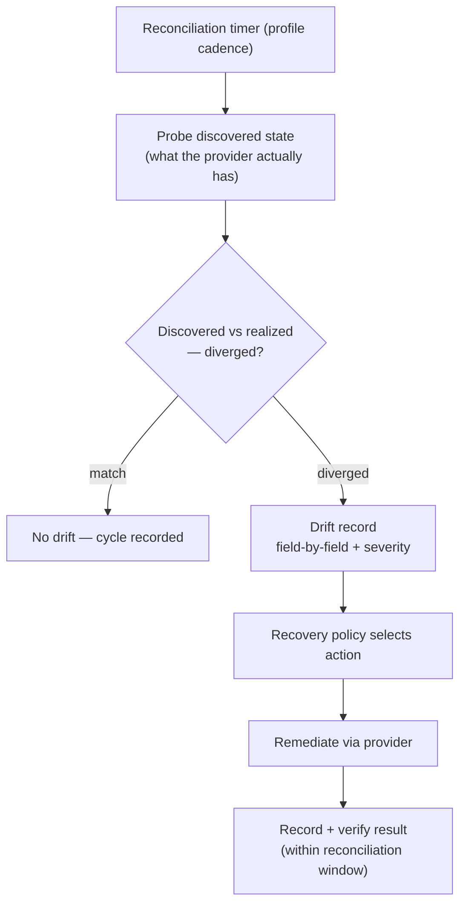

# UC-14 · Drift detection and remediation — the stage

**What this settles:** the steady-state loop that keeps *realized* honest — compare what the provider actually
has (**discovered** state) against what DCM provisioned (**realized** state), record any divergence as a
classified drift record, and remediate per the recovery policy. A **lighter** flow — it **builds on
[request-realization](request-realization.md)**; this is what runs *after* commit, on a timer, not a new
request.

> **Use Case:** `observability/drift-detection-remediation`. **Persona:** platform-engineer · **Profile:** standard.

**In one breath.** On the profile's reconciliation cadence, the system probes what the provider really has and
diffs it against the realized record. A divergence becomes a drift record — field by field, with a severity of
info, warning, or critical — and the recovery policy decides what to do about it. The remediation runs, its
result is recorded and verified, and the cycle stays inside the profile's reconciliation window.

## What this adds over request-realization
- **A fifth read: discovered state.** Realization ends at realized. This loop introduces *discovered* — the
  provider's actual current state, probed live — and makes realized-vs-discovered the thing under watch.
- **Drift is a first-class record.** A divergence is not just a log line: it is a record with a field-by-field
  comparison and a **severity classification** (info / warning / critical) that the recovery policy keys on.
- **Recovery is policy, not a fixed reaction.** What to do about drift — re-converge, alert, quarantine — is a
  recovery policy decision, so different severities and resources can be handled differently.
- **Remediation is verified, not fire-and-forget.** After the action runs, its result is recorded and checked,
  closing the loop rather than assuming success.
- **It is bounded in time.** The whole detect-classify-remediate cycle must complete within the
  profile-governed reconciliation window — a timing guarantee realization itself never makes.

## The flow — only what's different

The remediating build, where one is needed, is request-realization.

## Success criteria (from the UC)
- Discovered state is probed and compared against realized state.
- Divergences produce drift records with a field-by-field comparison.
- Drift records include a severity classification (info, warning, critical).
- The recovery policy triggers the appropriate remediation actions.
- Remediation results are recorded and verified.
- The drift detection cycle completes within the profile-governed reconciliation window.

## Data · Policy · Provider
- **Data:** discovered and realized states are compared; the drift record (comparison + severity) and the
  verified remediation result are stored.
- **Policy:** the recovery policy governs which remediation runs for a given drift, keyed on severity.
- **Provider:** probed for discovered state, and executes the remediation when one is required.

## Pointers
- Base flow: [request-realization](request-realization.md). UC source: `observability/drift-detection-remediation`.
