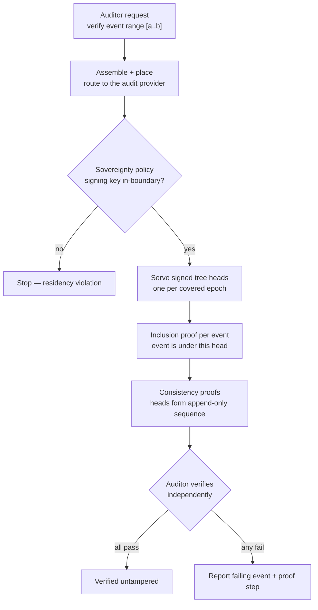

# UC-15 · Merkle-tree audit verification — the stage

**What this settles:** how an auditor proves a named range of past audit events has not been tampered with — signed tree heads, inclusion proofs per event, and consistency proofs across epochs — with the signing key kept inside the sovereignty boundary. A **lighter** flow — it **builds on [request-realization](request-realization.md)** and documents only what this case adds.

> **Use Case:** `governance/audit-merkle-tree-verification`. **Persona:** compliance-auditor · **Profile:** sovereign.

**In one breath.** This is request-realization's machinery pointed at a **read**: the auditor's request is assembled and placed like any other, but it routes to an **audit/information provider** that returns *proofs* instead of building anything. The provider gives signed tree heads for each epoch, an inclusion proof for every requested event, and consistency proofs tying the heads into one append-only sequence. The auditor verifies these independently; a sovereignty policy guarantees the signing key never left the boundary. Nothing is reserved, nothing is committed — the audit state is only read.

## What this adds over request-realization

- **A query, not a build.** The same assemble → place path runs, but the terminal step is **serve proofs**, not reserve/commit. No tenant resource changes; the flow reads audit state and returns cryptographic evidence.
- **Tamper-evidence is the payload.** The result is a set of **signed tree heads**, **inclusion proofs** (each event is in the tree the head commits to), and **consistency proofs** (later heads extend earlier ones — append-only, no rewrite).
- **Sovereignty binds the key, not just placement.** The cross-domain policy here checks the residency of the **signing key material**, not only where compute runs ([the enrichment/compliance split of request-realization](request-realization.md#where-the-value-comes-from), applied to key residency).
- **Failure is specific.** A verification miss names the **exact event and the proof step** that failed — not a blanket "verification failed."

## The flow — only what's different

Assemble and place are request-realization; from the audit provider onward is this case.

## Success criteria (from the UC)

- Signed tree heads are retrievable for every audit epoch covering the requested range.
- Inclusion proofs are produced for each requested event and verify against the tree heads.
- Consistency proofs show the tree heads form a coherent append-only sequence.
- Signing key material never leaves the sovereignty boundary.
- A verification failure on any event surfaces the specific event and proof step that failed.

## Data · Policy · Provider

- **Data:** audit event records, looked up by handle and epoch; the tree heads and proofs derived over them.
- **Policy:** the sovereignty policy that pins signing-key residency inside the boundary (cross-domain constraint).
- **Provider:** an audit/information provider that serves tree heads and generates inclusion and consistency proofs.

## Pointers

- Base flow: [request-realization](request-realization.md). UC source: `governance/audit-merkle-tree-verification`.
- Capability-validation sibling (does DCM *provide* this): [uc-21-audit-chain-proofs-capability](uc-21-audit-chain-proofs-capability.md).
