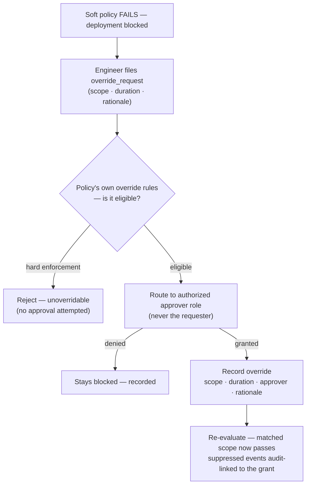

# UC-16 · Policy override approval workflow — the stage

**What this settles:** how a governance policy that is *blocking* a request gets a **time-bounded, scoped
override** — evaluated against that policy's own override rules, routed to an authorized approver, and
recorded — without ever letting a hard-enforcement policy be waived. A **lighter** flow — it **builds on
[request-realization](request-realization.md)** and documents only what this case adds.

> **Use Case:** `governance/policy-override-approval`. **Persona:** platform-engineer · **Profile:** prod.

**In one breath.** A soft policy is failing and holding up a business-critical deployment. The engineer asks
for a temporary override; the system checks the *policy's own* override-eligibility declaration, routes the
request to the role authorized for that override class (not the requester), and — if granted — records an
override scoped to that one request, bounded in time, with a rationale. Later evaluations honor it and every
suppressed event is audit-linked. Hard policies never reach an approval attempt.

## What this adds over request-realization
- **A new object on the policy-application state** — an `override_request` that *modifies* how policies apply
  to one matched request scope. Realization (assemble → place → enrich → reserve → commit) is unchanged; what
  changes is the outcome of a failing policy evaluation.
- **Eligibility is per-policy, not global** — the override is checked against *that policy's* declared
  override rules. A policy that declares itself unoverridable (hard enforcement) is rejected up front, with no
  approval routed.
- **Separation of duties** — approval goes to the role authorized for this override class, never to the
  requester. Human escalation is part of the flow, not a bypass of it.
- **The grant is narrow and bounded** — scoped to the specific matched request, given a duration, and carrying
  the approver and rationale. It is not a global "policy off" switch.
- **Suppression is audited** — the grant *and* every subsequent policy event it suppresses are audit-linked,
  so a reviewer can see exactly what the override let through and for how long.

## The flow — only what's different

Everything else is request-realization.

## Success criteria (from the UC)
- Override eligibility is evaluated against the policy's own override rules, not globally permitted.
- Approval is routed to the role authorized for this override class, not the requester.
- Granted overrides are scoped in time and narrowed to the specific matched request.
- Hard-enforcement policies are rejected as unoverridable without an approval attempt.
- The override grant and every subsequent policy-suppressed event are audit-linked.

## Data · Policy · Provider
- **Data:** the `override_request` and the resulting override record — scope, duration, approver, rationale —
  attached to the policy-application state, plus the audit links to suppressed events.
- **Policy:** each policy declares its own override eligibility and enforcement class (soft vs hard); the
  approval routing to an authorized role is itself policy.
- **Provider:** unchanged — the provider only builds once the (now-overridden) policy set passes.

## Pointers
- Base flow: [request-realization](request-realization.md). UC source: `governance/policy-override-approval`.
