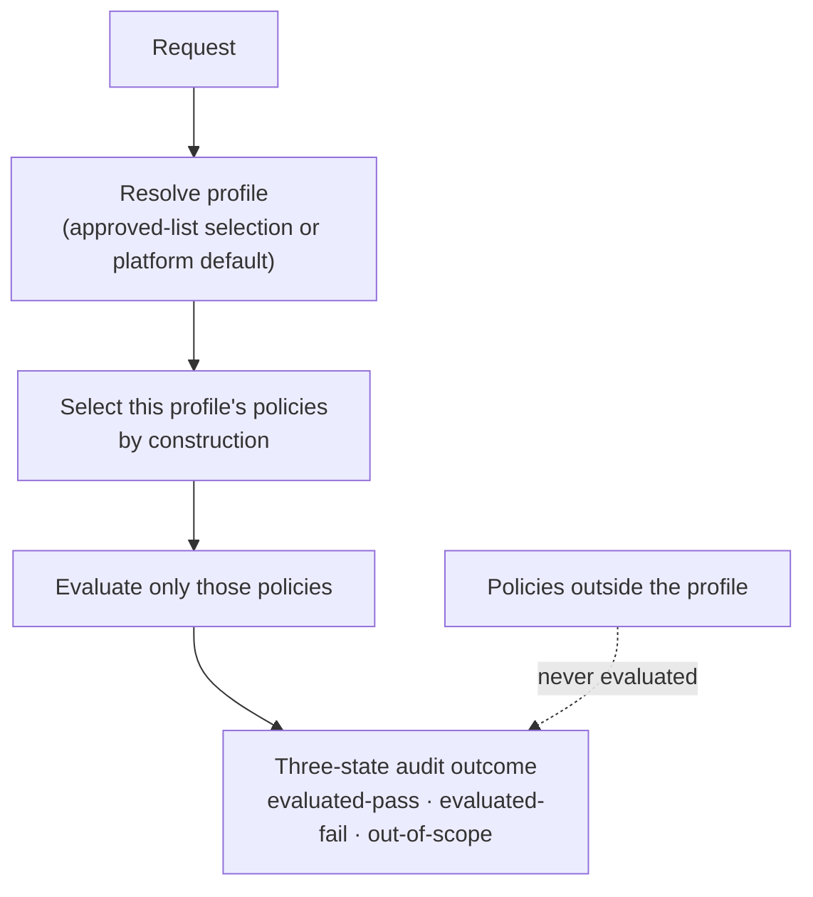

# UC-16 · Policy resolution by profile — the stage

**What this settles:** policy applicability is decided **by resolved-profile membership** — the request's
profile is resolved, only that profile's policies are evaluated, and the audit says *evaluated-pass*,
*evaluated-fail*, or *out-of-scope* — with out-of-scope kept distinct from skipped-and-passed. A **lighter**
flow — it **builds on [request-realization](request-realization.md)** and makes explicit the "resolved-profile
policies" step that flow assumes. Validation UC for **DR-E**.

> **Use Case:** `governance/policy-resolution-capability` — set 29 (FF Extended Target). **Persona:** platform-engineer · **Profile:** standard.

**In one breath.** Which policies apply is not a global sweep. DCM resolves the request's profile (an approved-list
selection, or the platform default) and evaluates *only* the policies in that profile, by construction. Policies
outside the profile are recorded as **out-of-scope** — never as a silent soft-pass — and there is no global
fall-through that reaches them.

## What this adds over request-realization
- **Names the selection rule request-realization glosses.** The base flow says the "resolved-profile policies"
  are evaluated; this UC pins down *how* the set is chosen — by profile membership, by construction, not by a
  global list filtered at runtime.
- **Three-state outcomes, not pass/fail.** Every policy lands as *evaluated-pass*, *evaluated-fail*, or
  *out-of-scope*. The third state is the point: a policy that did not apply is honestly marked, not folded into
  "passed".
- **No silent soft-pass.** Out-of-scope is distinct from skipped-and-passed. A reviewer can tell "this policy
  did not apply here" from "this policy applied and passed" — they are different facts.
- **No global fall-through.** Nothing outside the resolved profile is ever evaluated. Applicability is a
  positive membership decision, closed by construction.

## The flow — only what's different

Where these evaluations sit in the build is request-realization.

## Success criteria (from the UC)
- DCM resolves the request's profile and selects that profile's policies by construction.
- Policies not in the resolved profile are not evaluated.
- The audit outcome distinguishes evaluated-pass, evaluated-fail, and out-of-scope.
- Out-of-scope policies are never recorded as skipped-and-passed (no silent soft-pass).
- No global policy fall-through evaluates policies outside the resolved profile.

## Data · Policy · Provider
- **Data:** the request records the resolved profile and its policy set; the audit lists policies-evaluated
  honestly with three-state outcomes.
- **Policy:** the engine resolves the profile, selects its policies by construction, and emits the three-state
  outcomes — no global fall-through.
- **Provider:** unaffected; this UC governs which policies gate the build, not how it is built.

## Pointers
- Base flow: [request-realization](request-realization.md). Companion profile-resolution UC: [UC-17](uc-17-profile-resolution-capability.md). UC source: `governance/policy-resolution-capability`.
