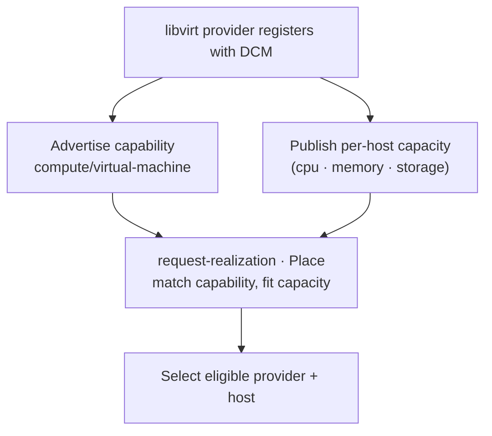

# UC-17 · Provider registration and capability advertisement — the stage

**What this settles:** how a compute provider becomes *eligible* — it registers, advertises the `compute/virtual-machine` capability, and publishes per-host capacity — so placement has real capability and capacity to choose from. A **lighter** flow — it **builds on [request-realization](request-realization.md)** and documents only what this case adds.

> **Use Case:** `libvirt-vm-provider/standard/provider-registration-capability`. **Persona:** platform-operator · **Profile:** standard.

**In one breath.** request-realization's Place step "narrows to the providers that fit" — this case is what makes a libvirt provider *one of those providers* in the first place. It registers, advertises the capability it serves (`compute/virtual-machine`), and publishes each host's cpu/memory/storage capacity. Placement then selects an eligible provider *and host* from advertised capability and capacity — the inputs the base flow's Place step consumes.

## What this adds over request-realization

- **Registration precedes placement.** Before any VM request, the provider declares itself, its capability, and its capacity — the base flow assumes eligible providers exist; this is how they come to exist.
- **Capability advertisement.** The provider names what it can serve (`compute/virtual-machine`), so placement can match a VM intent to it.
- **Per-host capacity feeds selection.** cpu/memory/storage published per host make placement pick not just a provider but a *host* with room — richer than "a provider that fits".

## The flow — only what's different

The Place step is request-realization's; this UC supplies what it selects over.

## Success criteria (from the UC)

- A provider registers with DCM and advertises capability `compute/virtual-machine`.
- Per-host capacity (cpu, memory, storage) is published and considered for placement.
- DCM selects an eligible provider/host for a VM intent based on advertised capability and capacity.

## Data · Policy · Provider

- **Data:** the provider's registration record — capability set and per-host capacity.
- **Policy:** system defaults only; placement matches capability then fits capacity.
- **Provider:** multiple eligible — each advertises what it serves and how much host room it has; DCM chooses among them.

## Pointers

- Base flow: [request-realization](request-realization.md) — this UC feeds its **Place** step. UC source: `libvirt-vm-provider/standard/provider-registration-capability`.
- What a provider declares it requires (a sibling of what it advertises): `contracts/provider-contract.md`.
