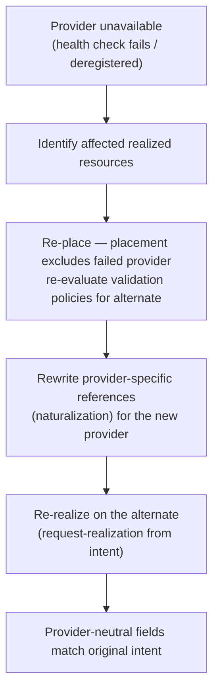

# UC-18 · Workload portability across providers — the stage

**What this settles:** how resources survive **losing their provider** — the placement engine re-resolves them
onto an alternate eligible provider, the provider-specific references are rewritten for the new home, and the
rebuild proceeds from intent alone. A **lighter** flow — it **builds on
[request-realization](request-realization.md)**; the trigger is a provider failure, and the new twist is
rewriting naturalized references.

> **Use Case:** `cross-domain/provider-portable-rebuild`. **Persona:** platform-engineer · **Profile:** standard.

**In one breath.** A provider goes away — health check fails, or it is deregistered — while resources depend on
it. Placement re-resolves the affected resources onto an alternate eligible provider, the provider-specific
references (the naturalized values like a namespace or a native id) are rewritten for the new provider, and the
resources are re-realized from their intent. The provider-neutral fields still match the original intent — the
resource was never locked to one provider.

## What this adds over request-realization
- **The trigger is a provider failure, not a user request.** Detection (health check or explicit
  deregistration) is what kicks the flow off; the affected resources are already realized.
- **Re-placement onto an *alternate* provider.** Placement runs again but with the failed provider excluded,
  landing the resource on a different eligible one. Validation policies re-evaluate for the new provider.
- **Naturalized references are rewritten.** The provider-specific values in `provider_extensions` (deprecated — subsumed by ADR-038, interim, retiring #202) — the
  namespace, the native id, the cluster — are the old provider's and cannot carry over. They are re-derived
  (re-enriched) for the new provider; the portable base is untouched.
- **Portability is the proof.** Success is that the provider-neutral fields still match intent after the move.
  A resource that can be rebuilt on a different provider from intent alone was genuinely portable, not pinned.

## The flow — only what's different

The re-realize step is request-realization, run with the failed provider excluded.

## Success criteria (from the UC)
- Provider unavailability is detected (via health check or explicit deregistration).
- Affected resources are re-resolved onto an alternate eligible provider.
- Provider-specific references (naturalization) are rewritten for the new provider.
- Resources are re-realized on the alternate provider.
- Realized state matches the original intent for provider-neutral fields.
- The re-resolution and rebuild are recorded in the audit trail.

## Data · Policy · Provider
- **Data:** intent is the source of truth; provider-specific references in `provider_extensions` are rewritten
  while the portable base holds steady; realized state is updated.
- **Policy:** validation policies re-evaluate for the alternate provider — the move is governed, not blind.
- **Provider:** the original is detected unavailable; an alternate eligible provider re-realizes the resources.

## Pointers
- Base flow: [request-realization](request-realization.md). Whole-environment rebuild: [UC-10](uc-10-dynamic-rehydration.md). UC source: `cross-domain/provider-portable-rebuild`.
