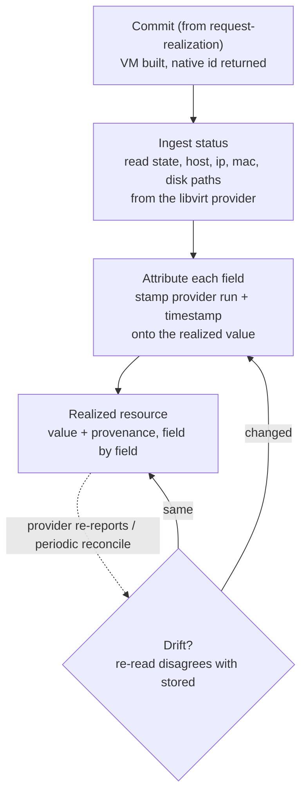

# UC-18 · Realized status with field-level provenance — the stage

**What this settles:** what happens *after* commit — the provider's reported status (state, host, ip, mac, disk paths) lands on the realized resource, and **every realized field carries who produced it, in which run, and when**. Drift re-runs this and updates both the value and its provenance. A **lighter** flow — it **builds on [request-realization](request-realization.md)** and documents only what this case adds.

> **Use Case:** `libvirt-vm-provider/standard/vm-status-provenance`. **Persona:** auditor · **Profile:** standard.

**In one breath.** request-realization ends at commit with "what was asked and what was built are both stored." This case makes the *built* side auditable: the libvirt provider's status isn't just written onto the resource — each field records its origin (which provider run, at what time), and when reality drifts, the field and its provenance are updated together. So an auditor can always answer "where did this ip come from, and is it still current?"

## What this adds over request-realization

- **Provenance is per realized field, not per resource.** request-realization records origin for *requested* values during enrichment. Here the same discipline extends to the *realized* side: `state`, `host`, `ip`, `mac`, and disk paths each carry the run and timestamp that produced them ([ADR-016](../adr/ADR-016-resource-type-role-graph-audit-not-config.md) — the type is the audit surface).
- **Status ingest is a first-class step.** Commit hands back native facts once; this case keeps reconciling them onto the resource as the provider re-reports, so the realized model tracks the running VM.
- **Drift is reconciliation, not a rewrite.** When a re-read disagrees with stored status (a live migration moved the `host`, DHCP changed the `ip`), the field updates *and* its provenance advances to the new run — the old value's origin isn't silently overwritten with no trail.

## The flow — only what's different

Everything up to Commit is request-realization.

## Success criteria (from the UC)

- Realized status (state, host, ip, mac, disk paths) is read from the provider and stored.
- Each realized field carries provenance — which provider/run produced it, and when.
- Status drift updates the realized entity **and** its provenance.

## Data · Policy · Provider

- **Data:** the realized (status) side of `Compute.VirtualMachine`, each field paired with a provenance record (provider run id + timestamp). This is the [four-states](../../foundations/four-states.md) Realized side made auditable.
- **Policy:** system defaults only (`system_defaults_only`) — no placement or enrichment logic here; the concern is faithful ingest, not choosing values.
- **Provider:** libvirt/KVM reports native status on commit and on re-read; DCM reconciles each report onto the resource.

## Pointers

- Base flow: [request-realization](request-realization.md). UC source: `libvirt-vm-provider/standard/vm-status-provenance`.
- The four states (Intent → Requested → Realized): [`foundations/four-states.md`](../../foundations/four-states.md).
