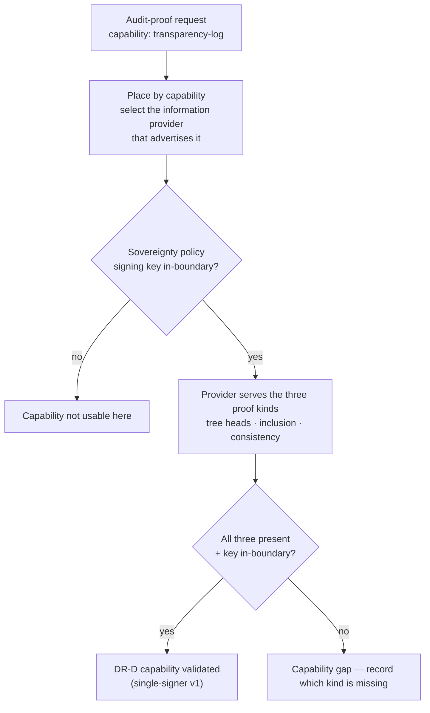

# UC-20 · Transparency-log capability validation — the stage

**What this settles:** validation for **DR-D** — that DCM actually *provides* the transparency-log capability: it can produce signed tree heads, inclusion proofs, and consistency proofs, with signing-key material in-boundary under a sovereign profile. Where [UC-19](uc-19-audit-merkle-tree-verification.md) is an auditor *performing* a verification, this is confirming the capability *exists to be used*. A **lighter** flow — it **builds on [request-realization](request-realization.md)** and documents only what this case adds.

> **Use Case:** `governance/audit-chain-proofs-capability`. **Persona:** compliance-auditor · **Profile:** sovereign.

**In one breath.** UC-19 assumes the audit provider is there and asks it to prove a specific range. This case is one step behind: it validates that an **information provider advertising the transparency-log capability** is registered, is selected by placement for an audit-proof request, and returns the three proof kinds with the key kept in-boundary. It's a capability check — the same proof machinery as UC-19, but the thing under test is *DCM's coverage of DR-D*, not a particular auditor's range. **v1 is single-signer**; split-view / equivocation defense (external witnesses) is a tracked limitation, not a gap this UC claims to close.

## What this adds over request-realization

- **Capability, matched at placement.** request-realization's placement narrows by type and policy; here it narrows by an **advertised capability** — "produces transparency-log proofs." The validation is that such a provider is registered and selected ([the specificity/placement scale](request-realization.md#the-specificity-scale), applied to a capability rather than a size).
- **Three proof kinds are the contract.** The capability is only satisfied if the provider serves **signed tree heads**, **inclusion proofs**, and **consistency proofs** — all three, not a subset.
- **Sovereignty is part of the capability.** In-boundary signing-key residency is a condition of the capability being usable under the sovereign profile, checked as a cross-domain policy.
- **Scope is honest.** Single-signer v1; equivocation across split views is out of scope pending external witnesses. The UC validates what v1 provides and records the boundary.

## The flow — only what's different

Assemble and place are request-realization; capability match and proof-serving are this case.

## Success criteria (from the UC)

- DCM produces signed tree heads for every audit epoch covering a requested range.
- DCM produces inclusion proofs for each requested event.
- DCM produces consistency proofs across epoch tree heads.
- Signing-key material is kept within the sovereignty boundary.
- v1 is single-signer; split-view / equivocation is a known limitation pending external witnesses.

## Data · Policy · Provider

- **Data:** the audit epochs and events the proofs are computed over.
- **Policy:** the sovereignty policy pinning signing-key residency (cross-domain constraint) — a condition of the capability.
- **Provider:** an information provider advertising the transparency-log capability, serving tree heads and proofs.

## Pointers

- Base flow: [request-realization](request-realization.md). UC source: `governance/audit-chain-proofs-capability`.
- The verification act (auditor proves a specific range): [uc-19-audit-merkle-tree-verification](uc-19-audit-merkle-tree-verification.md).
