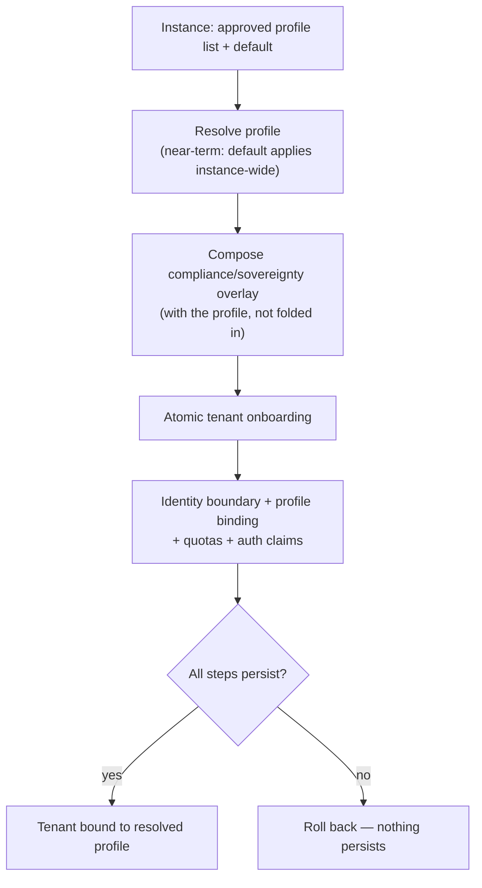

# UC-20 · Profile resolution and tenant onboarding (DR-B) — the stage

**What this settles:** where a request's profile *comes from* — an instance declares an **approved list plus a
default**, and (near-term) the default applies instance-wide — and how a tenant is **onboarded atomically**
against it: identity boundary, profile binding, quotas, and auth claims all persist together or not at all. A
**lighter** flow — it **builds on [request-realization](request-realization.md)** by supplying the profile
that flow later resolves policies from. Validation UC for **DR-B**.

> **Use Case:** `cross-domain/profile-resolution-capability`. **Persona:** platform-engineer · **Profile:** fsi.

**In one breath.** The instance publishes an approved list of profiles and a default; profile resolution picks
from that list (near-term, the default applies instance-wide). Onboarding a tenant binds it to the resolved
profile and stands up its identity boundary, quotas, and auth claims as a single all-or-nothing transaction. A
compliance or sovereignty overlay is *composed with* the profile, not folded into it, and profiles are
compared as capability sets by set-containment — never ranked.

## What this adds over request-realization
- **Supplies the profile the base flow assumes.** Request-realization resolves policies from a profile; this
  UC is where that profile is *resolved* — from the instance's approved list and default.
- **Profiles are capability sets, compared by containment.** One profile is "more" than another only if its
  capability set contains the other's — there is no numeric rank. Comparison is by content, not by tier.
- **Onboarding is atomic.** Identity boundary, profile binding (a `policy_profile` DCMGroup), quotas, and auth
  claims either all persist or none do. A partial tenant is never left behind.
- **Overlays compose, they don't merge in.** A compliance/sovereignty overlay is layered *with* the profile so
  it stays separable and auditable — not baked into the profile where it would be invisible.

## The flow — only what's different

Requests from this tenant then run request-realization under the bound profile.

## Success criteria (from the UC)
- DCM resolves the instance profile from the platform approved list and default.
- Tenant onboarding binds the tenant to the resolved profile via a `policy_profile` DCMGroup.
- Onboarding is atomic — either all steps persist or none do.
- A compliance/sovereignty overlay is composed with the profile, not folded into it.
- Profiles are capability sets compared by content set-containment, not by rank.

## Data · Policy · Provider
- **Data:** the tenant is bound to the instance profile; the compliance overlay is stored composed-but-separate.
- **Policy:** profile resolution from approved-list + default; an orchestration-flow policy enforces onboarding atomicity.
- **Provider:** the auth provider is configured with the tenant's claims-mapping reference as part of the atomic step.

## Pointers
- Base flow: [request-realization](request-realization.md). Companion policy-resolution UC: [UC-19](uc-19-policy-resolution-capability.md). UC source: `cross-domain/profile-resolution-capability`.
