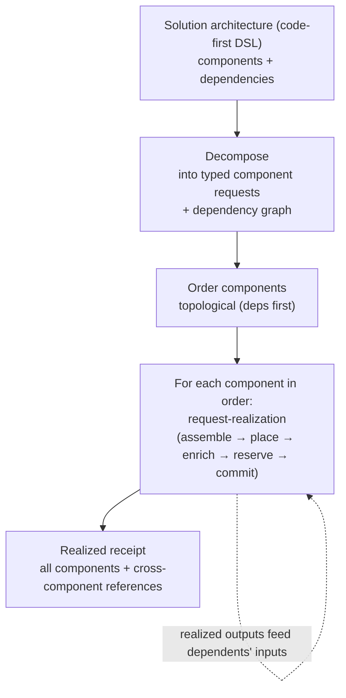

# UC-21 · Solution architecture deployment — the stage

**What this settles:** how a whole **solution** — a multi-component architecture written in a code-first DSL — becomes many resource requests that deploy in dependency order, each enriched and placed on its own, with cross-component references captured in one realized receipt. A **lighter** flow — it **builds on [request-realization](request-realization.md)** and documents only what this case adds: the **decompose-and-orchestrate** wrapper around it.

> **Use Case:** `cross-domain/solution-architecture-deployment`. **Persona:** solution-architect · **Profile:** prod.

**In one breath.** request-realization builds *one* resource. A solution architecture describes *many* — a database, an app tier, a load balancer, the links between them. This case decomposes that DSL into per-component requests, resolves the dependency graph, and runs each component through request-realization **in order** — a component that depends on another waits for the reference it needs (the database's address, the network's id). Providers can differ per component (`multiple_eligible`). When the graph is fully realized, one receipt records every component, its realized state, and the cross-component references that wire them together.

## What this adds over request-realization

- **A composite, decomposed.** The unit of intent is a **solution**, not a resource. Decomposition turns the DSL into a set of typed component requests plus the edges between them (`composite_service`).
- **Dependency-ordered orchestration.** Components realize in topological order; a dependent component's request is only assembled once its upstreams have produced the references it consumes. This is the static orchestration flow (`orchestration_flow_static`) wrapping N runs of request-realization.
- **Each component is still a normal request.** Every node runs the full assemble → place → enrich → reserve → commit underneath — including its own base engineering pattern plus the architect's customizations. Nothing about the single-resource contract changes.
- **Cross-component references in the receipt.** The realized receipt is not N independent records; it captures the **wiring** — which component's realized output feeds which component's input — so the solution can be understood and later rehydrated as a whole.

## The flow — only what's different

Each component's own build is request-realization; decompose, order, and the wiring receipt are this case.

## Success criteria (from the UC)

- All components provisioned in dependency order.
- Each component conforms to its base engineering pattern plus user customizations.
- The realized receipt captures the full deployment state with cross-component references.

## Data · Policy · Provider

- **Data:** the solution as a graph of typed component requests and their dependency edges; the realized receipt binding component outputs to dependents' inputs.
- **Policy:** compliance-gated orchestration (`compliance_gated`) plus each component's own placement and enrichment; the ordering is static, derived from the graph.
- **Provider:** potentially many — each component may land on a different eligible provider (`multiple_eligible`).

## Pointers

- Base flow (per component): [request-realization](request-realization.md). UC source: `cross-domain/solution-architecture-deployment`.
- The four states (each component realizes independently): [`foundations/four-states.md`](../../foundations/four-states.md).
