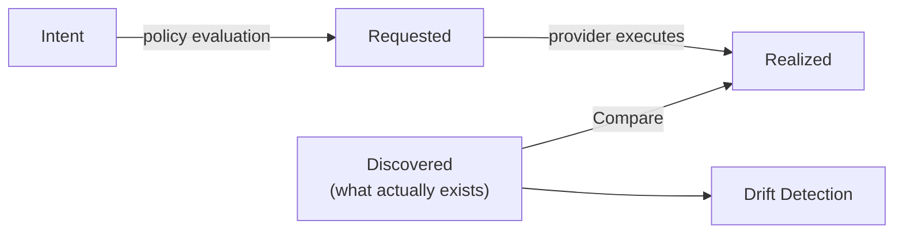

# UDLM — Context and Purpose


**Document Status:** ✅ Complete  
**Related Documents:** [Entity Types](entity-types.md) | [Ownership, Sharing, and Allocation](ownership-sharing-allocation.md) | [Four States](four-states.md) | [Layering and Versioning](layering-and-versioning.md) | [Examples](examples.md)

> **Foundation Document Reference**
>
> This document is a detailed reference for a specific domain of the UDLM data model.
> The three foundational abstractions — Data, Provider, and Policy — are defined in
> [foundations.md](foundations.md). All concepts in this document map to one or
> more of those three abstractions.
> See also: [Provider Contract](../contracts/provider-contract.md) | [Policy Contract](../contracts/policy-contract.md)
>
> **This document maps to: DATA**
>
> The Data abstraction — foundational data model, provenance, four lifecycle states


---

## 1. Purpose

UDLM is the foundational data model upon which a conformant realization (e.g. DCM) operates. It is not a storage mechanism or a database schema — it is the **lingua franca** through which every component of a realization communicates: reading, writing, validating, enriching, transforming, or comparing data.

The data model exists to solve a problem that is endemic to enterprise IT: **there is no single, trustworthy, consistent representation of infrastructure state**. Tools proliferate, CMDBs diverge, and the result is that no one knows with confidence what exists, what was requested, what was provisioned, or whether the current state matches the intended state.

UDLM establishes a **unified, versioned, declarative single source of truth** for all infrastructure state across the full lifecycle of every resource a realization manages.

---

## 2. The Data Model as Inter-Component Contract

The data model is not owned by any single component — it is the **contract between all of them**. Every component of a realization acts on the data in some well-defined way (assembling a request payload, evaluating policy, provisioning via a provider, recording audit at each state transition, comparing states for drift, attributing cost, discovering current state, gating access, exposing a catalog), and even components that never talk directly are coupled through the shared data model. This is what lets each component be built, tested, and evolved independently.

*How a specific realization's components consume the data model — the component roster and each one's read/write relationship to the data — is realization architecture, not part of the data model. See the DCM architecture documentation for that mapping.*

---

## 3. Universal Identity (why it matters)

Every data object in UDLM is identified by a **UUID**, and that single decision is what makes the rest of the model work: unambiguous reference across every component, policy, and layer; provenance anchoring (each recorded change references the UUID of the entity that caused it); dependency mapping by reference rather than by name; audit fidelity across renames; and correlation of the same resource across the Intent, Requested, Realized, and Discovered states. Because identity is the anchor for provenance and cross-state correlation, it cannot be optional.

The **normative** identifier rules — UUID required on every entity, the allowed UUID versions and reject-at-ingest behavior, handle syntax, and reference resolution — are defined in [identifier-scheme.md](../contracts/identifier-scheme.md) and [data-model-core](data-model-core.md). This section is the motivation; those specs bind.

---

## 4. Field-Level Provenance and Data Lineage

One of the most critical requirements of UDLM is the ability to trace the complete lineage of any piece of data at any stage of the pipeline. This is not a logging concern — it is a **structural requirement of the data model itself**.

### 4.1 The Requirement

At any point in a realization's pipeline, for any field in any data object, it must be possible to answer:

- What is the current value of this field?
- Where did this value originate? (catalog item, base layer, intermediate layer, policy, consumer input, discovery)
- Has this value been modified since origination?
- If modified:
  - What is the complete history of modifications?
  - Which entity caused each modification? (identified by UUID)
  - What type of entity caused it? (policy, layer, component, provider)
  - When did each modification occur?
  - What was the value before each modification?
  - Why was the modification made? (enrichment, validation, transformation, gating)
- What is the complete chain of custody of this field from origin to current value?

### 4.2 Why Field-Level Lineage Matters

Document-level versioning alone is insufficient for DCM's requirements. Consider a resource request flowing through the pipeline:

1. Consumer selects a catalog item — catalog item UUID recorded
2. Base resource definition layer applied — base layer UUID recorded, fields established
3. Intermediate layers applied — each layer UUID recorded, field overrides recorded
4. Policy evaluation validates — policy UUID recorded, validation outcome recorded
5. Policy evaluation enriches — policy UUID recorded, enriched field values and their source recorded
6. Policy evaluation transforms — policy UUID recorded, transformation recorded with before/after values
7. Request payload submitted — complete provenance chain intact across all fields

Without field-level provenance, it is impossible to determine after the fact whether a specific field value came from a consumer request, a data layer, a security policy, or a business rule. This ambiguity is unacceptable in a governed, auditable system.

### 4.3 Provenance as a Structural Element

What is **normative** is that a field's evolution is *reconstructable*: for any field, who/what/why/when set each value can be recovered from stored facts. Provenance is a structural property of the data, not a side log to be reconciled after the fact. This ensures that:

- Any consumer of the data can recover its lineage without querying a separate system
- Provenance survives data export, migration, and portability scenarios
- The audit capability reads lineage that was recorded at the point of change, not reconstructed from logs

**Where** provenance is stored is a realization choice. It MAY be carried inline with the field, or content-addressed/tiered so the object is not bloated — `layering-and-versioning.md` §3a defines the deduplicated and tiered storage models, and OPS-002 guarantees full reconstruction regardless of model. The obligation is reconstructability; inline co-location is not required.

### 4.4 Provenance Metadata Structure

Every field that can be created or modified by any DCM process carries provenance metadata alongside its value. The conceptual structure is:

```yaml
field_name:
  value: <current value>
  metadata:
    # Simple override declaration (Level 2) — most fields only need this
    override: <allow|constrained|immutable>
    # OR matrix declaration (Level 3) — for actor-specific governance
    override_matrix:
      default: <allow|constrained|deny>
      actors: <list of actor permissions>
      trusted_grants: <list of explicit expansion grants>

    # Always present regardless of level
    basis_for_value: <human-readable — why this value was set>
    baseline_value: <the original default before any override>
    locked_by_policy_uuid: <uuid of policy that set this>
    locked_at_level: <global|tenant|user>
    constraint_schema: <JSON Schema — if constrained>

  provenance:
    origin:
      value: <original value>
      source_type: <catalog_item|base_layer|intermediate_layer|service_layer|policy|consumer|discovery|provider>
      source_uuid: <uuid of originating entity>
      timestamp: <ISO 8601 timestamp>
    modifications:
      - sequence: 1
        previous_value: <value before this modification>
        modified_value: <value after this modification>
        source_type: <policy|layer|component|provider>
        source_uuid: <uuid of modifying entity>
        operation_type: <enrichment|transformation|validation|gating|override|lock|grant>
        actor: <actor type that performed this operation>
        timestamp: <ISO 8601 timestamp>
        reason: <human-readable description of why the change was made>
```

**Note:** The `metadata` block is set exclusively by policy evaluation. Data layers and request assembly never set override control. `operation_type: lock` is used when a compliance-class Validation Policy sets `override: immutable`. `operation_type: grant` is used when a trusted_grant is issued. The three levels of override control are: Level 1 (no declaration — fully overridable), Level 2 (simple `override:` property), Level 3 (full `override_matrix:` with per-actor permissions). See the Layering and Assembly document Section 5a for the complete model.

### 4.5 The Provenance Obligation

Provenance recording is a **data-model obligation, not optional**: any entity that creates or modifies a field value records, alongside that value, the source UUID and source type that produced it, the timestamp, and — for modifications — the operation type and reason (§4.4). A process that modifies data without recording this violates the data-model contract.

This obligation is stated **normatively**, together with the assembly and storage models that satisfy it (LAY-00x / OPS-00x), in [layering-and-versioning.md](layering-and-versioning.md) — the layering/assembly spec. This section summarizes why it matters; that spec binds.

*Which specific realization components carry this obligation, and exactly what each records, is realization architecture — see the DCM architecture documentation.*

### 4.6 Relationship to Audit

A realization's audit capability reads provenance data that is intrinsic to every data object. This means:

- Audit does not reconstruct history from logs — it reads lineage that was recorded at the point of change
- Any data object can be audited at any time, in any state, by any authorized persona
- The audit trail is as durable and immutable as the data itself
- Compliance evidence is produced from the data, not from a separate audit system that could diverge from the data

---

## 5. Foundational Constraints

UDLM is governed by three foundational constraints that apply universally and without exception:

### 5.1 Declarative

Data in DCM describes **what something is or should be**, not how to achieve it. Every entity in the data model is a complete, self-describing statement of state. The procedures required to achieve that state are the concern of the Service Provider, not the data model.

This means:
- A resource definition declares its desired configuration, not the steps to configure it
- A policy declares its conditions and outcomes, not its execution logic
- A layer declares its overrides, not the merge algorithm used to apply them

### 5.2 Idempotent in Operation

Applying the same data to the same system multiple times must always produce the same result. No operation on DCM data should have different outcomes based on how many times it has been applied.

This is critical for:
- **Drift reconciliation** — reapplying desired state to a drifted resource must produce correct results
- **DC rehydration** — replaying the full set of declared states must reconstruct the environment correctly
- **Retry scenarios** — failed operations can be safely retried without risk of inconsistent state
- **Audit and compliance** — the same data, applied by anyone at any time, produces the same verifiable outcome

### 5.3 Immutable if Versioned

Once a version of any entity is published, it cannot be modified. If a change is required, a new version must be created. The previous version remains intact and accessible.

This constraint is what makes the following capabilities trustworthy:
- **Audit trails** — every state at every point in time is preserved and verifiable
- **Drift detection** — comparison between states is meaningful because neither state can change retroactively
- **Intent portability** — a previously declared intent can be replayed against **current** tenancy/sovereignty/authorization policies while the **original intent record stays immutable**; only resource-*configuration* policy MAY optionally be pinned to a historical version. This is the rehydration invariant RHY-001 — the intent record is historical, the governing policies are current-by-default (see [four-states.md](four-states.md) §5)
- **Rollback** — reverting to a previous version is always possible because previous versions are never destroyed
- **Chain of trust** — the provenance of any configuration can be traced through an unbroken chain of immutable versions

---

## 5a. Artifact Metadata Standard

Every UDLM artifact — layers, policies, resource types, catalog items, provider registrations, entity definitions, and all other defined or stored objects — carries a universal **Artifact Metadata** block. This is a structural requirement that applies to all artifacts without exception.

### The Purpose

Artifact metadata answers: **who created this, when, who owns it, what changed, and how do we contact them?** It is the identity and accountability record for the artifact itself — distinct from field-level provenance which tracks data value lineage.

### The Five Artifact Statuses

All DCM artifacts follow a five-status lifecycle:

| Status | Meaning | Key Behavior |
|--------|---------|-------------|
| `developing` | In active development | Dev mode / dev pipeline only. Not applied in production. |
| `proposed` | Submitted for validation | Shadow execution for policies — output captured, not applied. In PR review for data artifacts. |
| `active` | Live and governing | Applied to all relevant requests. |
| `deprecated` | Being phased out | Still works, replacement available, warning on use. |
| `retired` | End of life | Cannot be used. Terminal status. |

### Key Design Decisions

**created_by vs owned_by:** Deliberately separate. The creator is the audit record — who physically submitted the artifact. The owner is the accountability record — who is responsible and receives notifications for conflicts, deprecation warnings, and policy violations.

**Contact info — two modes:** When an Identity Provider is registered, the `uuid` field links to the IdP record and `display_name` is a non-authoritative display cache. In standalone/air-gapped mode, `uuid` is absent and `display_name` + `email` are the primary identity fields. Both modes are fully supported.

**created_via:** Declares the ingestion path — `pr` (full GitOps review history), `api` (direct submission), `migration` (imported, limited provenance), `system` (DCM-created). Makes audit quality transparent.

**Proposed shadow execution:** Policy artifacts in `proposed` status execute in shadow mode against real traffic — output is captured and reported but never applied. Enables safe validation before activation.

See [Data Layers and Assembly — Section 4b](layering-and-versioning.md) for the complete artifact metadata structure and all field definitions.

---

## 6. The Four States

UDLM tracks the lifecycle of every resource through four distinct states, together giving complete visibility into the gap between what was wanted, what was asked for, what was built, and what actually exists:

| State | Represents | Primary use |
|-------|-----------|-------------|
| **Intent** | What the consumer wants (raw declaration, before processing) | Intent portability — replay through current policies |
| **Requested** | The assembled, policy-validated, provider-ready payload | Record of what was formally requested; input to audit/drift |
| **Realized** | What a provider actually built (ground truth) | Baseline for drift; source of truth for audit; cost input |
| **Discovered** | What is independently observed to exist right now | Drift detection; brownfield ingestion |



The four states, their definitions, storage contracts, and the operations across them (drift detection, intent portability, brownfield ingestion, rehydration) are defined canonically in **[The Four States](four-states.md)**. This section is an at-a-glance summary — see that document for the authoritative model.

---

## 7. Data as the Provider Contract Boundary

The data model defines the boundary between a realization and its providers. The realization is explicitly **not concerned with how a provider accomplishes its work** — only with the data that crosses the boundary in both directions. This is a data-model property:

- Providers are interchangeable as long as they honor the data contract
- New providers can be added without changing the core data model
- Provider implementation can evolve independently of the realization
- The contract is enforced at the data level — conformant data in, conformant data out

This separation of concerns is what makes a realization technology-agnostic while maintaining a consistent and trustworthy data model across all providers.

*The wire protocol that carries data across this boundary — how a provider transforms unified data into its own tool-specific format and back (naturalization / denaturalization) — is the provider INTERFACE. See [Provider Contract](../contracts/provider-contract.md) and the DCM architecture documentation.*

---

## 8. Resolved Questions

The prior-state "open questions" for this document are all resolved, and each
outcome now lives where it is normative: the store-contract model in
[data-model-core](data-model-core.md) §6 (ruling D1), `native_passthrough`
(DATA-001), and the provenance models (OPS-001/OPS-002) in
[layering-and-versioning.md](layering-and-versioning.md). The resolved-questions
table has been removed so those decisions are not duplicated here.

---

## 9. Related Concepts

- **Sovereign Execution Posture** — the target end state the data model enables by providing a verified, auditable chain of custody through the full resource lifecycle
- **CMDB Replacement** — DCM's four-state model is intended to replace the fragmented multi-CMDB problem by becoming the singular resource domain
- **GitOps** — an ingress/carrier profile: consumers who prefer PR-based workflows can submit intent via Git; at the `minimal` profile git is itself a conforming State-Store carrier. Store bindings are contract-based per profile + sovereignty policy ([data-model-core](data-model-core.md) §6, ruling D1)
- **Data Lineage** — the chain of custody of a field value from origin through every modification; defined canonically with field-level provenance in [layering-and-versioning.md](layering-and-versioning.md) (see [GLOSSARY](../GLOSSARY.md) and §4 here for the summary)
- **Field-Level Provenance** — the structural mechanism by which data lineage is captured and carried; defined canonically in [layering-and-versioning.md](layering-and-versioning.md) (§4 here summarizes it)
- **UUID** — the universal identity mechanism that makes provenance references, dependency mapping, and cross-state correlation unambiguous and durable; defined normatively in [identifier-scheme.md](../contracts/identifier-scheme.md)

---

*Document maintained by the DCM Project. For questions or contributions see [GitHub](https://github.com/dcm-project).*
