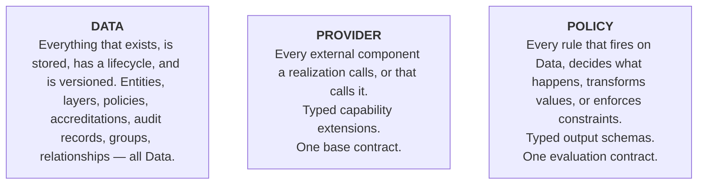
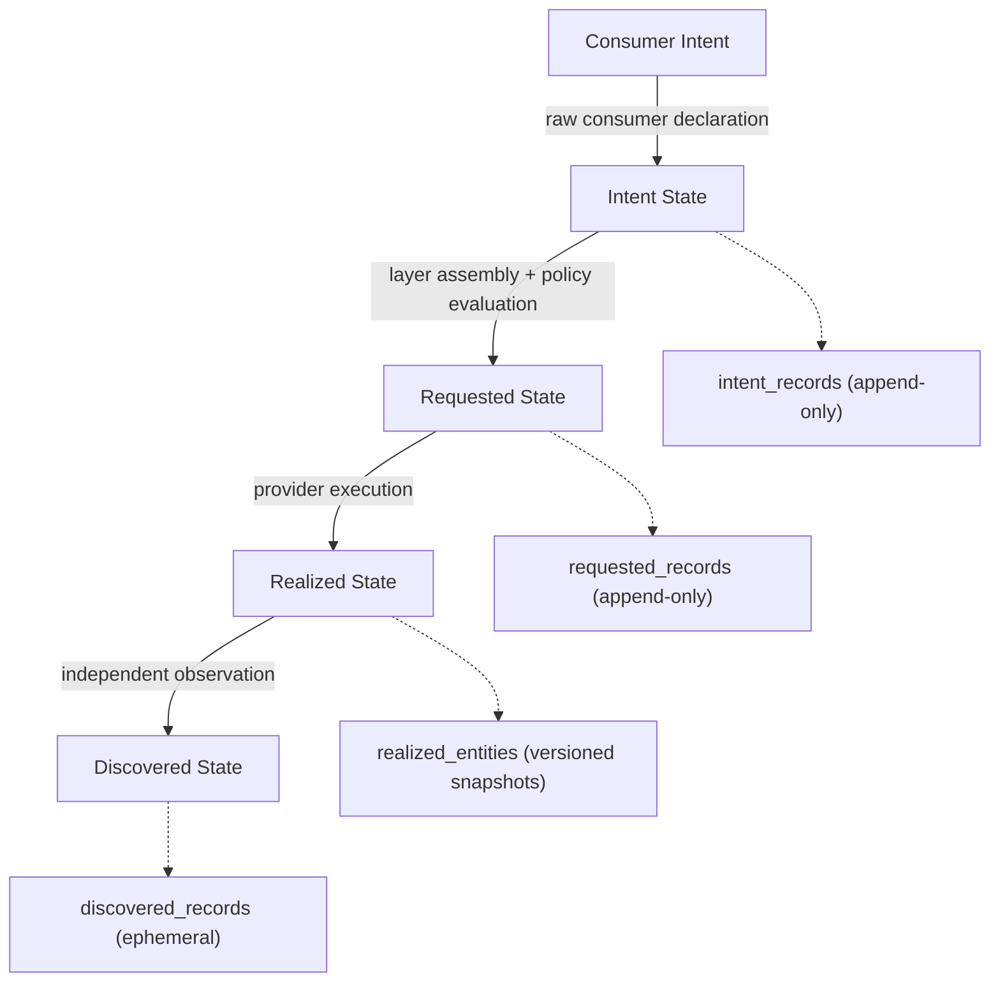

# UDLM — The Three Abstractions: Data, Provider, Policy

**Document Status:** ✅ Complete
**Document Type:** Foundational model — read this first
**Related Documents:** [Data Model Context](context-and-purpose.md) | [Provider Contract](../contracts/provider-contract.md) | [Policy Contract](../contracts/policy-contract.md)

> **Scope.** This document defines the three abstractions the **data model** is built from and their
> universal properties. How a realization *connects* them at runtime — the event loop, the policy
> evaluator, the control-plane components — is realization architecture, not the data model; it is owned by
> the DCM architecture docs, and this document points to it rather than specifying it (the UDLM/DCM boundary,
> [ADR-008](../docs/adr/ADR-008-udlm-dcm-boundary.md): if a peer could realize it differently and still be
> valid, it is DCM, not UDLM).

---

## 1. The Three Abstractions

The data model is built on three foundational abstractions. Every concept in the model is an instance of
one of these three — or a combination of them. There is no fourth.

The three abstractions are **peers** in the decomposition — no fixed importance order. Data is the substrate;
a Provider is how external reality is reached under contract; a Policy is how a decision is declared over Data.

**Connecting them at runtime is DCM's concern.** At runtime these operate as a trigger-driven,
re-entrant convergence loop — an event (a Data state change, a provider outcome, a denial) re-evaluates the
matching Policies, whose results invoke Providers or produce new Data, which emit new events, until the
target state converges. That loop is the **operational model of a realization**, not part of the data model:
it is specified in the DCM architecture docs, with its soundness rules (bounded convergence, idempotent
re-entry, causal audit of every trigger) in [ADR-006 — Convergence control model](../docs/adr/ADR-006-convergence-control-model.md).
UDLM defines the three abstractions and their contracts; a realization wires them into a running system.

---

## 2. DATA — Everything That Exists

**Definition:** Data is any structured artifact with a type, fields, classification, provenance, and
lifecycle state. Data is always versioned, always identified by UUID, and always carries provenance
describing where each field value came from.

**The universal properties of all Data:**
- **UUID** — every Data artifact has a universally unique identifier, stable across its full lifecycle
- **Type** — every Data artifact has a declared type that determines its schema and valid field set
- **Lifecycle state** — every Data artifact is in exactly one lifecycle state at any moment
- **Artifact metadata** — every Data artifact carries a standard metadata block (handle, version, status, owned_by, created_by, created_via, contact modes); the **complete v1 field set** is defined canonically in [layering-and-versioning.md](layering-and-versioning.md) §4b, not a representative sample
- **Provenance** — every field in every Data artifact carries lineage metadata describing its origin and all modifications
- **Data classification** — every field carries a classification (public → classified) governing what may cross interaction boundaries
- **Immutability if versioned** — once a version is published, it cannot be modified; changes produce new versions
- **Contributor identity** — every Data artifact records who contributed it (platform admin, consumer/tenant, service provider, or peer realization) and what review it received before activation. The model defaults to a federated contribution model — all authorized actor types can create Data within the bounds their role permits. See [Federated Contribution Model](../governance/federated-contribution-model.md).

**The Data taxonomy** — the enumerated Data/resource types (resource and process entities, the four states,
data layers, policies and policy groups, accreditations, groups, tokens, drift and audit records, and the
rest) are defined canonically in the **[registry](../registry/)** (the Resource Type Specifications and the
instance meta-schema). This document defines the Data *abstraction* and its universal properties; it does
not restate the member list, so there is a single source of truth and no drift with the registry.

**How Data flows — the four lifecycle stages:**

Data flows through four lifecycle stages — the same entity observed at four points, not four separate things:

These four stages are defined canonically in **[The Four States](four-states.md)** — this section shows
only how Data flows through them, it does not redefine each stage.

**How Data is composed — the layering model:**

Data fields are assembled from multiple contributing layers in a deterministic precedence order. See
[Data Model Context](context-and-purpose.md) and [Layering and Versioning](layering-and-versioning.md) for
the complete assembly algorithm.

---

## 3. PROVIDER — Everything External

**Definition:** A Provider is any external component reached through a defined contract. Providers receive
Data, act on it, and return Data. The contract governs how this exchange happens — not what the Provider
does internally.

**The universal properties of all Providers:**
- **Registration** — every Provider registers, declaring its capabilities, sovereignty, and accreditation
- **Health check** — every Provider exposes a health endpoint that a realization can monitor
- **Sovereignty declaration** — every Provider declares where it operates and what jurisdictions it covers
- **Accreditation** — every Provider declares its compliance certifications, enforced via the Governance Matrix
- **Governance Matrix enforcement** — every interaction with a Provider is subject to the Governance Matrix before data crosses the boundary
- **Zero trust** — every Provider interaction is authenticated and authorized; no implicit trust from network position
- **Lifecycle** — every Provider registration goes through a defined lifecycle (SUBMITTED → VALIDATING → ACTIVE → DEREGISTERED)

The single interface every Provider implements — the base contract, and the capability declaration that
distinguishes one Provider type from another — is defined in [provider-contract.md](../contracts/provider-contract.md).

**The Provider taxonomy** — the enumerated Provider types (Service Provider, Information Provider, data
store, External Policy Evaluator, credential management service, Auth Provider, notification service, event
routing service, Resource Type Registry, Peer realization, ITSM integration, …) and their capability
declarations are defined canonically in the **[Provider Contract](../contracts/provider-contract.md)**. This
document defines the Provider *abstraction* and its universal properties; the member list lives in one place
there, not restated here.

**The unified Provider base contract** is defined in [provider-contract.md](../contracts/provider-contract.md).
All Provider types implement this base contract. What varies is the capability declaration — what operations
the Provider exposes and what data flows in which direction.

**Peer realization as Provider:** A federated peer instance is a typed Provider. The federation tunnel is
the Provider's communication channel; federation routing is policy-governed provider selection. There is no
separate "federation abstraction" — federation is the Provider abstraction applied across instances.

---

## 4. POLICY — Everything That Decides

**Definition:** A Policy is a rule artifact that fires when Data matches declared conditions, produces a
typed output (decision, mutation, action, or directive), and is enforced according to a declared level.
Policies govern every transition, transformation, and constraint over Data.

**The universal properties of all Policies:**
- **Match conditions** — every Policy declares when it fires, using the four governance matrix axes (subject, data, target, context) or payload type + field conditions
- **Typed output schema** — every Policy produces one of seven output types; the output type determines how the result is applied
- **Enforcement level** — hard (cannot be overridden) or soft (can be tightened by more-specific policies)
- **Domain precedence** — policies at more-specific domains win within their concern type; system > platform > tenant > resource_type > entity
- **Lifecycle** — every Policy follows the standard artifact lifecycle (developing → proposed → active → deprecated → retired)
- **Shadow mode** — proposed Policies execute against real traffic without applying results; safe validation before activation
- **Audit** — every Policy evaluation produces an audit record regardless of outcome

UDLM is deliberately **policy-language-agnostic**: it defines the policy *contract* (match conditions, typed
output schemas, evaluation model) — not a policy language, and not a policy engine. What data is in scope
during evaluation, and the required output schema per policy type, are defined in
[policy-contract.md](../contracts/policy-contract.md).

**The Policy taxonomy** — the enumerated Policy types (Validation, Transformation, Recovery, Orchestration
Flow, Governance Matrix Rule, Lifecycle, ITSM Action, …) and their typed output schemas are defined
canonically in the **[Policy Contract](../contracts/policy-contract.md)**. This document defines the Policy
*abstraction* and its universal properties; the member list is not restated here.

**The unified Policy base contract** is defined in [policy-contract.md](../contracts/policy-contract.md).
All Policy types implement this base contract. What varies is the output schema.

**Policies as orchestration — two levels that compose:**

*Level 1 — Named Workflow Artifacts (explicit, visible, auditable):* An Orchestration Flow Policy with
`concern_type: orchestration_flow` (`concern_type` is a policy's concern category — the typed axis policies
are grouped and precedence-ordered by; the enumerated categories live in
[policy-contract.md](../contracts/policy-contract.md)) and `ordered: true` is a named workflow. It declares steps in explicit
sequence. Named workflows are first-class Data artifacts — versioned, GitOps-managed, profile-bound. Adding
an explicit pipeline step = adding a step to a workflow Policy artifact.

*Level 2 — Dynamic Policies (conditional, inline):* Compliance-class Validation Policy, Transformation,
Recovery, and Governance Matrix Policies fire when their match conditions are satisfied — within or
alongside workflow steps, without being declared in the workflow. Adding conditional behavior = writing a
dynamic policy.

Both levels are *data* — Policy artifacts with typed output schemas. How a realization evaluates and
sequences them (the policy evaluator, the event bus) is DCM runtime; the two levels compose naturally
because a named workflow provides the sequence skeleton and dynamic policies provide conditional behavior
within it.

**The Governance Matrix as Policy:** The Governance Matrix rules (see
[`governance-matrix.md`](../governance/governance-matrix.md)) are typed Policies with the `boundary_control`
output schema. They fire at every cross-boundary interaction and follow the same match conditions,
enforcement levels, and lifecycle as all other Policies. The governance matrix is not a separate system — it
is the Policy abstraction applied at interaction boundaries.

---

## 5. Connecting the three at runtime — DCM's concern

The three abstractions are connected, at runtime, by machinery that is **realization architecture, not the
data model**: an event bus that routes Data state-changes to a policy evaluator, the evaluator that fires
matching Policies, the results that invoke Providers or produce new Data, and the control-plane components
that specialize this loop (placement, discovery scheduling, drift reconciliation, notification routing, a
queryable search projection, and the rest).

By the boundary test ([ADR-008](../docs/adr/ADR-008-udlm-dcm-boundary.md)), all of that is DCM: a peer could
implement the event bus, the evaluator, and each control-plane component differently and still honor the
same Data, Provider, and Policy contracts. So it is **specified in the DCM architecture docs, not here.**

What UDLM fixes — and what any conforming realization must preserve — is the *contract* the runtime operates
over: the four states and their transitions ([four-states.md](four-states.md)), the layer-assembly precedence
([layering-and-versioning.md](layering-and-versioning.md)), the Provider base contract
([provider-contract.md](../contracts/provider-contract.md)), and the Policy evaluation contract
([policy-contract.md](../contracts/policy-contract.md)). Given those, the runtime is a realization concern.

---

## 6. Extension Points

The model is designed to be extended without modifying the core. Every extension fits within the three
abstractions:

**Extending Data:** New entity types, new artifact types, new resource types, new group classes — all are
typed extensions of the Data abstraction. Register them in the Resource Type Registry or DCMGroup registry.

**Extending Providers:** New provider types (a Billing Provider, a CMDB Provider, an AI/ML Provider) —
implement the unified Provider base contract with a new capability declaration extension. Register in the
Provider Type Registry.

**Extending Policies:** New policy types, new governance matrix rules, new orchestration flows — implement
the unified Policy base contract with a new output schema. Register in the Policy Store via GitOps.

**The extension principle:** If you can express it as Data, Provider, or Policy, it belongs in the model. If
you cannot express it within these three abstractions, it is either a runtime implementation detail (DCM's,
not the model's) or a genuinely novel concept that should be explicitly identified and documented as such.

---

## 7. The Core Ethos

These three abstractions serve one core ethos — managing the lifecycle of resources across a
sovereign private cloud — expressed as four qualities the data model is shaped to enable:

**Effective at the core mission.** The Data abstraction ensures every resource is tracked, versioned, and
auditable; the Provider abstraction ensures every external integration is governed and trustworthy; the
Policy abstraction ensures every decision is declared, reproducible, and auditable.

**Easy to use.** Consumers interact with Data (submit an intent, receive a resource). Policies govern what
happens without consumers needing to understand them; Providers handle the implementation details.

**Easy to implement.** Implementors implement one base contract (Provider) with a typed capability
extension; a realization's policy evaluator handles all policy evaluation; the Data model handles all
storage and provenance.

**Easy to extend and integrate.** Add a new provider type by implementing the base contract; a new policy
type by defining an output schema; a new data type by defining a schema. No core changes required.

---

*Part of the UDLM specification. For questions or contributions see [GitHub](https://github.com/dcm-project).*

---

## Design Priority Order

The priority order that governs every design decision — **security → ease of use → extensibility → fit-for-purpose** (higher wins on conflict; all apply where none conflicts) — is defined once, with its decision procedure, profile scaling table, and `DPO-001–006` policies, in [Design Priorities](../design-principles/design-priorities.md). It is not restated here.

---

**The implication for profiles:** The `homelab` profile is "security with minimal operational overhead" — not
"minimal security." The security architecture is present and correct in every profile. What varies is how
much automation, how strict the thresholds, and how much manual intervention is acceptable. This is the
principle that makes the platform trustworthy in a homelab and in a sovereign government deployment using
the same model.

**Profile scope (current vs. future).** In this version a profile is **deployment-scoped** — one active
profile applies **platform-wide** (a homelab or a single sovereign deployment selects one). The model is
deliberately designed so profiles can later be **group-scoped** — bound to a Tenant, a Service, or a
compliance domain and **composing over** the platform default (e.g. a per-Tenant `sovereign` profile inside
an otherwise `standard` platform). Group-scoped profiles are future work; today, read "profile" as
platform-wide — but do not assume it is *only* platform-wide. Any profile-governed field (time-sync
tolerance per ADR-005, provenance policy group, credential assurance floor, version policy) is a candidate
for group-scoped override once the scoping mechanism lands. See [ADR-007 — Profile model](../docs/adr/ADR-007-profile-model.md)
for the full model: profiles are composed **sets** (policies + operational config + required mechanics), not
levels; they set floors; and modifying a built-in forks a new custom profile.
