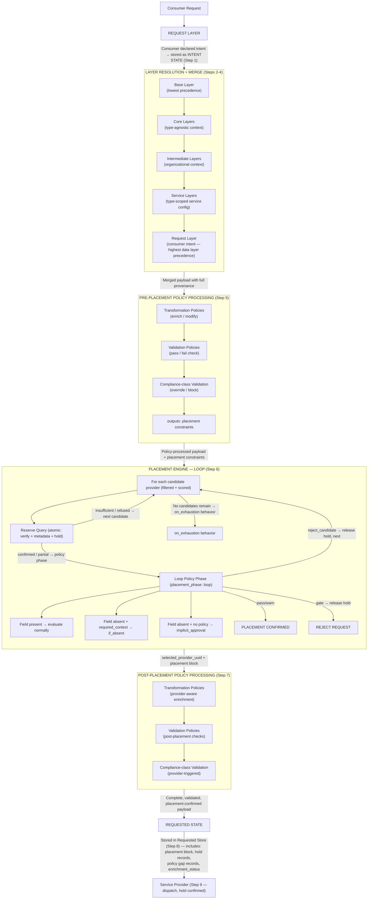
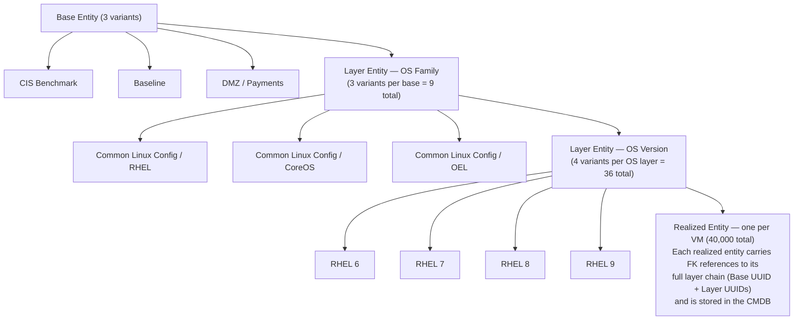
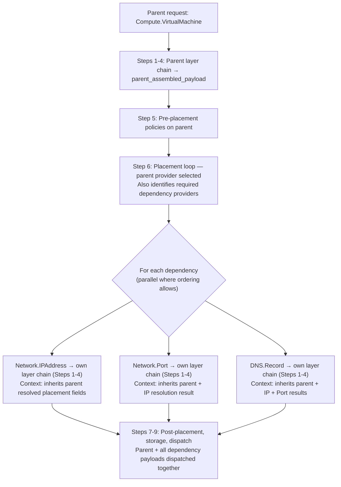

# UDLM — Data Layers and the Assembly Process — Annex (Non-Normative)

**Document Status:** ✅ Complete (non-normative)  
**Companion to:** [Data Layers and the Assembly Process](layering-and-versioning.md)

> **This annex is non-normative.** It collects the long worked examples, the
> assembly diagram, the scale illustration, the layer-gap analysis (Q21–Q24),
> and the resolved open-questions log that were extracted from the layering
> specification to keep the normative core implementable on its own. Nothing
> here adds a requirement; the binding rules (merge precedence, artifact
> metadata, and the `LAY-00x`/`OPS-00x` system policies) live in the
> [normative core](layering-and-versioning.md).

---

## 4d. Complete Layer Definition Structure

Combining all elements — identity, artifact metadata, scope, priority, and fields:

```yaml
# Complete layer definition
layer:
  # === ARTIFACT METADATA (universal — required on all artifacts) ===
  artifact_metadata:
    uuid: "layer-uuid-001"
    handle: "platform/core/security-cpu-limits"
    version: "1.2.0"
    status: active
    created_by:
      uuid: "actor-uuid-001"       # Optional — present if IdP registered
      display_name: "Jane Smith"
      email: "jane.smith@example.com"
      notification_endpoint: "https://notify.example.com/webhooks/jane"
    created_at: "2026-01-15T10:30:00Z"
    created_via: pr
    owned_by:
      uuid: "team-uuid-security"   # Optional — present if IdP registered
      display_name: "Platform Security Team"
      email: "platform-security@example.com"
      notification_endpoint: "https://notify.example.com/webhooks/platform-security"
    modifications:
      - sequence: 1
        modified_by:
          display_name: "Jane Smith"
          email: "jane.smith@example.com"
        modified_at: "2026-01-15T10:30:00Z"
        modification_type: create
        version_before: null
        version_after: "1.0.0"
        change_summary: "Initial creation — CPU limits per CISO mandate SEC-2024-047"
        pr_reference: "https://github.com/org/dcm-layers/pull/42"
        reason: "CISO mandate SEC-2024-047 requires CPU limits on all containers"
      - sequence: 2
        modified_by:
          display_name: "Bob Jones"
          email: "bob.jones@example.com"
        modified_at: "2026-02-20T14:00:00Z"
        modification_type: update
        version_before: "1.0.0"
        version_after: "1.2.0"
        change_summary: "Increased CPU limit from 4 to 8 per updated mandate"
        pr_reference: "https://github.com/org/dcm-layers/pull/67"
        reason: "Updated CISO mandate SEC-2024-047-rev2 allows 8 CPU"

  # === LAYER IDENTITY ===
  domain: platform
  layer_type: core

  scope:
    resource_types:
      - Compute.Container
      - Compute.Pod
    # Empty list = type-agnostic (applies to all resource types)

  priority:
    value: "200.30.10"
    label: "security.container.cpu_limits"
    category: security
    rationale: >
      CPU limit enforcement for container workloads per
      CISO mandate SEC-2024-047. Overrides platform defaults.

  # === LAYER CHAIN ===
  parent_chain:
    - uuid: "base-layer-uuid-001"
      handle: "system/base/universal-defaults"
      version: "1.0.0"
      layer_type: base

  # === FIELDS ===
  fields:
    cpu_limit:
      value: 8
      metadata:
        basis_for_value: "CISO mandate SEC-2024-047-rev2"
        baseline_value: 4
      override: constrained
      constraint_schema:
        minimum: 1
        maximum: 8
```

---

---

## 7. Layer Assembly Diagram



---

## 11. Scale Example — 40,000 Linux VMs

This example illustrates the power of the layering model at scale. 40,000 distinct VM configurations are governed by 36 layer definitions:



**Result:** 3 × 3 × 4 = **36 layer definitions** govern **40,000 VM configurations**. Each VM's realized entity is a lightweight reference to its layer chain — not a copy of all the configuration data.

This also means:
- Updating the CIS Benchmark base layer creates one new layer version that cascades to all 40,000 VMs at their next realization
- Drift detection compares each VM's discovered state against its realized entity's layer chain
- Any VM can be reproduced exactly by replaying its layer chain through the assembly process

---

## 13. Layer Gaps — Q21 through Q24

### 13.1 Consumer Layer Exclusion (Q21)

Consumers may explicitly exclude specific layers from their request. Each exclusion carries a mandatory human-readable reason recorded in provenance and the audit trail.

```yaml
request:
  resource_type: Compute.VirtualMachine
  layer_exclusions:
    - layer_handle: "platform/networking/default-dns-config"
      reason: "This VM uses custom DNS — default config conflicts with application requirements"
    - layer_uuid: <uuid>
      reason: "Dev environment — monitoring layer not required"
```

**Exclusion mechanics:**
- Excluded layers are removed from the candidate set during **Step 2 (Layer Resolution)** before priority ordering
- Excluded layers produce no fields in the assembled payload
- If a validation policy requires a field that would have been injected by an excluded layer, the validation fails with a clear message identifying the excluded layer
- Exclusion is different from override — exclusion removes the entire layer; override changes specific field values

**Policy enforcement:** Compliance-class Validation Policies may declare specific layers non-excludable:

```yaml
policy:
  type: validation
  enforcement_class: compliance
  rule: >
    If request.layer_exclusions CONTAINS layer.concern_tags CONTAINS "security-baseline"
    THEN gate: "Security baseline layers cannot be excluded"
  immutable_ceiling: absolute
```

### 13.2 Service Layer Versioning (Q22)

Service Layers are **independently versioned artifacts** — not coupled to Service Provider versions. Service Providers declare semver-compatible version constraints for the layers they use.

```yaml
# Service Provider registration — layer compatibility declarations
provider_registration:
  layer_compatibility:
    - layer_handle: "layers/vm-compute-defaults"
      compatible_versions: "^1.0.0"    # any 1.x version
    - layer_handle: "layers/vm-networking-config"
      compatible_versions: "~1.2"      # any 1.2.x revision
```

**Version lifecycle:** Service Layers follow the standard five-status artifact lifecycle. A deprecated Service Layer continues to work for existing realizations until retired. If a provider bumps to a new major version and updates its compatibility declaration, the old layer version is no longer used for new requests via that provider but continues to work for existing realizations.

**Cache invalidation:** Service Layer Cache entries carry the layer version. When the registered layer version increments, the cache entry is invalidated and refreshed before the next assembly.

### 13.3 Conditional Layer Inclusion (Q23)

Layers may declare an `activation_condition` — a field comparison evaluated during **Step 2 (Layer Resolution)**. Layers whose condition evaluates false are excluded from the candidate set.

```yaml
layer:
  handle: "platform/compute/gpu-config"
  activation_condition:
    field: request.gpu_requested
    operator: equals
    value: true
```

**Compound conditions:**
```yaml
activation_condition:
  conditions:
    operator: and   # and | or
    rules:
      - field: request.gpu_requested
        operator: equals
        value: true
      - field: request.resource_class
        operator: in
        value: [ml-training, gpu-compute]
```

**Condition field scope** — activation conditions may reference:
- Request fields (`request.gpu_requested`)
- Tenant attributes (`tenant.tags`, `tenant.profile`)
- Resource type fields (`resource_type.version`)
- Core Layer fields already resolved in Step 1 (`core_layers.location_region`)
- Ingress fields (`ingress.actor.roles`) — enabling role-specific layers

**Condition vs consumer exclusion:** Conditional inclusion is declared by the layer author and evaluated automatically. Consumer exclusion (Q21) is declared at request time by the consumer. Both result in the layer being absent from the candidate set — but for different reasons, recorded differently in provenance.

### 13.4 Layer Chain and Service Dependencies (Q24)

Each service dependency executes its **own independent layer chain** during assembly. Dependencies do not share the parent request's layer chain.

**Dependencies inherit from parent (read-only context):**
- Tenant UUID and sovereignty context
- Parent's resolved placement fields (declared by Resource Type Specification as `propagated_to_dependencies`)
- Parent's resolved identity fields (hostname, etc.)
- Active Profile

**Dependencies do NOT inherit:**
- Parent consumer declarations
- Resource-type-specific layers (each type has its own)
- Provider-specific layers (each provider has its own)

**Dependency assembly flow:**


**Layer exclusions on dependencies** — consumers may declare per-dependency exclusions:
```yaml
request:
  resource_type: Compute.VirtualMachine
  dependencies:
    - resource_type: Network.IPAddress
      layer_exclusions:
        - layer_handle: "layers/ip-default-ttl-config"
          reason: "Custom TTL required — excluding default"
```

---

## 14. Open Questions

| # | Question | Impact | Status |
|---|----------|--------|--------|
| 1 | How are conflicting Service Layers at the same precedence level resolved? | Assembly determinism | ✅ Resolved — priority schema + conflict detection at ingestion |
| 2 | Should Core Layers be ordered within their precedence level? | Merge determinism | ✅ Resolved — priority schema provides deterministic ordering |
| 3 | Can a consumer explicitly exclude a layer from their request? | Consumer control vs. standardization | ✅ Resolved — layer_exclusions with mandatory reason; compliance-class Validation Policy can lock layers as non-excludable (LAY-001) |
| 4 | How are Service Layers registered and versioned relative to Service Provider registration? | Provider contract | ✅ Resolved — independently versioned; provider declares semver compatibility; cache invalidation on version change (LAY-002) |
| 5 | Should assembly support conditional layer inclusion? | Assembly flexibility | ✅ Resolved — activation_condition on layers; evaluated in Step 2; references request, tenant, resource type, core layer, and ingress fields (LAY-003) |
| 6 | How does the layer chain interact with service dependencies? | Dependency model | ✅ Resolved — each dependency has its own layer chain; inherits parent resolved placement context; no consumer declaration inheritance (LAY-004) |
| 7 | Should `override_preference` be declarable in layer definitions as a hint to the Policy Engine? | Override control | ✅ Resolved — override: allow/constrained/immutable enforced by Request Payload Processor at Step 3; compliance-class Validation Policy may additionally lock (LAY-005) |
| 8 | When `override_preference: immutable` is set — can a higher-priority policy still override it? | Override control precedence | ✅ Resolved — immutable prevents lower-authority overrides only; higher-domain layers always win; compliance-class Validation Policy can additionally lock (LAY-005) |
| 9 | Should the `constraint_schema` on a constrained field be visible to consumers in the Service Catalog UI? | Consumer experience | ✅ Resolved — full/summary/hidden disclosure levels; profile-governed defaults; API endpoint returns schema at declared visibility (LAY-006) |
| 10 | Should the background validation job for detecting post-ingestion conflicts run on a schedule or be event-triggered? | Operational | ✅ Resolved — event-triggered primary (on layer ingestion/update) + weekly scheduled sweep safety net; async non-blocking; both produce same conflict record format (OPS-003) |
| 11 | What is the minimum validation review period for a proposed policy before it can be activated? | Policy governance | ✅ Resolved — Validation Policy (compliance-class)=14d, Validation Policy (operational-class)=7d, Transformation=3d × profile multiplier (minimal=0×, dev=0.5×, standard=1×, prod=1.5×, fsi/sovereign=2×); DCM enforces; emergency bypass requires dual-approval audit (OPS-004) |

---


*Non-normative annex maintained by the DCM Project. See the [normative core](layering-and-versioning.md).*
